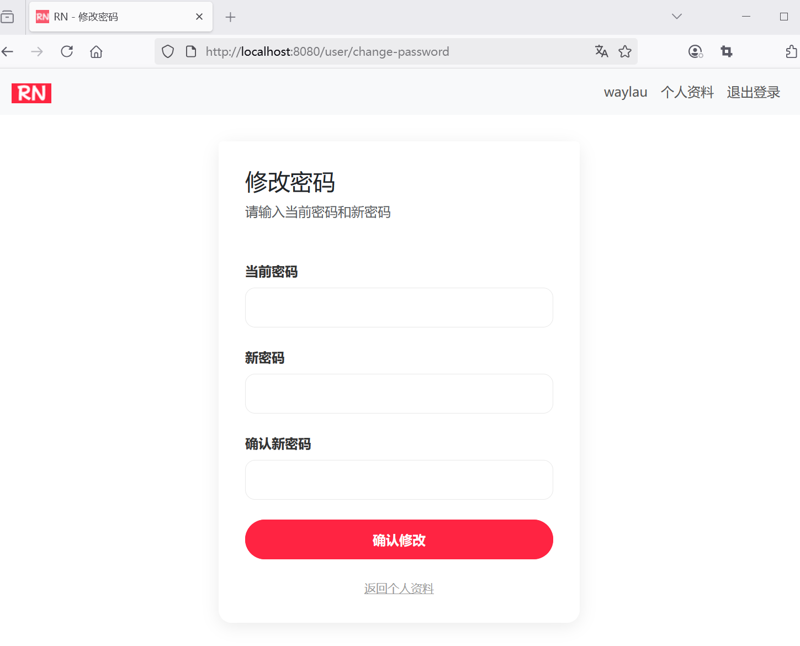
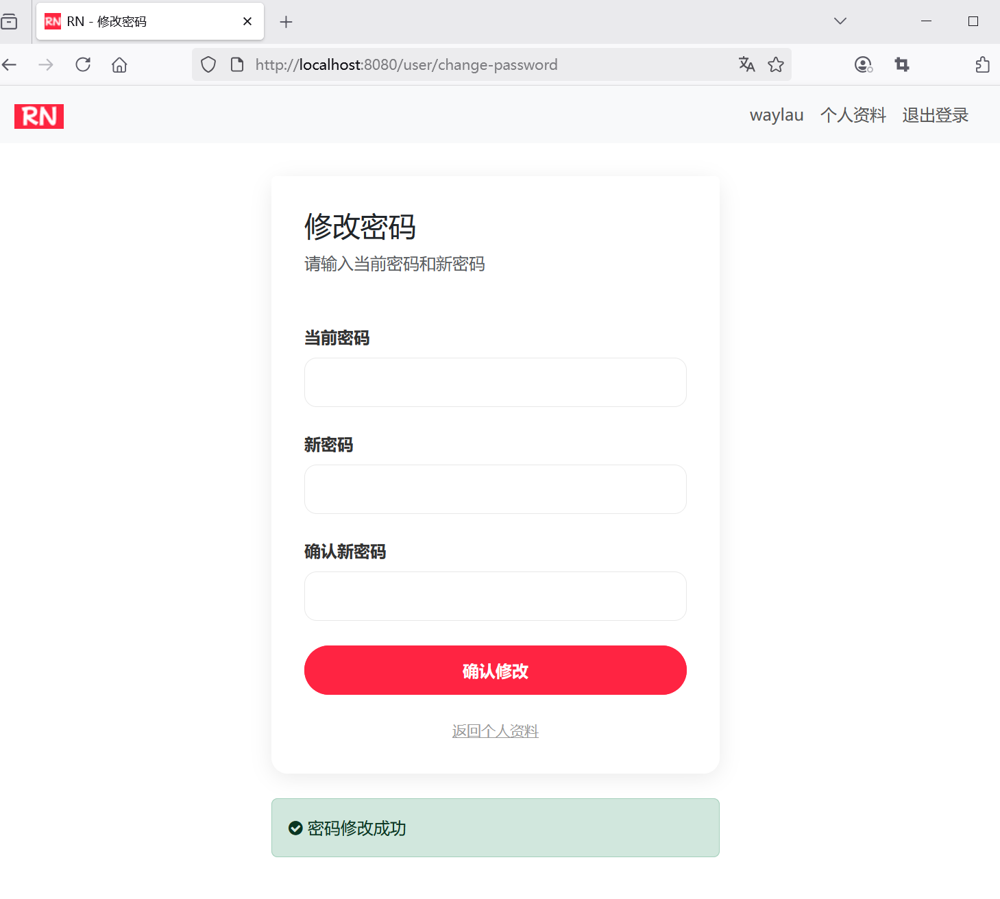
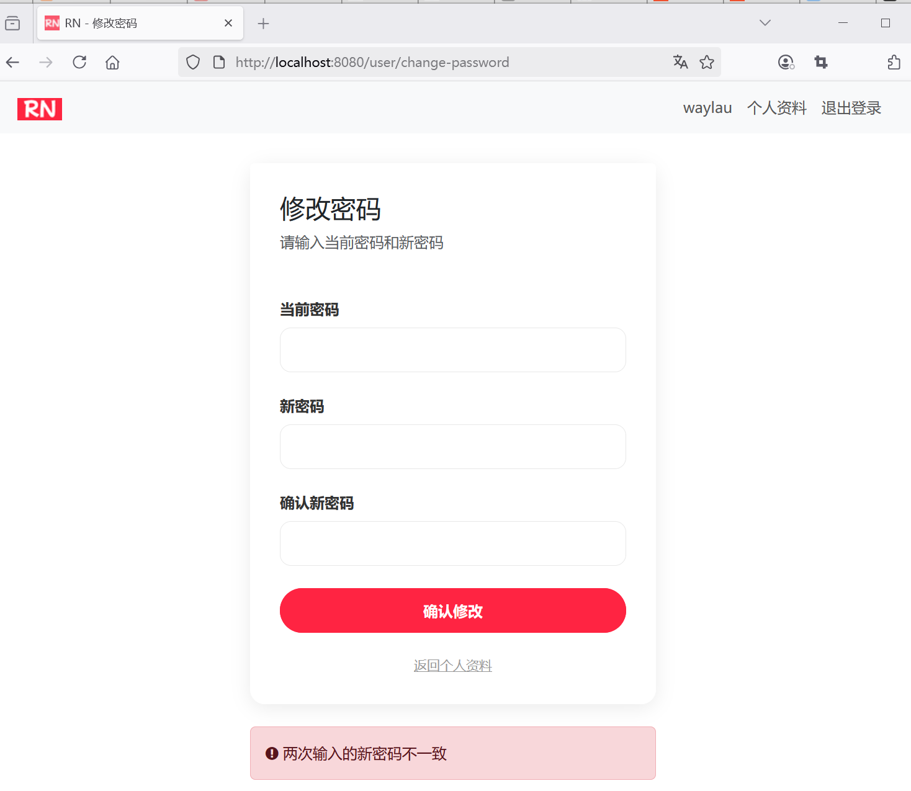

## 6.10 使用BCryptPasswordEncoder对新密码进行加密并更新到数据库


### 修改用户控制器UserController


新增对修改密码页面处理：

```java
package com.waylau.rednote.controller;

// ...为节约篇幅，此处省略非核心内容

@Controller
@RequestMapping("/user")
public class UserController {

    // ...为节约篇幅，此处省略非核心内容

    @GetMapping("/change-password")
    public String changePasswordForm() {
        return "user-change-password";
    }

    @PostMapping("/change-password")
    public String changePassword(@RequestParam String oldPassword, @RequestParam String newPassword, @RequestParam String confirmPassword, RedirectAttributes redirectAttributes) {
        // 密码验证，验证两次输入的密码是否一致
        if (!newPassword.equals(confirmPassword)) {
            redirectAttributes.addFlashAttribute("error", "两次输入的密码不一致");
            return "redirect:/user/change-password";
        }

        // 密码旧密码是否正确
        if (!userService.verifyPassword(userService.getCurrentUser().getUsername(), oldPassword)) {
            redirectAttributes.addFlashAttribute("error", "旧密码错误");
            return "redirect:/user/change-password";
        }

        // 新密码强度验证
        if (!newPassword.matches("^[a-zA-Z0-9_]{8,20}$")) {
            redirectAttributes.addFlashAttribute("error", "新密码强度不够");
            return "redirect:/user/change-password";
        }

        // 更新密码到数据库
        userService.changePassword(userService.getCurrentUser().getUsername(), newPassword);
        redirectAttributes.addFlashAttribute("success", "密码修改成功");

        return "redirect:/user/change-password";
    }
}
```

其中：

* `userService.changePassword()`接口用于将修改后的密码保存到数据库；
* `redirectAttributes.addFlashAttribute()`重定向到页面时，传递消息。


### 修改后的密码保存到数据库


修改UserService，增加如下接口：

```java

/**
* 修改密码
*/
void changePassword(String username, String newPassword);
```


修改UserServiceImpl，增加如下方法：


```java
@Override
public void changePassword(String username, String newPassword) {
    User user = userRepository.findByUsername(username)
            .orElseThrow(() -> new UsernameNotFoundException(ExceptionType.USERNAME_NOT_FOUND));

    // 加密密码
    String encodedPassword = passwordEncoder.encode(newPassword);
    user.setPassword(encodedPassword);

    userRepository.save(user);
}
```


新密码需要通过 BCryptPasswordEncoder 加密后存储。


### 运行调测


用户修改密码页面如下：





用户修改密码完成之后的页面如下：





用户修改密码失败之后的页面如下：



