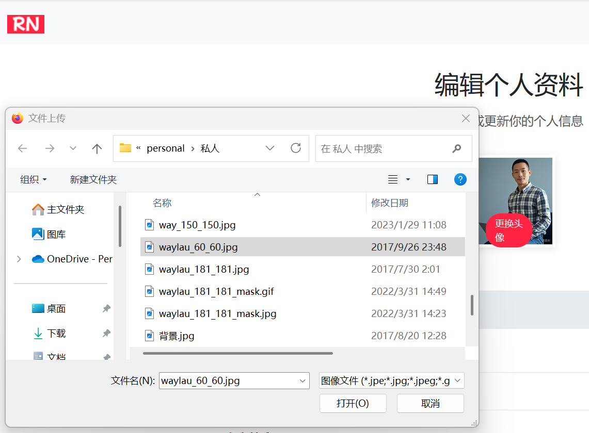
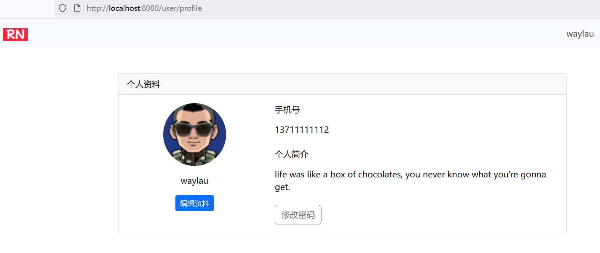
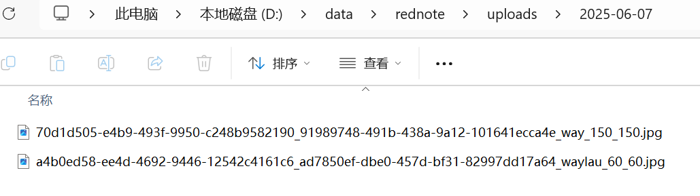

## 6.12 实现文件存储服务器


### 文件存储服务实现

实现如下：

```java
package com.waylau.rednote.service.impl;

import com.waylau.rednote.exception.FileStorageException;
import com.waylau.rednote.service.FileStorageService;
import org.springframework.beans.factory.annotation.Value;
import org.springframework.stereotype.Service;
import org.springframework.web.multipart.MultipartFile;

import java.io.InputStream;
import java.nio.file.Files;
import java.nio.file.Path;
import java.nio.file.Paths;
import java.nio.file.StandardCopyOption;
import java.time.LocalDate;
import java.util.UUID;

/**
 * FileStorageServiceImpl 文件存储服务
 *
 * @author <a href="https://waylau.com">Way Lau</a>
 * @version 2025/08/18
 **/
@Service
public class FileStorageServiceImpl implements FileStorageService {

    // 文件存储根路径，可以配置在应用配置文件中
    @Value("${file.upload-dir:/data/rednote}")
    private String uploadDir;

    // 静态资源访问路径前缀，可以配置在应用配置文件中
    @Value("${file.static-path-prefix:/uploads/}")
    private String staticPathPrefix;

    @Override
    public String saveFile(MultipartFile file, String filename) {
        // 确保文件名唯一
        String uniqueFileName = UUID.randomUUID() + "_" + filename;

        // 生成文件存储路径，按照日期分目录，提高文件系统的性能
        String subDir = LocalDate.now().toString();
        Path uploadPath = Paths.get(uploadDir + staticPathPrefix + subDir);

        try {
            // 创建目录（如果不存在）
            if (!Files.exists(uploadPath)) {
                Files.createDirectories(uploadPath);
            }

            // 拷贝文件。使用完后释放资源
            try (InputStream inputStream = file.getInputStream()) {
                Files.copy(inputStream, uploadPath.resolve(uniqueFileName), StandardCopyOption.REPLACE_EXISTING);
            }
        } catch (Exception e) {
            // 抛出自定义运行时异常
            throw new FileStorageException("文件上传失败：" + filename, e);
        }

        // 返回可访问的URL路径
        return staticPathPrefix + subDir + "/" + uniqueFileName;
    }

    @Override
    public void deleteFile(String filePath) {
        // 判定文件路径是否为空
        if (filePath == null || filePath.isEmpty()) {
            return;
        }

        // 安全检查，确保路径在上传目录内
        Path fullPath = Paths.get(uploadDir + filePath).normalize();

        try {
            // 删除文件
            Files.deleteIfExists(fullPath);
        } catch (Exception e) {
            // 抛出自定义运行时异常
            throw new FileStorageException("文件删除失败：" + filePath, e);
        }
    }
}
```


### 在视图中显示头像上传功能

修改user-profile-edit.html:

```html
<div class="avatar-upload">
    <!-- 文件上传 --->
    <input type="file" id="avatarFile" name="avatarFile" accept="image/*" class="d-none"></input>
    <label for="avatarFile">更换头像</label>
</div>
```


### 异常处理

#### 1. 自定义文件存储异常


```java
package com.waylau.rednote.exception;

/**
 * FileStorageException 文件存储异常
 *
 * @author <a href="https://waylau.com">Way Lau</a>
 * @version 2025/06/07
 **/
public class FileStorageException extends ValidationException {
    public FileStorageException(String message) {
        super("文件存储异常. " + message);
    }

    public FileStorageException(String message, Throwable cause) {
        super("文件存储异常. " + message, cause);
    }
}
```

#### 2. 自定义验证相关异常

```java
package com.waylau.rednote.exception;

/**
 * ValidationException 验证相关异常
 *
 * @author <a href="https://waylau.com">Way Lau</a>
 * @version 2025/06/07
 **/
public class ValidationException extends BusinessException {
    public ValidationException(String message) {
        super(message);
    }

    public ValidationException(String message, Throwable cause) {
        super(message, cause);
    }
}
```

#### 3. 自定义基础业务异常

```java
package com.waylau.rednote.exception;

/**
 * BusinessException 基础业务异常
 *
 * @author <a href="https://waylau.com">Way Lau</a>
 * @version 2025/06/07
 **/
public class BusinessException extends RuntimeException {
    public BusinessException(String message) {
        super(message);
    }

    public BusinessException(String message, Throwable cause) {
        super(message, cause);
    }
}
```

### 应用配置


```
# 文件上传配置
file.upload-dir=/data/rednote
file.static-path-prefix=/uploads/

# 上传文件大小限制
spring.servlet.multipart.max-file-size=10MB
spring.servlet.multipart.max-request-size=10MB
```


### 运行调测


点击“更换头像”按钮，会弹出文件上传选取框如下：





头像更新之后，会重定向到用户信息展示页面，可以看到头像更新后的图片，如下：




头像图片会存储在指定目录下，如下：




### 总结

实现 Spring MVC 文件上传需要关注以下关键点：
1. **配置 MultipartResolver** 处理文件上传请求
2. **安全验证**：类型检查、大小限制、路径验证
3. **文件存储策略**：本地存储或云存储
4. **数据库关联**：保存文件路径到数据库
5. **静态资源映射**：确保文件可被访问
6. **异常处理**：完善的错误处理机制

通过以上步骤，你可以实现一个安全、高效的头像上传功能，同时支持本地存储和云存储方案，满足不同规模应用的需求。