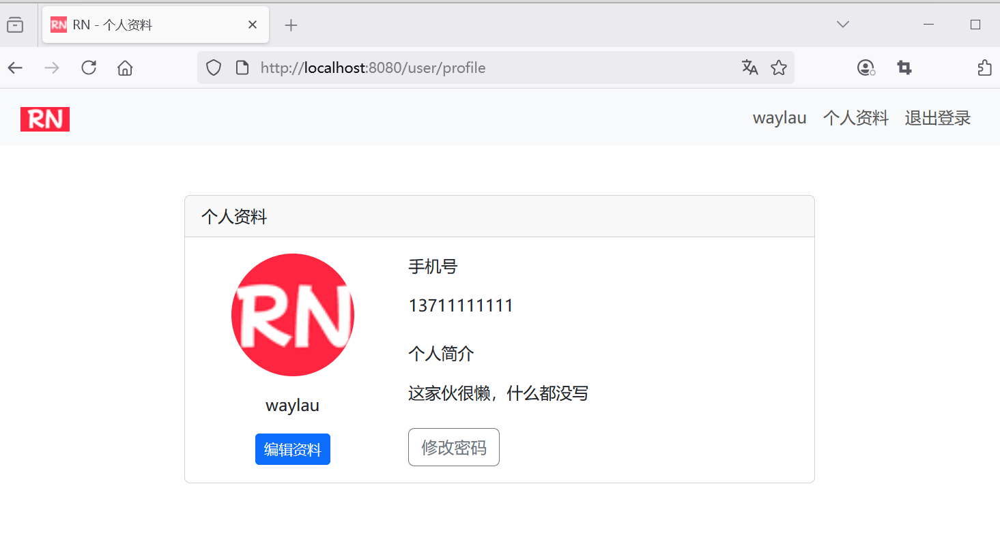

## 6.3 使用Spring MVC控制器将后端用户信息绑定到前端页面进行显示

1. 创建处理用户信息管理请求的控制器类
2. 定义不同请求方法对应的处理方法
3. 将不同的请求路径映射到相应的处理方法
4. 接收前端传来的用户信息参数，进行必要的格式校验
5. 根据业务逻辑处理结果，返回合适的响应信息


### 更新User实体

增加了以下字段：

```java
/**
  * 头像
  */
private String avatar;

/**
  * 简介
  */
private String bio;
```


### 新建用户控制器 UserController

```java
package com.waylau.rednote.controller;

import com.waylau.rednote.entity.User;
import com.waylau.rednote.service.UserService;
import org.springframework.beans.factory.annotation.Autowired;
import org.springframework.stereotype.Controller;
import org.springframework.ui.Model;
import org.springframework.web.bind.annotation.GetMapping;
import org.springframework.web.bind.annotation.RequestMapping;

/**
 * UserController 用户控制器
 *
 * @author <a href="https://waylau.com">Way Lau</a>
 * @version 2025/08/17
 **/
@Controller
@RequestMapping("/user")
public class UserController {

    @Autowired
    private UserService userService;

    @GetMapping("/profile")
    public String profile(Model model) {
        // 获取当前用户信息
        User user = userService.getCurrentUser();

        model.addAttribute("user", user);

        return "user-profile";
    }
}
```

其中，需要UserService提供新的接口getCurrentUser()来获取当前用户的信息。


```java
/**
  * 获取当前用户
  */
User getCurrentUser();
```

接着，将该用户信息绑定到模型，并通过前端页面user-profile.html进行显示。


访问地址：<http://localhost:8080/user/profile>，可以看到如下图6-1所示的界面。




