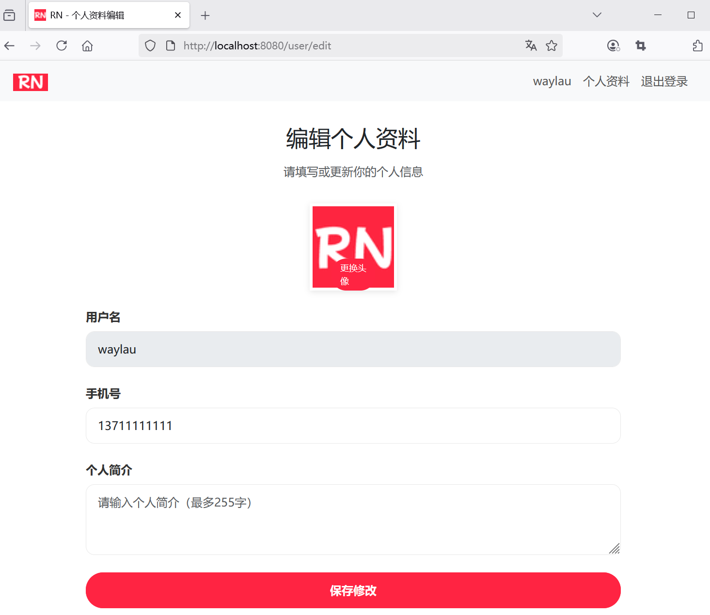
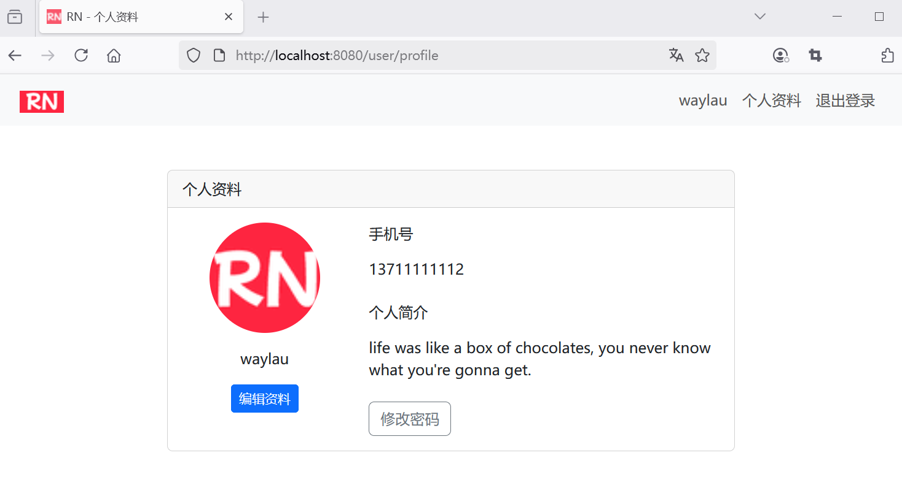

## 6.7 用户对可编辑信息进行修改，并将修改后的数据保存到数据库

### 修改用户控制器UserController


新增对编辑的页面处理：

```java
package com.waylau.rednote.controller;

// ...为节约篇幅，此处省略非核心内容

import org.springframework.web.servlet.mvc.support.RedirectAttributes;

/**
 * UserController 用户控制器
 *
 * @author <a href="https://waylau.com">Way Lau</a>
 * @version 2025/06/05
 **/
@Controller
@RequestMapping("/user")
public class UserController {

    // ...为节约篇幅，此处省略非核心内容

    @GetMapping("/edit")
    public String editProfile(Model model) {
        User user = userService.getCurrentUser();

        model.addAttribute("user", user);

        return "user-profile-edit";
    }


    @PostMapping("/edit")
    public String updateProfile(@ModelAttribute User user, RedirectAttributes redirectAttributes) {
        User currentUser = userService.getCurrentUser();

        // 更新用户信息
        currentUser.setPhone(user.getPhone());
        currentUser.setAvatar(user.getAvatar());
        currentUser.setBio(user.getBio());

        // 修改内容保存到数据库
        userService.updateUser(currentUser);

        // 重定向到指定页面，并传递参数
        redirectAttributes.addFlashAttribute("success", "个人信息更新成功");

        return "redirect:/user/profile";
    }

}
```

其中：

* `userService.updateUser()`接口用于将修改后的数据保存到数据库；
* `redirectAttributes.addFlashAttribute()`重定向到页面时，传递消息。


### 修改后的数据保存到数据库


修改UserService，增加如下接口：

```java
/**
* 更新用户
*/
User updateUser(User currentUser);
```


修改UserServiceImpl，增加如下方法：


```java
@Override
public User updateUser(User user) {
    return userRepository.save(user);
}
```


### 运行调测


用户信息编辑页面如下：





用户信息更新完成之后的页面如下：



