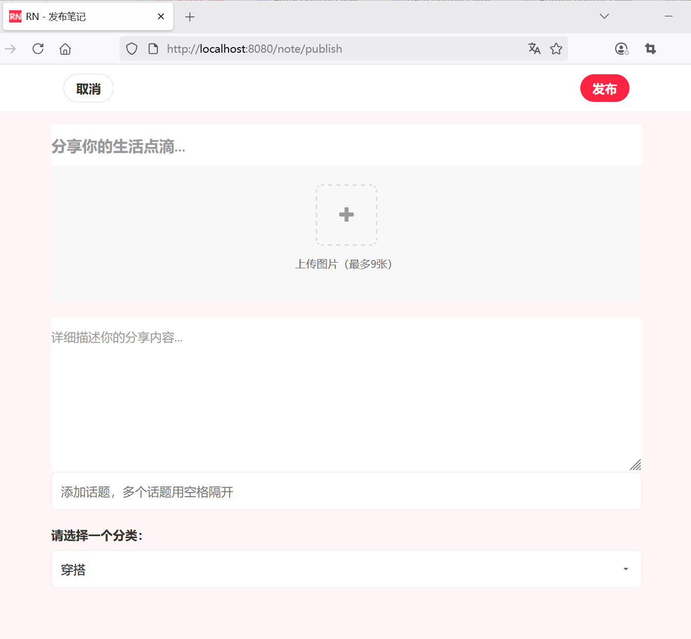
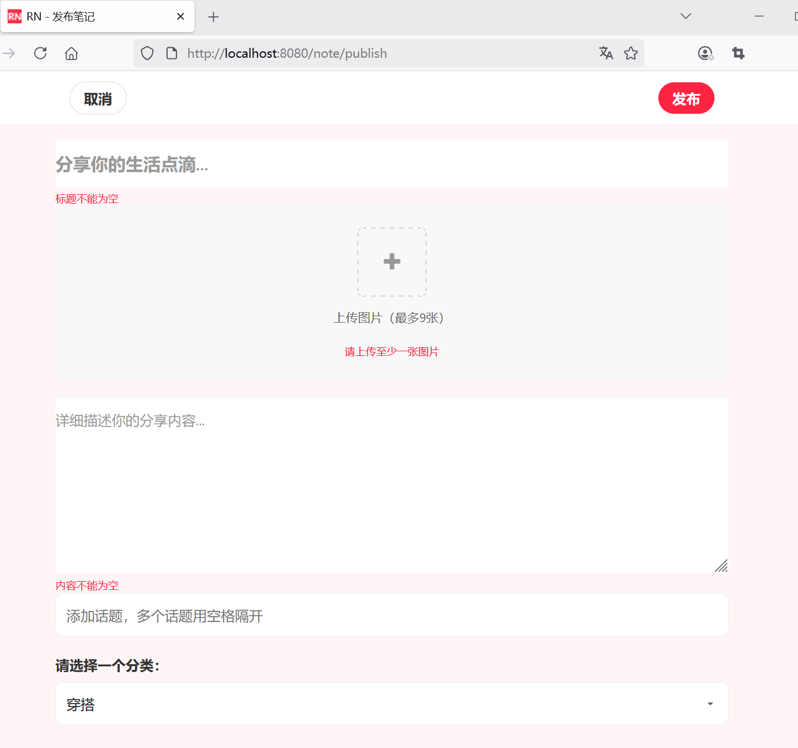
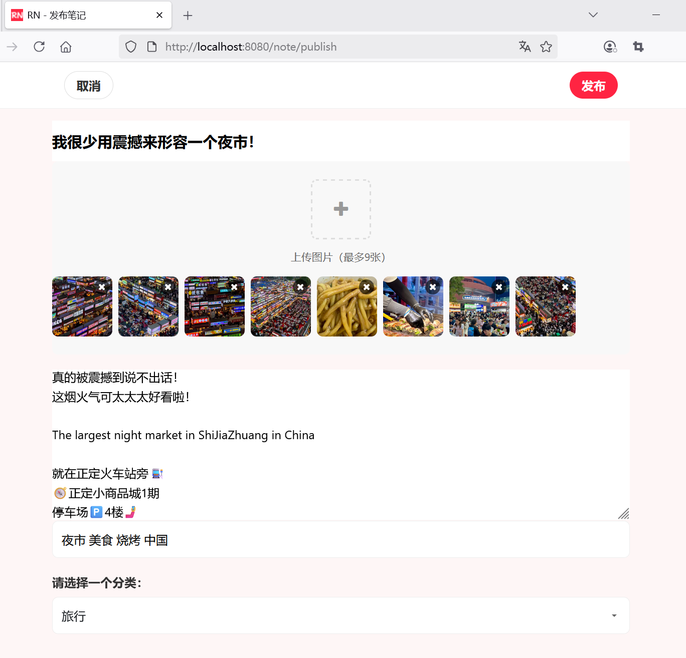
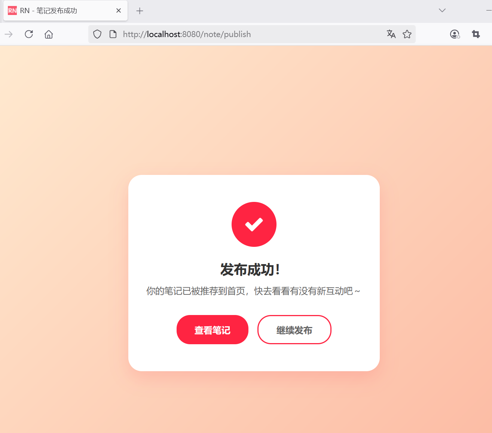

## 7.7 掌握Repository设计模式来实现笔记保存


1. 笔记表结构设计
2. 创建笔记实体类，使用 `@Entity`、`@Table` 等注解映射到数据库表
3. 处理笔记实体类与用户实体类的关联关系，确保笔记与发布用户的对应
4. 创建笔记 Repository 接口NoteRepository
5. 配置笔记发布页面的访问权限，确保只有已登录用户可以访问笔记发布页面并发布笔记
6. 在控制器方法中，从 Spring Security 的上下文获取当前登录用户的信息
7. 将笔记的作者信息设置为当前登录用户，并进行必要的权限验证，防止非法发布


### 定义实体


```java
package com.waylau.rednote.entity;

import jakarta.persistence.*;
import lombok.AllArgsConstructor;
import lombok.Data;
import lombok.NoArgsConstructor;

import java.time.LocalDateTime;
import java.util.ArrayList;
import java.util.List;

/**
 * Note 笔记实体
 *
 * @author <a href="https://waylau.com">Way Lau</a>
 * @version 2025/08/18
 **/
@Entity
@Table(name = "t_note")
// @Data集合了@Getter @Setter @ToString @EqualsAndHashCode
@Data
// 无参构造器
@NoArgsConstructor
// 包含所有参数的构造器
@AllArgsConstructor
public class Note {
    @Id
    @GeneratedValue(strategy = GenerationType.AUTO)
    private Long noteId;

    private String title;

    private String content;

    @ElementCollection
    private List<String> topics = new ArrayList<>();

    @ElementCollection
    private List<String> images = new ArrayList<>();

    private String category;

    @ManyToOne(fetch = FetchType.LAZY)
    @JoinColumn(name = "user_id")
    private User author;

    @Column(updatable = false)
    private LocalDateTime createAt = LocalDateTime.now();

    private LocalDateTime updateAt = LocalDateTime.now();
}
```


### 实现NoteRepository


```java
package com.waylau.rednote.repository;

import com.waylau.rednote.entity.Note;
import com.waylau.rednote.entity.User;
import org.springframework.data.repository.Repository;

import java.util.Optional;

/**
 * NoteRepository 笔记仓库
 *
 * @author <a href="https://waylau.com">Way Lau</a>
 * @version 2025/06/09
 **/
public interface NoteRepository extends Repository<Note, Long> {

    /**
     * 保存笔记
     *
     * @param note
     * @return
     */
    Note save(Note note);

}
```


### 3. 服务层实现


接口如下：


```java
package com.waylau.rednote.service;

import com.waylau.rednote.dto.NotePublishDto;
import com.waylau.rednote.entity.Note;
import com.waylau.rednote.entity.User;


/**
 * NoteService 笔记服务
 *
 * @author <a href="https://waylau.com">Way Lau</a>
 * @version 2025/06/08
 **/
public interface NoteService {
    /**
     * 创建笔记
     *
     * @param notePublishDto
     * @param author
     * @return
     */
    Note createNote(NotePublishDto notePublishDto, User author);

}
```


实现如下：


```java
package com.waylau.rednote.service.impl;

import com.waylau.rednote.common.StringUtil;
import com.waylau.rednote.dto.NotePublishDto;
import com.waylau.rednote.entity.Note;
import com.waylau.rednote.entity.User;
import com.waylau.rednote.repository.NoteRepository;
import com.waylau.rednote.service.FileStorageService;
import com.waylau.rednote.service.NoteService;
import org.springframework.beans.factory.annotation.Autowired;
import org.springframework.stereotype.Service;
import org.springframework.transaction.annotation.Transactional;
import org.springframework.web.multipart.MultipartFile;

import java.util.List;

/**
 * NoteServiceImpl 笔记服务
 *
 * @author <a href="https://waylau.com">Way Lau</a>
 * @version 2025/08/18
 **/
@Service
public class NoteServiceImpl implements NoteService {
    @Autowired
    private NoteRepository noteRepository;

    @Autowired
    private FileStorageService fileStorageService;

    @Transactional
    @Override
    public Note createNote(NotePublishDto notePublishDto, User author) {
        Note note = new Note();

        note.setTitle(notePublishDto.getTitle());
        note.setContent(notePublishDto.getContent());
        note.setCategory(notePublishDto.getCategory());
        note.setAuthor(author);

        // 话题字符串转为List
        note.setTopics(StringUtil.splitToList(notePublishDto.getTopics(), " "));

        // 处理图片上传
        List<MultipartFile> images = notePublishDto.getImages();
        if (images != null) {
            for (MultipartFile image : images) {
                if (!image.isEmpty()) {
                    String fileName = image.getOriginalFilename();
                    String fileUrl = fileStorageService.saveFile(image, fileName);
                    note.getImages().add(fileUrl);
                }

            }
        }

        return noteRepository.save(note);
    }
}
```

这里主要注意：

1. 前端传入的topics是空格间隔的字符串，因此需要通过StringUtil.splitToList()工具将主题转为List结构。
2. 前端传入的`List<MultipartFile> images`，需要通过遍历的方式处理列表中的每个文件。最终，文件通过FileStorageService.saveFile()实现存储。
3. 笔记Note对象，通过NoteRepository.save()保存入库。
4. `@Transactional`确保笔记和图片的原子性操作，失败时自动回滚。


StringUtil工具类如下：

```java
package com.waylau.rednote.common;

import java.util.Arrays;
import java.util.Collections;
import java.util.List;

/**
 * StringUtil 字符串工具类
 *
 * @author <a href="https://waylau.com">Way Lau</a>
 * @version 2025/08/18
 **/
public class StringUtil {
    // 字符串转为List
    public static List<String> splitToList(String source, String regex) {
        if (source == null) {
            return null;
        }

        if (source.isEmpty()) {
            return Collections.emptyList();
        }

        return Arrays.asList(source.split(regex));
    }
}
```


### 安全配置增强

确保 Spring Security 配置允许用户访问`/note/**`路径下的资源：

```java
@Bean
public SecurityFilterChain filterChain(HttpSecurity http) throws Exception {
    http

            .authorizeHttpRequests(authorize -> authorize
                    // ...为节约篇幅，此处省略非核心内容
                    
                    // 允许普通用户角色访问
                    .requestMatchers("/note/**").hasRole("USER")
                    // 其他请求需要认证
                    .anyRequest().authenticated()
            )
            // ...为节约篇幅，此处省略非核心内容
```


### 修改笔记控制器


通过笔记服务创建笔记：


```java
@PostMapping("/publish")
public String publishNote(@Valid @ModelAttribute("note") NotePublishDto notePublishDto,
                            BindingResult bindingResult,
                            Model model){
    // 验证表单
    if (bindingResult.hasErrors()) {
        model.addAttribute("note", notePublishDto);
        return "note-publish";
    } else {
        // 获取当前用户信息
        User user = userService.getCurrentUser();

        // 通过笔记服务创建笔记
        noteService.createNote(notePublishDto, user);

        // 显示笔记发布成功页面
        return "note-publish-success";
    }
}
```


### 修改应用配置

为了便于保存测试数据，将以下配置create改为update：


```
## create:每次运行程序，没有表会新建表，表内有数据会清空
## update:启动时更新表结构，添加缺少的列，修改已有列类型等，但不会删除任何东西。
spring.jpa.properties.hibernate.hbm2ddl.auto=update
```

### 运行调测


访问笔记发布界面地址：<http://localhost:8080/note/publish>，效果如下图7-2所示:





下图7-3展示的是校验提示信息:





下图7-4展示填写笔记内容的效果展示:





下图7-5展示的是笔记发布成功的效果展示:



