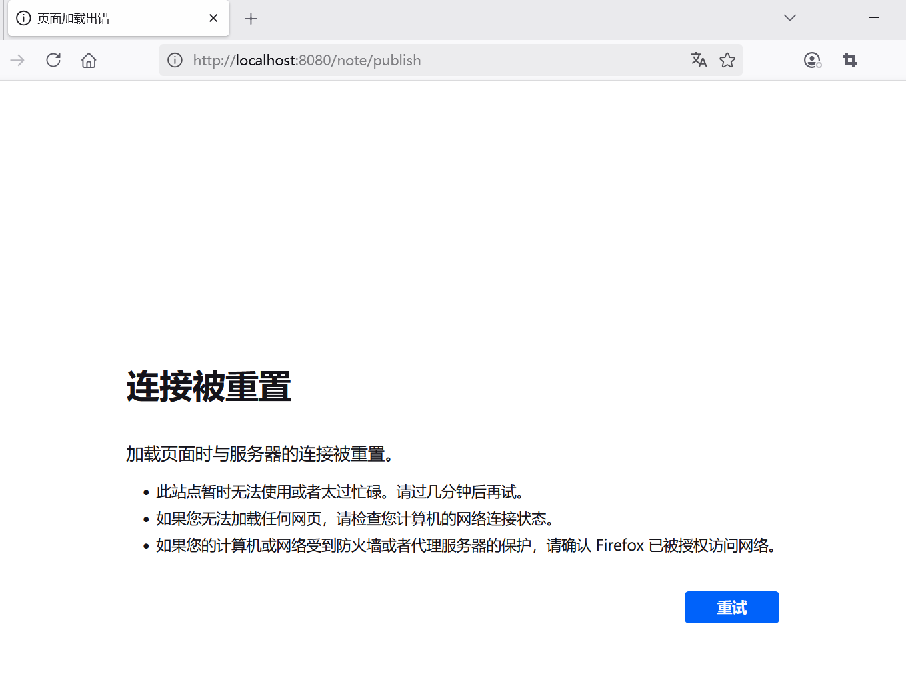
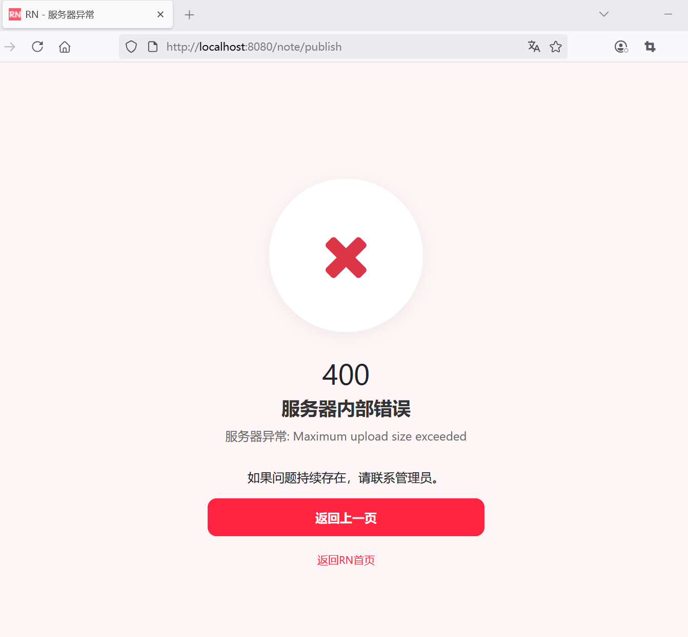

## 7.8 定义全局异常处理器，处理笔记发布过程中可能出现的异常


如果你的文件过多，体积过大，则可能遇到如下异常：

```
2025-06-09T16:03:39.448+08:00  WARN 36316 --- [rednote] [nio-8080-exec-7] .w.s.m.s.DefaultHandlerExceptionResolver : Resolved [org.springframework.web.multipart.MaxUploadSizeExceededException: Maximum upload size exceeded]
```

这个异常表示上传的文件大小超过了配置的限制。除了调整文件上传的最大大小限制配置`spring.servlet.multipart.max-file-size`和`spring.servlet.multipart.max-request-size`之外，还需要定义全局异常处理器，处理笔记发布过程中可能出现的异常。


 
### 配置全局异常处理


为了处理验证失败的情况，你可以配置一个全局异常处理器：

```java
package com.waylau.rednote.exception;

import org.slf4j.Logger;
import org.slf4j.LoggerFactory;
import org.springframework.ui.Model;
import org.springframework.web.bind.annotation.ControllerAdvice;
import org.springframework.web.bind.annotation.ExceptionHandler;
import org.springframework.web.multipart.MaxUploadSizeExceededException;


/**
 * GlobalExceptionHandler 全局异常处理
 *
 * @author <a href="https://waylau.com">Way Lau</a>
 * @version 2025/08/18
 **/
@ControllerAdvice
public class GlobalExceptionHandler {
    private static final Logger log = LoggerFactory.getLogger(GlobalExceptionHandler.class);

    @ExceptionHandler(MaxUploadSizeExceededException.class)
    public String handleMaxSizeException(MaxUploadSizeExceededException exc, Model model) {
        log.error("服务器异常：{}", exc.getMessage(), exc);

        model.addAttribute("errorCode", 400);
        model.addAttribute("errorMessage", "服务器异常：" + exc.getMessage());

        return "400-error";
    }
}
```

在 Spring MVC 中，`@ControllerAdvice` 通常用于全局处理控制器层的异常或进行一些全局的数据预处理。
`@ExceptionHandler`用于捕获特定类型的异常，并返回相应的视图。

### 使用 Thymeleaf 实现错误页面

当采用 Thymeleaf 技术时，我们可以创建专门的错误页面模板，并通过 Spring MVC 的错误处理机制将异常信息传递给这些模板。以下是完整的实现方案：


在 `src/main/resources/templates` 目录下创建错误页面400-error.html（可以复用403-error.html代码）：

```html
<!DOCTYPE html>
<html lang="en" xmlns:th="http://www.thymeleaf.org">

<head>
    <meta charset="UTF-8">
    <meta name="viewport" content="width=device-width, initial-scale=1.0">
    <title>RN - 服务器异常</title>
    <!-- 引入 Bootstrap CSS -->
    <link href="https://cdn.bootcdn.net/ajax/libs/bootstrap/5.3.6/css/bootstrap.min.css"
          th:href="@{/css/bootstrap.min.css}" rel="stylesheet">

    <!-- 引入 Font Awesome -->
    <link href="https://cdn.bootcdn.net/ajax/libs/font-awesome/4.7.0/css/font-awesome.min.css"
          th:href="@{/css/font-awesome.min.css}" rel="stylesheet">

    <!-- 自定义样式-->
    <style>
        body {
            background-color: #fef6f6;
            font-family: -apple-system, BlinkMacSystemFont, "Segoe UI", Roboto, Helvetica, Arial, sans-serif;
        }

        .error-container {
            max-width: 400px;
            margin: 0 auto;
            padding: 40px 20px;
            text-align: center;
        }

        .error-icon {
            font-size: 80px;
            color: #ff2442;
            margin-bottom: 20px;
        }

        .error-title {
            font-size: 24px;
            font-weight: 700;
            color: #333;
            margin-bottom: 10px;
        }

        .error-message {
            font-size: 16px;
            color: #666;
            margin-bottom: 30px;
        }

        .btn-primary {
            background-color: #ff2442;
            border-color: #ff2442;
            border-radius: 12px;
            padding: 12px;
            font-size: 16px;
            font-weight: 600;
            transition: all 0.3s ease;
            width: 100%;
        }

        .btn-primary:hover,
        .btn-primary:focus {
            background-color: #e61e3a;
            border-color: #e61e3a;
            box-shadow: 0 4px 12px rgba(255, 36, 66, 0.2);
        }

        .back-home {
            margin-top: 20px;
            font-size: 14px;
            color: #999;
        }

        .back-home a {
            color: #ff2442;
            text-decoration: none;
        }

        .back-home a:hover {
            text-decoration: underline;
        }

        .error-image {
            width: 200px;
            height: 200px;
            margin: 0 auto 30px;
            background-color: #fff;
            border-radius: 50%;
            display: flex;
            align-items: center;
            justify-content: center;
            box-shadow: 0 4px 20px rgba(0, 0, 0, 0.05);
        }

        .error-image img {
            width: 120px;
            height: 120px;
        }
    </style>
</head>
<body class="d-flex align-items-center min-vh-100 py-4">
<div class="container">
    <div class="error-container">
        <!-- 错误图标 -->
        <div class="error-image">
            <i class="fa fa-lock fa-5x text-danger"></i>
        </div>

        <!-- 错误标题 -->
        <h2 class="error-code" th:text="${errorCode}">400</h2>
        <h2 class="error-title">服务器内部错误</h2>

        <!-- 错误信息 -->
        <p class="error-message" th:text="${errorMessage}">
            服务器遇到了问题，请稍后再试。
        </p>
        <div class="error-details">
            <p>
                如果问题持续存在，请联系管理员。
            </p>
        </div>

        <!-- 返回按钮 -->
        <button class="btn btn-primary" onclick="goBack()">返回上一页</button>

        <!-- 跳转到首页 -->
        <p class="back-home">
            <a href="/" th:href="@{/}">返回RN首页</a>
        </p>
    </div>
</div>

<!-- Bootstrap JS -->
<script src="https://cdn.bootcdn.net/ajax/libs/bootstrap/5.3.6/js/bootstrap.bundle.min.js"
        th:src="@{/js/bootstrap.bundle.min.js}"></script>

<script>
    // 返回按钮点击事件
    function goBack() {
        window.history.back();
    }
</script>
</body>
</html>
```


### 未跳转到指定的错误页面？

虽然配置了全局异常处理，但也可能未跳转到未跳转到指定的错误页面400-error.html，具体界面显示如下：





观察控制台日志，可以看到报错信息：


```
Caused by: org.apache.tomcat.util.http.fileupload.impl.SizeLimitExceededException: the request was rejected because its size (10692204) exceeds the configured maximum (10485760)
	at org.apache.tomcat.util.http.fileupload.impl.FileItemIteratorImpl.init(FileItemIteratorImpl.java:161) ~[tomcat-embed-core-10.1.41.jar:10.1.41]
	at org.apache.tomcat.util.http.fileupload.impl.FileItemIteratorImpl.getMultiPartStream(FileItemIteratorImpl.java:205) ~[tomcat-embed-core-10.1.41.jar:10.1.41]
	at org.apache.tomcat.util.http.fileupload.impl.FileItemIteratorImpl.findNextItem(FileItemIteratorImpl.java:224) ~[tomcat-embed-core-10.1.41.jar:10.1.41]
	at org.apache.tomcat.util.http.fileupload.impl.FileItemIteratorImpl.<init>(FileItemIteratorImpl.java:142) ~[tomcat-embed-core-10.1.41.jar:10.1.41]
	at org.apache.tomcat.util.http.fileupload.FileUploadBase.getItemIterator(FileUploadBase.java:252) ~[tomcat-embed-core-10.1.41.jar:10.1.41]
	at org.apache.tomcat.util.http.fileupload.FileUploadBase.parseRequest(FileUploadBase.java:276) ~[tomcat-embed-core-10.1.41.jar:10.1.41]
	at org.apache.catalina.connector.Request.parseParts(Request.java:2584) ~[tomcat-embed-core-10.1.41.jar:10.1.41]
	... 68 common frames omitted
```


当上传文件超 Tomcat 的大小限制后会先于 Controller 触发异常，所以这时我们的异常处理类无法捕获 Controller 层的异常。

增设如下应用配置即可：

```
# 配置内嵌的 tomcat 的最大吞吐量
server.tomcat.max-swallow-size = 100MB
```

注意上面最重要的是要配置内嵌的 tomcat 的最大吞吐量即 max-swallow-size，可以设置 -1 不限制，也可以设置一下比较大的数字这里微酷设置 100M。
这样当上传文件超大小限制后就可以被全局异常处理类捕获了，具体界面显示如下：





