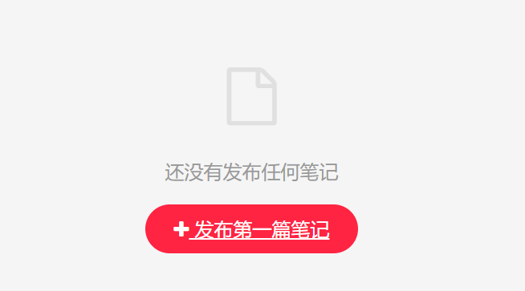
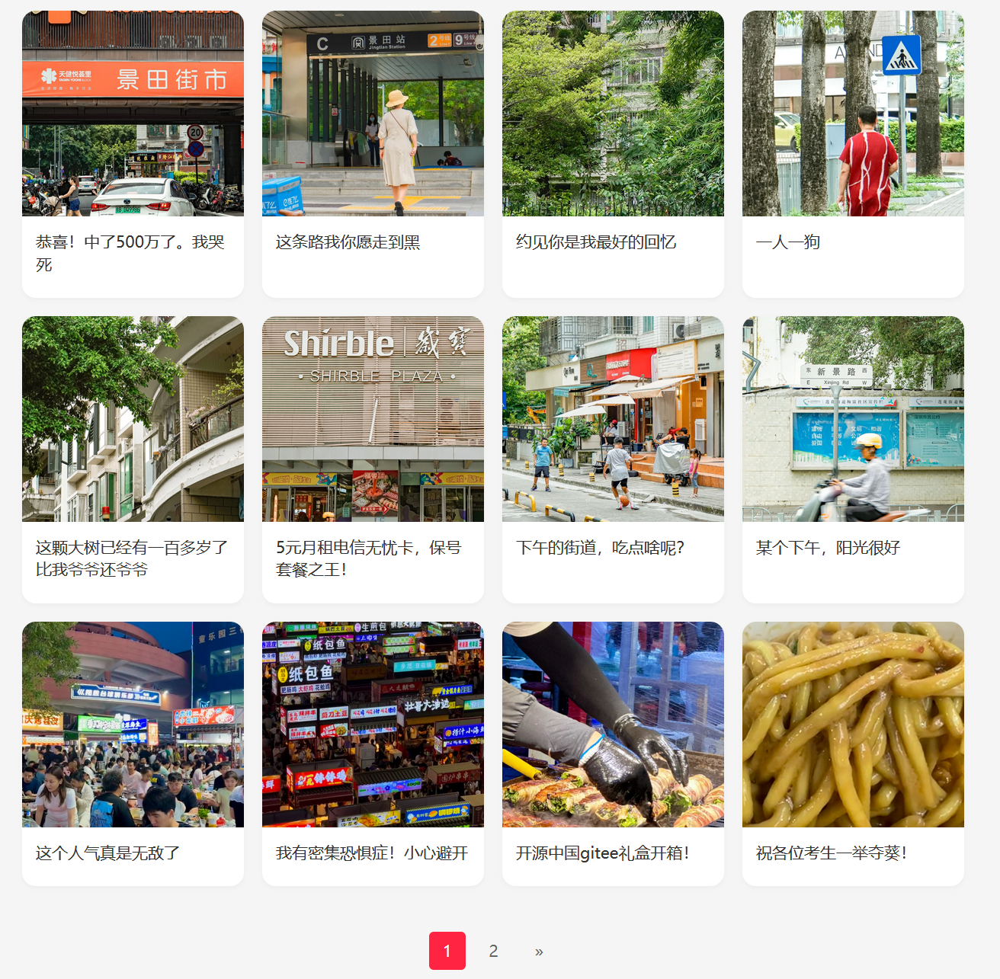

## 8.4 使用分页及网格组件设计笔记列表展示界面


修改user-profile.html，在原有的代码基础上，增加如下代码。


### 笔记列表区域

```html
<style>

    /* ...为节约篇幅，此处省略非核心内容 */
    

    /* 笔记列表 */
    .note-grid {
        display: grid;
        grid-template-columns: repeat(auto-fill, minmax(180px, 1fr));
        gap: 16px;
        padding: 16px;
    }

    .note-card {
        background-color: white;
        border-radius: 12px;
        overflow: hidden;
        box-shadow: 0 2px 4px rgba(0, 0, 0, 0.03);
        transition: transform 0.2s;
    }

    .note-card:hover {
        transform: translateY(-2px);
        box-shadow: 0 4px 8px rgba(0, 0, 0, 0.05);
    }

    .note-image {
        width: 100%;
        height: 180px;
        object-fit: cover;
    }

    .note-content {
        padding: 12px;
    }

    .note-title {
        font-size: 14px;
        font-weight: 500;
        line-height: 1.4;
        overflow: hidden;
        display: -webkit-box;
        -webkit-line-clamp: 2;
        -webkit-box-orient: vertical;
        color: #333;
        margin-bottom: 8px;
    }

    .note-meta {
        display: flex;
        justify-content: space-between;
        font-size: 12px;
        color: #999;
    }

    /* 空状态提示 */
    .empty-state {
        padding: 48px;
        text-align: center;
    }

    .empty-icon {
        font-size: 48px;
        color: #e0e0e0;
        margin-bottom: 16px;
    }

    .empty-text {
        color: #999;
        margin-bottom: 24px;
    }

    .create-note-btn {
        background-color: #ff2442;
        color: white;
        padding: 10px 24px;
        border-radius: 24px;
        font-weight: 500;
    }
</style>

<div class="container mt-5">
    <div class="row justify-content-center">
      
        <!-- 用户个人信息 -->

        <!-- ...为节约篇幅，此处省略非核心内容-->
 
        <!-- 笔记列表 -->
        <div class="col-md-8">
            <!-- 空状态提示 -->
            <div class="empty-state" th:if="${notePage.empty}">
                <div class="empty-icon">
                    <i class="fa fa-file-o"></i>
                </div>
                <div class="empty-text">
                    还没有发布任何笔记
                </div>
                <a href="/note/publish" th:href="@{/note/publish}" class="create-note-btn">
                    <i class="fa fa-plus"></i>
                    发布第一篇笔记
                </a>
            </div>

            <!-- 非空状态提示 -->
            <div class="note-grid" th:if="${!notePage.empty}">
                <!-- 循环遍历笔记列表生成笔记卡片 -->
                <div class="note-card" th:each="note : ${notePage.content}">
                    <a th:href="@{/note/{noteId}(noteId=${note.noteId})}">
                        
                    </a>
                    <div class="note-content">
                        <dive class="note-title">
                            [[${note.title}]]
                        </dive>
                    </div>
                </div>
            </div>
        </div>

        <!-- TODO 分页导航 -->
    </div>
</div>
```


上述页面考虑了两种场景。如果该用户发布过笔记，则界面效果如下图8-1所示。


点击上述笔记封面，可以跳转到该笔记的详情页面（后续实现）。


如果该用户没有发布过笔记，则界面效果如下图8-2所示。





点击上述“发布第一篇笔记”按钮，可以跳转到笔记的发布页面。


### 分页组件

```html
<style>
/* ...为节约篇幅，此处省略非核心内容*/

/* 分页组件 */
.pagination {
    padding: 24px;
    display: flex;
    justify-content: center;
    gap: 8px;
    font-size: 14px;
}

.page-btn {
    padding: 6px 12px;
    border-radius: 4px;
    color: #666;
    text-decoration: none;
}

.page-btn.active {
    background-color: #ff2442;
    color: white;
    font-weight: 500;
}
</style>

<!-- 分页导航 -->
<div class="col-md-8">
    <div class="pagination" th:if="${totalPages > 0}">
        <a class="page-btn" th:if="${currentPage > 1}"
            th:href="@{/user/profile/{userId}(userId=${user.userId},page=${currentPage - 1})}">«</a>

        <a class="page-btn" th:each="pageNum : ${#numbers.sequence(1, totalPages)}"
            th:href="@{/user/profile/{userId}(userId=${user.userId},page=${pageNum})}"
            th:classappend="${pageNum == currentPage} ? ' active'">[[${pageNum}]]</a>

        <a class="page-btn" th:if="${currentPage < totalPages}"
            th:href="@{/user/profile/{userId}(userId=${user.userId},page=${currentPage + 1})}">»</a>

    </div>
</div>
```


界面效果如下图8-3所示。




