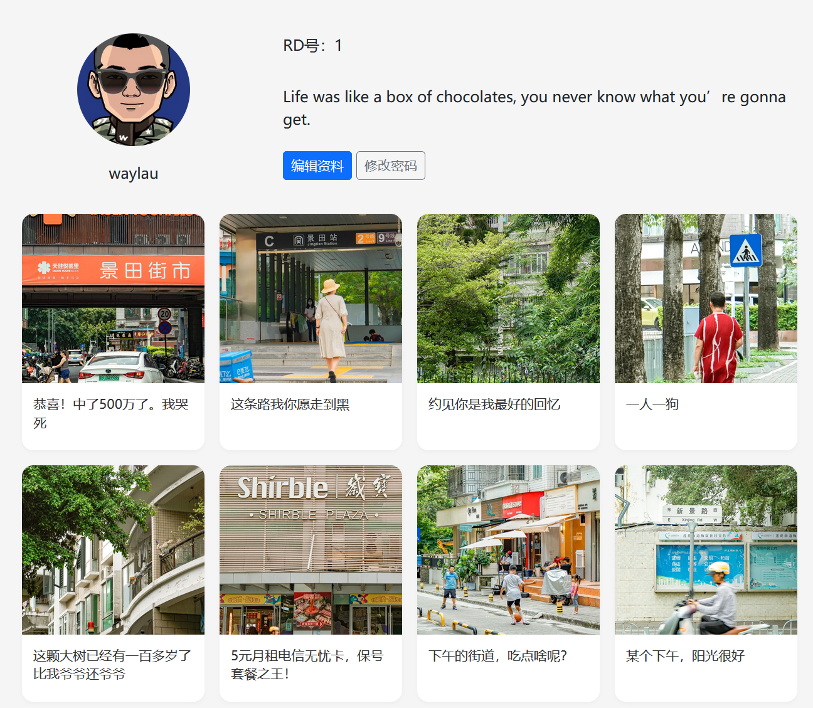
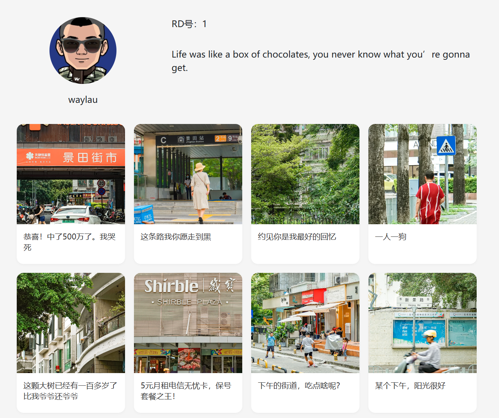

## 8.5 区用户信息展示分自己视角和访客视角的技巧


因为用户信息展示区包括了对用户个人信息的操作（编辑资料和修改密码），因此，需要调整原有的用户信息展示界面，以区分自己视角和访客视角。

* 自己视角：可以看到“编辑资料”按钮和“修改密码”按钮。
* 访客视角：看不到“编辑资料”按钮和“修改密码”按钮。


### 用户个人信息


用户个人信息代码调整如下：

```html
<!-- 用户个人信息 -->
<div class="col-md-8">
    <!--<div class="card">-->
        <!--<div class="card-header">
            个人资料
        </div>-->
        <!--<div class="card-body">-->
            <div class="row">
                <div class="col-md-4 text-center">
                    
                    <p class="mt-3">[[${user.username}]]</p>

                    <!-- 仅作者自己可见 -->
                    <div th:if="${#authentication.name == user.username}">
                        <a href="/user/edit" th:href="@{/user/edit}" class="btn btn-primary btn-sm">编辑资料</a>
                    </div>

                </div>

                <div class="col-md-8">
                    <dive class="mb-3">
                        <!--<label class="form-label">手机号</label>
                        <p class="form-control-plaintext">[[${user.phone}]]</p>-->
                        <label class="form-label">RN号：[[${user.userId}]]</label>
                    </dive>
                    <dive class="mb-3">
                        <!--<label class="form-label">个人简介</label>-->
                        <p class="form-control-plaintext">[[${user.bio ?: '这家伙很懒，什么都没写'}]]</p>
                    </dive>

                    <!-- 仅作者自己可见 -->
                    <div th:if="${#authentication.name == user.username}">
                        <a href="/user/change-password" th:href="@{/user/change-password}"
                            class="btn btn-outline-secondary">修改密码</a>
                    </div>
                </div>
            </div>
        <!--</div>
    </div>-->
</div>
```

上述代码：


* 删除了一些多余的组件，比如标题“个人资料”以及Card组件，让整个页面看起来更加符合有互联网应用的风格。
* 为了保护个人隐私，去除了手机号的展示，改为展示RN号（也就是用户ID）。
* 设置认证校验，仅用户自己可以看到自己主页的“编辑资料”按钮和“修改密码”按钮。


如果是自己的视角，界面效果如下图8-4所示。





如果是访客的视角，界面效果如下图8-5所示。




