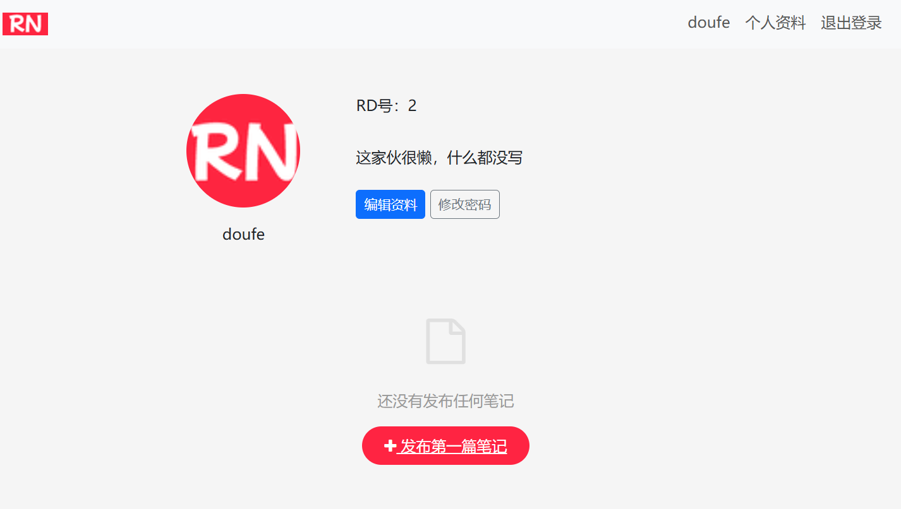
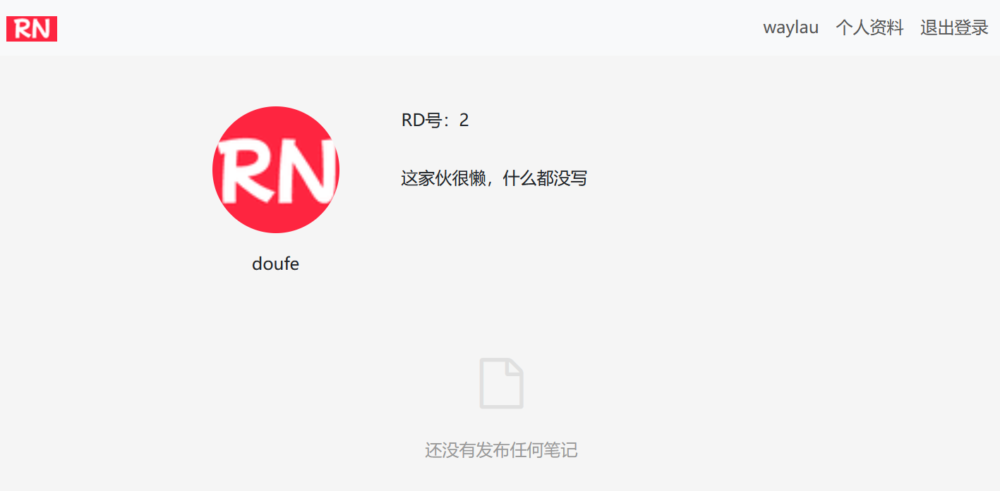

## 8.6 笔记列表展示区分自己视角和访客视角的技巧


因为笔记列表包括了对笔记发布的操作，因此，需要调整原有的笔记列表展示界面，以区分自己视角和访客视角。

* 自己视角：可以看到“发布第一篇笔记按钮。
* 访客视角：看不到“发布第一篇笔记”按钮。


### 修改笔记列表展示区域中对于空状态的处理


笔记列表展示区域中对于空状态代码调整如下：

```html
<!-- 空状态提示 -->
<div th:if="${notePage.empty}" class="empty-state">
    <div class="empty-icon"><i class="fa fa-file-o"></i></div>
    <div class="empty-text">还没有发布任何笔记</div>
    <a th:if="${#authentication.name == user.username}" th:href="@{/note/publish}" class="create-note-btn">
        <i class="fa fa-plus"></i> 发布第一篇笔记
    </a>
</div>
```


如果是自己的视角，界面效果如下图8-6所示。





如果是访客的视角，界面效果如下图8-7所示。




