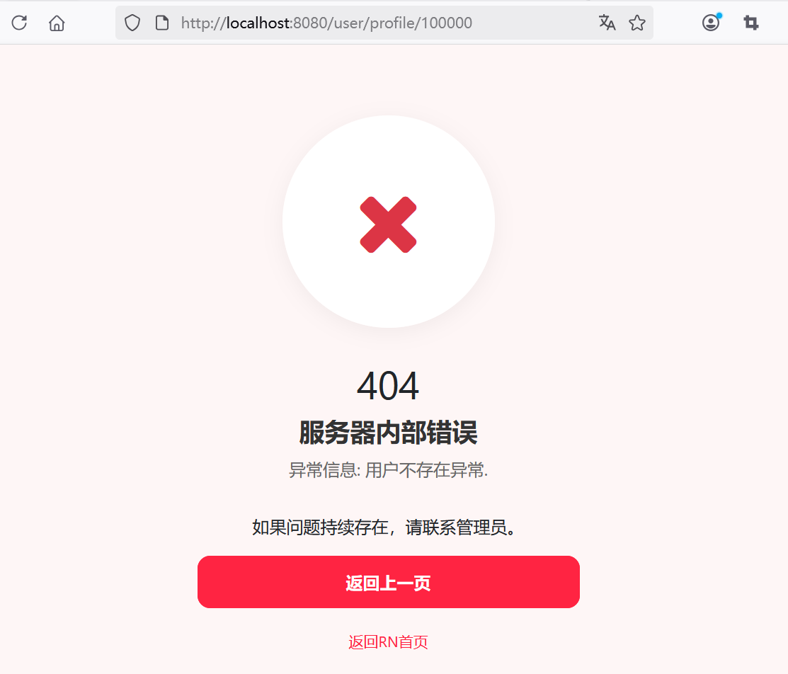

## 8.7 扩展统一异常处理UserNotFoundException


扩展统一异常处理，修改GlobalExceptionHandler，增加了对UserNotFoundException异常的处理：


```java
@ControllerAdvice
public class GlobalExceptionHandler {
    private static final Logger logger = LoggerFactory.getLogger(GlobalExceptionHandler.class);

    // ...为节约篇幅，此处省略非核心内容

    // 用户不存在异常
    @ExceptionHandler(UserNotFoundException.class)
    public String handleUserNotFoundException(UserNotFoundException ex, Model model) {
        logger.error("用户不存在异常: {}", ex.getMessage(), ex);
        model.addAttribute("errorCode", 404);
        model.addAttribute("errorMessage", "异常信息: " + ex.getMessage());
        return "400-error";
    }

}
```


当我们试图访问一个不存在的用户时，比如：<http://localhost:8080/user/profile/100000>。用户ID为100000的用户不存在，则会跳转到如下界面：





