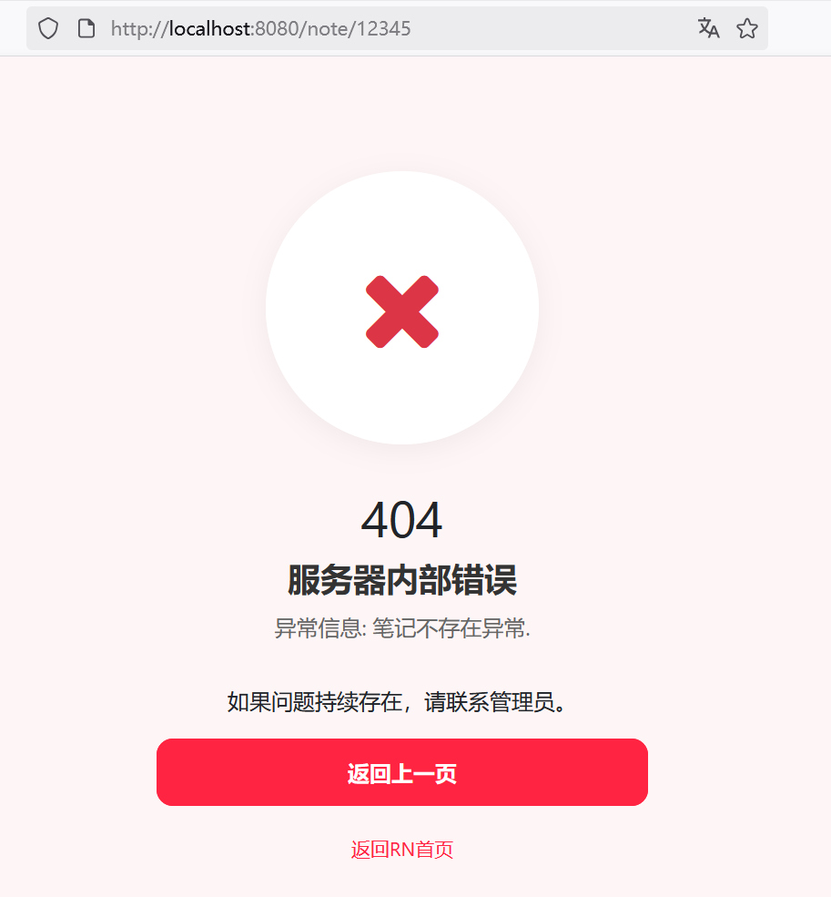

## 9.6 扩展统一异常处理NoteNotFoundException


扩展统一异常处理，增加了对NoteNotFoundException异常的处理：


```java
@ControllerAdvice
public class GlobalExceptionHandler {
    private static final Logger logger = LoggerFactory.getLogger(GlobalExceptionHandler.class);

    // ...为节约篇幅，此处省略非核心内容

    // 笔记不存在异常
    @ExceptionHandler(NoteNotFoundException.class)
    public String handleNoteNotFoundException(NoteNotFoundException ex, Model model) {
        logger.error("笔记不存在异常: {}", ex.getMessage(), ex);
        model.addAttribute("errorCode", 404);
        model.addAttribute("errorMessage", "异常信息: " + ex.getMessage());
        return "400-error";
    }

}
```


当我们试图访问一个不存在的笔记时，比如：<http://localhost:8080/note/12345>。笔记ID为12345的笔记不存在，则会跳转到如下界面：





