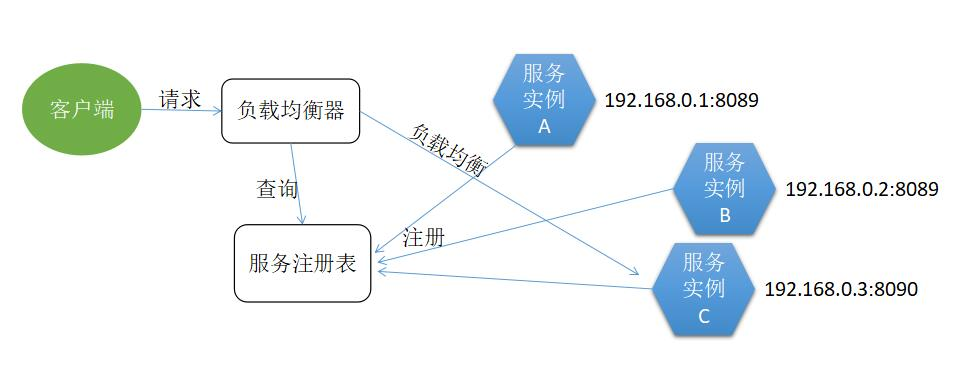

## 2.2 分布式系统概述，帮助全栈工程师构建分布式系统认知框架

对于全栈工程师而言，分布式系统并非单纯的“后端技术集合”，而是贯穿“前端交互-后端服务-数据存储-运维部署”的全链路协同体系。构建分布式系统认知，核心是理解**“如何将复杂业务拆分为独立单元，并通过规则让单元协同工作，同时解决拆分带来的新问题”**。以下从“核心定义-本质特征-核心组件-全栈视角挑战-演进逻辑”五个维度，搭建全栈工程师的分布式系统认知框架。

### 什么是分布式系统？

分布式系统的本质是**“多节点协作完成单节点无法胜任的任务”**，但需先明确两个关键前提：
- **物理分散**：节点（服务器、数据库、缓存实例等）不在同一台物理设备上，可能跨机房、跨地域（如阿里云上海节点+北京节点）；
- **逻辑统一**：用户/前端感知不到“多节点”的存在，认为是一个完整系统（例如用户刷小红书笔记，不会察觉笔记来自“北京内容服务节点”，评论来自“上海评论服务节点”）。

**对比单体系统**：单体系统是“单节点包含所有功能”（如一个JAR包包含笔记、用户、评论模块，一个数据库存储所有数据），而分布式系统是“多节点各司其职，通过网络交互协作”。

### 分布式系统常用术语

分布式系统是一门新兴的学科。为了方便后续章节的学习，先了解下分布式系统中常用的术语。

#### 1. 节点

节点（Node）是指一个可以独立按照分布式协议完成一组逻辑的程序个体。在具体的工程项目中，一个节点往往是一个操作系统上的进程。节点是一个完整的、不可分的整体，是执行分布式任务的最小的单元。

在这个高可用的分布式系统中，相同功能的程序往往会部署到不同的节点中。这种模式也称为“副本”。

#### 2. 副本

副本（Replica）指在分布式系统中为数据或服务提供的冗余。

对于数据副本而言，是指在不同的节点上持久化同一份数据，当出现某一个节点的存储的数据丢失时，可以从副本上读到数据。数据副本是分布式系统解决数据丢失异常的唯一手段。

对于服务副本而言，是指数个节点提供某种相同的服务，这种服务一般并不依赖于节点的本地存储，其所需数据一般来自其他节点。服务副本也称为“服务实例”。

例如，GFS系统的同一个chunk的数个副本就是典型的数据副本，而Map Reduce系统的Job Worker则是典型的服务副本。

图2-1展示的是一个微服务架构图，其中相同的服务会有多个服务实例（服务副本）。

#### 3. 集群

相同功能程序的副本，统称为该功能的集群。

#### 4. 通信

节点与节点之间是完全独立、相互隔离的，节点之间传递信息的唯一方式是网络通信（Communication）。图1-1中带箭头的直线表示了节点之间的消息通信。

消息通信可以是双向的或者是单向的。使用双箭头表示网络双向可达，而某些节点间只有单箭头表示网络单向可达，而某些节点间没有箭头表示网络完全不可达。

#### 5. 存储

节点可以通过将数据写入某台机器的本地存储（Storage）设备来保存数据。通常的存储设备可以是磁盘、SSD、文件，也可以是关系型数据库、NoSQL数据库、文件存储系统等。

#### 6. 状态

如果某个节点负责存储、读取数据，则该节点为有状态的节点，反之称为无状态的节点。如果某个节点A存储数据的方式是将数据通过网络发送到另一个节点B，由节点B负责将数据存储到节点B的本地存储设备，那么不能认为节点A是有状态的节点，而只有节点B是有状态的节点。

#### 7. 异常

异常主要是针对某个节点而言的。异常可能是由网络故障引起的，也可能是程序自身引起的。

需要注意的是，在高可用的分布式系统中，单个节点的异常，并不一定会影响整个分布式系统。分布式系统往往会设计一定的容错性。

#### 8. 性能

无论是分布式系统还是单机程序，都会对性能（Performance）有有所要求。对于不同的系统，关注点有所差异。常见的性能指标有：

* 吞吐能力，指系统在某一时间可以处理的数据总量，通常可以用系统每秒处理的总的数据量来衡量；
* 响应延迟，指系统完成某一功能需要使用的时间；
* 并发能力，指系统可以同时完成某一功能的能力，通常也用QPS（query per second，每秒请求数）来衡量。

上述三个性能指标往往会相互制约，追求高吞吐的系统，往往很难做到低延迟；系统平均响应时间较长时，也很难提高QPS。

#### 9. 一致性

分布式系统为了提高可用性，总是不可避免的使用副本的机制，从而引发副本一致性的问题。

根据具体的业务需求的不同，分布式系统总是提供某种一致性模型，并基于此模型提供具体的服务。

### 分布式系统的3个本质特征

全栈工程师需从“前后端协同视角”理解这些特征——它们既是分布式的优势，也是所有问题的根源：

#### 1. 去中心化：从“单点依赖”到“多节点协作”
- **核心逻辑**：没有任何一个节点是“绝对核心”，每个节点只负责部分功能（如笔记服务只处理笔记CRUD，用户服务只处理登录注册），节点间通过网络协议（HTTP、RPC、MQ）通信。
- **全栈视角体现**：
  - 前端：调用“创建笔记”接口时，无需关心背后是1个还是10个笔记服务实例（网关会自动路由）；
  - 后端：某笔记服务实例宕机，其他实例会接管请求，用户感知不到中断；
  - 风险点：节点间通信依赖网络，一旦网络延迟/中断，会出现“服务不可用”或“数据不一致”（如前端点击“发布笔记”，后端笔记服务成功但通知评论服务失败）。

#### 2. 可扩展性：按需扩容，应对业务增长
- **核心逻辑**：单体系统只能“整机扩容”（给服务器加CPU/内存），而分布式系统支持“按需扩容”——哪个模块压力大，就扩哪个模块的节点。
- **全栈视角体现**：
  - 后端：小红书笔记模块日活激增时，只需新增10个笔记服务实例，无需动用户、评论服务；数据库读写压力大时，可单独扩读库节点；
  - 前端：通过CDN（分布式内容分发网络）将静态资源（图片、JS/CSS）部署到全国节点，用户访问时自动拉取最近节点的资源，加载速度从500ms降至100ms；
  - 关键指标：**水平扩展**（加节点）而非**垂直扩展**（加硬件），是分布式系统应对高并发的核心手段。

#### 3. 容错性：局部故障不影响全局
- **核心逻辑**：单体系统“一损俱损”（数据库宕机则整个应用不可用），分布式系统通过“冗余设计”实现“局部故障隔离”。
- **全栈视角体现**：
  - 后端：Redis缓存集群中，一个节点宕机，其他从节点会自动切换为主节点，缓存服务不中断；
  - 前端：调用评论接口时，若评论服务临时故障，前端可触发“降级策略”（显示“评论加载中，稍后重试”而非整个页面崩溃）；
  - 关键设计：**冗余备份**（如数据库主从复制）、**故障检测**（如心跳机制）、**自动恢复**（如K8s重启故障容器）是容错的三大支柱。

