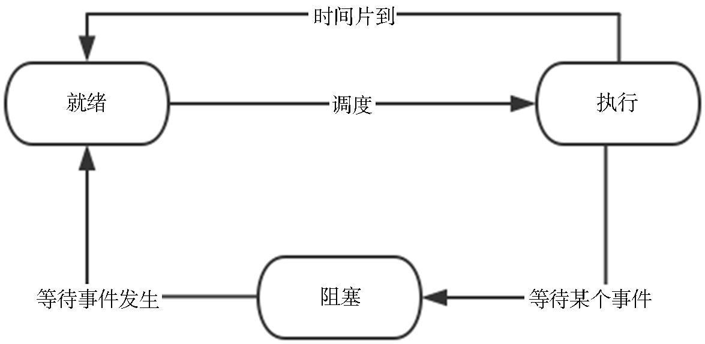

## 3.1 线程与进程原理解析，高并发应用的基石

### 3.1.1 什么是线程

在早期的计算机操作系统中，能拥有资源和独立运行的基本单位是进程。然而随着计算机技术的发展，进程出现了很多弊端，一是由于进程是资源拥有者，创建、撤消与切换存在较大的时空开销，因此需要引入轻量型进程；二是由于对称多处理机（Symmetric Multi-Processor，SMP）出现，可以满足多个运行单位，而多个进程并行开销过大。

因此在上世纪80年代，出现了能独立运行的基本单位—线程（Thread）。

线程是程序执行流的最小单元。一个标准的线程由线程ID、当前指令指针（PC）、寄存器集合和堆栈组成。另外，线程是进程中的一个实体，是被系统独立调度和分派的基本单位。线程自己不拥有系统资源，只拥有一点儿在运行中必不可少的资源，但它可与同属一个进程的其他线程共享进程所拥有的全部资源。一个线程可以创建和撤消另一个线程，同一进程中的多个线程之间可以并发执行。由于线程之间的相互制约，致使线程在运行中呈现出间断性。

典型的线程拥有三种基本状态：

* 就绪；
* 阻塞；
* 运行。

线程的状态图如图3-1所示。

就绪状态是指线程具备运行的所有条件，逻辑上可以运行，在等待处理机；运行状态是指线程占有处理机正在运行；阻塞状态是指线程在等待一个事件（如某个信号量），逻辑上不可执行。每一个程序都至少有一个线程，若程序只有一个线程，那就是程序本身。
线程是程序中一个单一的顺序控制流程，是进程内一个相对独立的、可调度的执行单元。在单个程序中同时运行多个线程完成不同的工作，称为多线程。多数情况下，多线程能提升程序的性能。

### 3.1.2 进程和线程的关系

进程和线程是并发编程的两个基本的执行单元。在大多数编程语言中，并发编程主要涉及线程。

一个计算机系统通常有许多活动的进程和线程。在给定的时间内，每个处理器中只能有一个线程得到真正的运行。对于单核处理器来说，处理时间是通过时间切片来在进程和线程之间进行共享的。

进程有一个独立的执行环境。进程通常有一个完整的、私人的基本运行时资源。特别是每个进程都有自己的内存空间。操作系统的进程表（Process table）存储了CPU寄存器值、内存映像、打开的文件、统计信息、特权信息等。进程一般定义为执行中的程序，也就是当前操作系统的某个虚拟处理器上运行的一个程序。多个进程并发共享同一个CPU以及其他硬件资源是透明的，操作系统支持进程之间的隔离。这种并发透明性需要付出相对较高的代价。

进程往往被视为等同于程序或应用程序。然而，用户看到的一个单独的应用程序可能实际上是一组合作的进程。大多数操作系统都支持进程间通信（Inter Process Communication，IPC），如管道和Socket。IPC不仅用于同个系统的进程之间的通信，也可以用在不同系统的进程之间进行通信。

线程有时被称为轻量级进程（Lightweight Process，LWP）。进程和线程都提供了一个执行环境，但创建一个新的线程比创建一个新的进程需要更少的资源。线程系统一般只维护用来让多个线程共享CPU所必须的最少量信息。特别是线程上下文（Thread Context）中一般只包含CPU上下文以及某些其他线程管理信息。通常忽略那些对于多线程管理不是完全必要的信息。这样单个进程中防止数据遭到某些线程不合法的访问的任务就完全落在了应用程序开发人员的肩上。线程不像进程那样彼此隔离以及受到操作系统的自动保护，所以在多线程程序开发过程中需要开发人员做更多的努力。

线程存在于进程中，每个进程都至少一个线程。线程共享进程的资源，包括内存和打开的文件。这使得工作变得高效，但也存在了一个潜在的问题—通信。关于通信的内容，会在后面章节中讲述。

现在多核处理器或多进程的计算机系统越来越流行。这大大增强了系统的进程和线程的并发执行能力。但即便是没有多处理器或多进程的系统中，并发仍然是可能的。关于并发的内容，会在后面章节中讲述。

### 3.1.3 线程和纤程

为了提高并发量，某些编程语言中提供了“纤程”（Fiber）的概念，比如Golang的goroutine，Erlang风格的actor。Java语言虽然没有定义纤程，但仍有一些第三方库可供选择，比如Quasar。纤程可以理解为是比线程更加细颗粒度的并发单元。同时，Java 19引入了类似的技术——虚拟线程（Virtual Threads）。不管是虚拟线程还是纤程，他们都是轻量级线程，其目的都是为了提高并发能力。

由于纤程是以用户方式代码来实现的，并不受操作系统内核管理，所以内核并不知道纤程，也就无法对纤程实现调度。纤程是根据用户定义的算法来调度的。因此，就内核而言，纤程采用了非抢占式调度方式，而线程是抢占式调度的。

一个线程可以包含一个或多个纤程。线程每次执行哪一个纤程的代码，是由用户来决定的。所以，对于开发人员来说，使用纤程可以获得更高的并发量，但同时也要面临着自己实现调度纤程的复杂度。