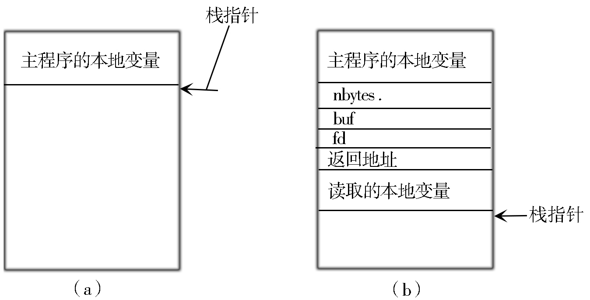

## 4.1 理解本地过程调用，初步掌握分布式体系调用技巧


进程间通信（Inter-Process Communication，IPC）指至少两个进程或线程间传送数据或信号的一些技术或方法。进程是计算机系统分配资源的最小单位。每个进程都有自己的一部分独立的系统资源，彼此是隔离的。为了能使不同的进程互相访问资源并进行协调工作，才有了进程间通信。这些进程可以运行在同一计算机上或网络连接的不同计算机上。进程间的通信技术包括消息传递、同步、共享内存和远程过程调用。进程间通信是一种标准的UNIX通信机制。


进程间通信可以分为本地过程调用和远程过程调用。

本节介绍本地过程调用。


### 4.1.1 本地过程调用的概念


本地过程调用（Local Procedure Call，LPC）是指被调用的过程（函数）与调用过程处于同一个进程中。典型的情况是，调用者通过执行某条机器指令把控制传给新过程，被调用过程保存机器寄存器的值，并在栈顶分配存放其本地变量的空间。


本地过程调用的基础是一种称为“端口(Port)”的进程间通信机制，类似于本地的Unix域的Socket。这种Port机制提供了面向报文传递（message passing）的进程间通信，而本地过程调用则是建立在这个基础上的高层机制，目的是提供跨进程的过程调用。注意这里所谓“跨进程的过程调用”不同于以前所说的“跨进程操作”。前者是双方有约定、遵循一定规程的、有控制的服务提供，被调用者在向外提供一些什么服务、即提供哪些函数调用方面是自主的，而后者则可以是在不知不觉之间的被利用、被操纵。前者是良性的，而后者可以是恶性的。

本地过程调用通常也被称为轻量过程调用或者本地进程间通信。在Windows Vista中，ALPC（Advanced Local Procedure Call，高级本地进程通信）替代了LPC。ALPC提供了一个高速可度量的通信机制，这样便于实现需要在用户模式下高速通信的用户模式驱动程序框架（UMDF，User-Mode Driver Framework）。


### 4.1.2 本地过程调用的实现


LPC是由内核的“端口”对象实现，这样可以确保安全（由访问控制表规定持有特定的安全标识符才可以访问）并可以验证链接另一端进程的身份。程序也可以对每一个信息设定安全标识符，并测试对应信息的变化，以实现每一条消息的安全性。

服务端和客户端之间典型的连接由下列过程表示：

* 服务端进程建立命名服务器连接端口对象，并等待客户端连接；
* 客户端通过向这一端口发送消息来建立连接；
* 如果服务端同意建立连接，便会建立两个无名端口：
* 客户端连接端口：客户线程由此向服务端发送数据；
* 服务端连接端口：服务端由此向客户端发送数据；每个客户端都分配一个独立的接口；
* 服务端持有一个服务连接端口的句柄，同时客户端也持有一个客户连接端口的句柄，这样进程间通信的通道就建立了。


让我们看看本地过程调用是如何在编程语言中实现的。考虑下面的C语言的调用：

```c
count = read(fd, buf, nbytes);
```

其中，fd为一个整型数，表示一个文件。buf为一个字符数组，用于存储读入的数据。nbytes为另一个整型数，用于记录实际读入的字节数。如果该调用位于主程序中，那么在调用之前堆栈的状态如图4-1（a）所示。为了进行调用，调用方首先把参数反序压入堆栈，即最后一个参数先压入，如图4-1（b）所示。在 read 操作运行完毕后，它将返回值放在某个寄存器中，移出返回地址，并将控制权交回给调用方。调用方随后将参数从堆栈中移出，使堆栈还原到最初的状态。





本地过程调用支持以下三种交换信息的方式：

* 针对较短信息（小于256字节）：系统内核在进程间直接复制消息，从发送方的地址空间拷贝消息至系统地址空间，之后再将消息拷贝至接收方的地址空间。
* 针对较长消息（大于256字节）：这需要在发送方和接收方之间建立一个共享内存区域。发送方首先将消息存放在共享内存中，再向接收方发送一个通知（可以通过如上发送短消息的方式实现），之后再由接收方从共享内存中读取这一消息。
* 当消息的数据量过大，难以放入共享内存时，服务端可以直接读取和写入客户端的地址空间。


本地过程调用在Windows NT及其衍生系统中得到了广泛应用。在Win32子系统中，LPC应用于客户端和子系统服务器之间的通信（CSRSS）。在Windows NT 3.51版本中引入了快速LPC以提高调用速度。然而由于NT4.0中将部分关键服务端移入内核模式（win32k.sys）以提高系统效能，这一方法已基本被摒弃。

本地安全认证子系统服务（LSASS），会话管理器（SMSS）以及服务控制管理器均使用LPC端口和客户进程直接通信。Winlogon和安全引用监视器与LSASS进程之间的通信同样使用了LPC。

在Windows系统中，高级本地过程调用（ALPC）拥有比以往的本地过程调用（LPC）更优的性能。因为LPC只能通过同步请求/应答机制通信，而ALPC还可以使用IOCP实现通信。这样，ALPC就可以在消息数量和进程数量间保持一定平衡，保证了端口的高速通信。此外，ALPC还允许信息的批量传输，减少了进程在用户模式和内核模式之间的切换次数。