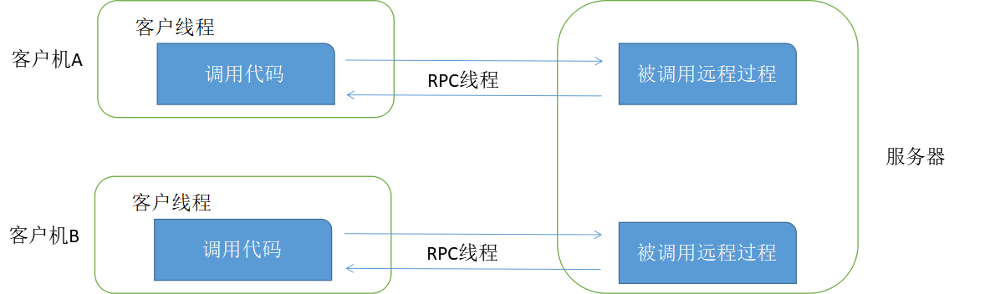
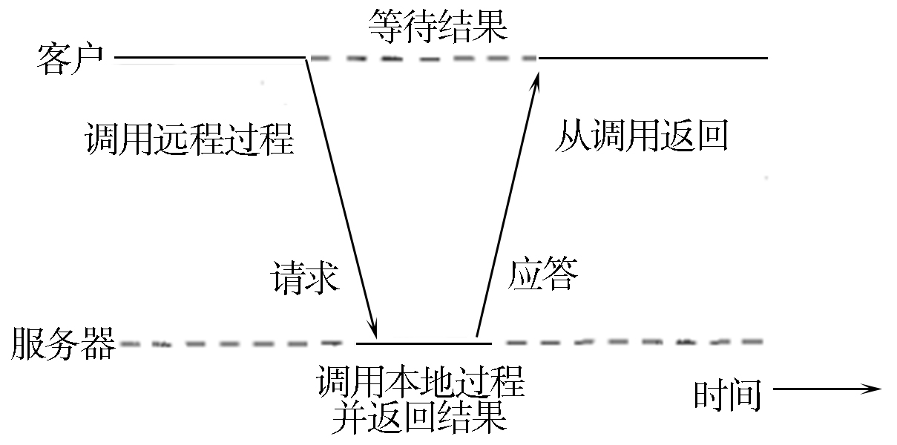
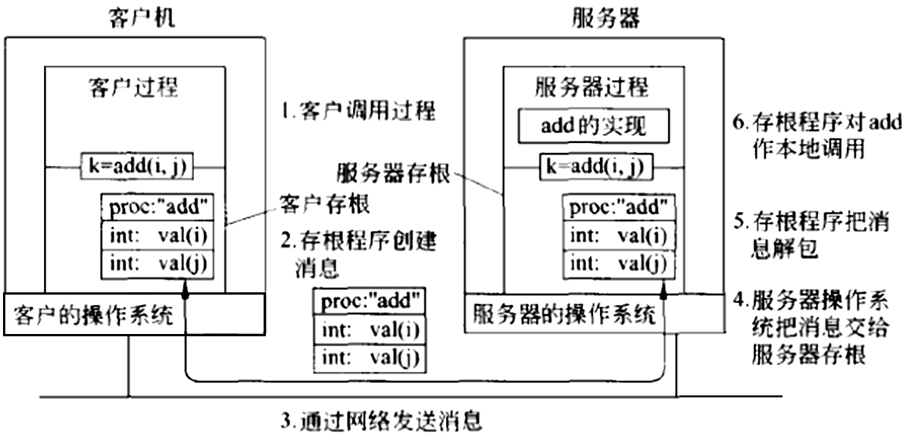

## 4.2 快速掌握远程过程调用，突破分布式服务调用障碍

RPC是远程过程调用（Remote Procedure Call）的缩写形式。Birrell和Nelson在1984发表于ACM Transactions on Computer Systems的论文*Implementing remote procedure calls*对RPC做了经典的诠释。RPC是指计算机A上的进程，调用另外一台计算机B上的进程，其中A上的调用进程被挂起，而B上的被调用进程开始执行，当值返回给A时，A进程继续执行。调用方可以通过使用参数将信息传送给被调用方，而后可以通过传回的结果得到信息。而这一过程，对于开发人员来说是透明的。
远程过程调用采用客户机/服务器（C/S）模式。请求程序就是一个客户机，而服务提供程序就是一台服务器。和常规或本地过程调用一样，远程过程调用是同步操作，在远程过程结果返回之前，需要暂时中止请求程序。使用相同地址空间的低权进程或低权线程允许同时运行多个远程过程调用。

图4-2描述了并发环境下RPC的调用过程。

### 4.2.1 远程过程调用原理

RPC背后的思想是尽量使远程过程调用具有与本地调用相同的形式。假设程序需要从某个文件中读取数据，程序员在代码中执行read调用来取得数据。在传统的系统中，read例程由链接器从库中提取出来，然后链接器再将它插入目标程序中。read过程是一个短过程，一般通过执行一个等效的read系统调用来实现，即read过程是一个位于用户代码与本地操作系统之间的接口。

虽然read中执行了系统调用，但它本身依然是通过将参数压入堆栈的常规方式实现调用的。如图4-1（b）所示，程序员并不知道read干了什么。

RPC通过类似的途径来获得透明性。当read实际上是一个远程过程时（比如在文件服务器所在的机器上运行的过程），库中就放入read的另外一个版本，称为客户存根（client stub）。这种版本的read过程同样遵循图4-1（b）的调用次序，这点与原来的read过程相同。另一个相同点是其中也执行了本地操作系统调用。唯一不同点是它不要求操作系统提供数据，而是将参数打包成消息，而后请求将此消息发送到服务器，如图4-3所示。在对send的调用后，客户存根调用receive过程，随即阻塞自己，直到收到响应消息。

当消息到达服务器时，服务器上的操作系统将它传递给服务器存根（server stub）。服务器存根是客户存根在服务器端的等价物，也是一段代码，用来将通过网络输入的请求转换为本地过程调用。服务器存根一般先调用receive，然后被阻塞，等待消息输入。收到消息后，服务器将参数从消息中提取出来，然后以常规方式调用服务器上的相应过程（见图4-3）。从服务器角度看，过程好像是由客户直接调用的一样：参数和返回地址都位于堆栈中，一切都很正常。服务器执行所要求的操作，随后将得到的结果以常规的方式返回给调用方。以read为例，服务器将用数据填充read中第二个参数指向的缓存区，该缓存区是属于服务器存根内部的。

调用完后，服务器存根要将控制权交回给客户发出调用的过程，它将结果（缓存区）打包成消息，随后调用send将结果返回给客户。事后，服务器存根一般会再次调用receive，等待下一个输入的请求。

客户机器接收到消息后，客户操作系统发现该消息属于某个客户进程（实际上该进程是客户存根，只是操作系统无法区分二者）。操作系统将消息复制到相应的缓存区中，随后解除对客户进程的阻塞。客户存根检查该消息，将结果提取出来并复制给调用者，而后以通常的方式返回。当调用者在read调用进行完毕后重新获得控制权时，它所知道的唯一事情就是已经得到了所需的数据。它不知道操作是在本地操作系统进行的，还是远程完成的。

整个方法中，客户方可以简单地忽略不关心的内容。客户所涉及的操作只是执行普通的（本地）过程调用来访问远程服务，它并不需要直接调用send和receive。消息传递的所有细节都隐藏在双方的库过程中，就像传统库隐藏了执行实际系统调用的细节一样。
概况来说，远程过程调用包含如下步骤：

* （1）客户过程以正常的方式调用客户存根。
* （2）客户存根生成一个消息，然后调用本地操作系统。
* （3）客户端操作系统将消息发送给远程操作系统。
* （4）远程操作系统将消息交给服务器存根。
* （5）服务器存根调将参数提取出来，而后调用服务器。
* （6）服务器执行要求的操作，操作完成后将结果返回给服务器存根。
* （7）服务器存根将结果打包成一个消息，而后调用本地操作系统。
* （8）服务器操作系统将含有结果的消息发送给客户端操作系统。
* （9）客户端操作系统将消息交给客户存根。
* （10）客户存根将结果从消息中提取出来，返回给调用它的客户存根。

以上步骤就是客户过程将客户存根发出的本地调用转换成对服务器过程的本地调用，而客户端和服务器都不会意识到中间步骤的存在。

RPC的主要好处是双重的。首先，程序员可以使用过程调用语义来调用远程函数并获取响应。其次，简化了编写分布式应用程序的难度，因为RPC隐藏了所有的网络代码存根函数。应用程序不必担心一些细节，比如socket、端口号以及数据的转换和解析。在OSI参考模型中，RPC跨越了会话层和表示层。

### 4.2.2 如何实现远程过程调用

要实现远程过程调用，需考虑以下几个问题。

#### 1. 如何传递参数

参数有两种，一种是值参数，一种是引用参数。

传递值参数比较简单，图4-4是一个简单RPC进行远程计算的例子。其中，远程过程add(i,j)有两个参数i和j，其结果是返回i和j的算术和。

通过RPC进行远程计算的步骤如下：

* （1）将参数放入消息中，并在消息中添加要调用的过程的名称或者编码。
* （2）消息到达服务器后，服务器存根对该消息进行分析，以判明需要调用哪个过程，随后执行相应的调用。
* （3）服务器运行完毕后，服务器存根将服务器得到的结果打包成消息送回客户存根，客户存根将结果从消息中提取出来，把结果值返回给客户端。

当然，这里只是做了简单的演示，在实际分布式系统中，还需要考虑其他情况，因为不同的机器对于数字、字符和其他类型的数据项的表示方式常有差异。比如整数型，就有Big Endian和Little Endian之分。

传递引用参数相对来说比较困难。单纯传递参数的引用（也包含指针）是完全没有意义的，因为引用地址传递给远程计算机，其指向的内存位置可能跟远程系统上完全不同。如果你想支持传递引用参数，就必须发送参数的副本，将它们放置在远程系统内存中，向它们传递一个指向服务器函数的指针，然后将对象发送回客户端，复制它的引用。如果远程过程调用必须支持引用复杂的结构，比如树和链表，它们需要将结构复制到一个无指针的表示里面（比如，一个扁平的树），并传输到远程端来重建数据结构。

#### 2. 如何表示数据

在本地系统上不存在数据不相容的问题，因为数据格式总是相同的。而在分布式系统中，不同远程机器上可能有不同的字节顺序，不同大小的整数，以及不同的浮点表示。对于RPC，如果想与异构系统通信，我们就需要想出一个“标准”来对所有数据类型进行编码，并可以作为参数传递。例如，ONC RPC使用XDR（eXternal Data Representation）格式。这些数据表示格式可以使用隐式或显式类型。隐式类型是指只传递值，而不传递变量的名称或类型。常见的例子是ONC RPC的XDR和DCE RPC的NDR。显式类型指需要传递每个字段的类型和值。常见的例子是ISO标准ASN.1（Abstract Syntax Notation）、JSON（JavaScript Object Notation）、Google Protocol Buffers，以及各种基于XML的数据表示格式。

#### 3. 如何选用传输协议

有些实现只允许使用一个协议（例如TCP）。大多数RPC实现支持几个，例如TCP、HTTP等，并允许用户选择。

#### 4. 出错时会发生什么

相比于本地过程调用，远程过程调用出错的机会更多。由于本地过程调用没有过程调用失败的概念，项目使用远程过程调用必须准备测试远程过程调用的失败或捕获异常。

#### 5. 远程调用的语义是什么

调用一个普通的过程语义很简单：当我们调用时，过程被执行。远程过程完全一次性调用成功是非常难以实现的。执行远程过程可以有如下结果：

* 如果服务器崩溃或进程在运行服务器代码之前就死了，那么远程过程会被执行0次；
* 如果一切工作正常，远程过程会被执行1次；
* 如果服务器返回服务器存根后在发送响应前就崩溃了，远程过程会被执行1次或者多次。客户端接收不到返回的响应，可以决定再试一次，因此出现多次执行函数。如果没有再试一次，函数执行一次；
* 如果客户机超时和重新传输，那么远程过程会被执行多次。也有可能是原始请求延迟了，两者都可能执行或不执行。

RPC系统通常会提供至少一次或最多一次的语义，或者在两者之间选择。如果需要了解应用程序的性质和远程过程的功能是否安全，可以通过多次调用同一个函数来验证。如果一个函数可以运行任何次数而不影响结果，这是幂等（idempotent）函数，如每天的时间、数学函数、读取静态数据等。否则，它是一个非幂等（nonidempotent）函数，如添加或修改一个文件。

#### 6. 远程调用的性能怎么样

毫无疑问，一个远程过程调用将比常规的本地过程调用慢得多，因为产生了额外的步骤以及网络传输本身存在延迟。然而，这并不应该阻止我们使用远程过程调用。

#### 7. 远程调用安全吗

使用RPC，我们必须关注各种安全问题：

* 客户端发送消息到远程过程，这个过程是可信的吗？
* 客户端发送消息到远程计算机，这个远程机器是可信的吗？
* 服务器如何验证接收的消息来自合法的客户端？服务器如何识别客户端？
* 消息在网络中传播时如何防止被其他进程嗅探？
* 如何防止消息在客户端和服务器的网络传播中被其他进程拦截和修改？
* 协议能防止重播攻击吗？
* 如何防止消息在网络传播中被意外损坏或截断？

#### 8. 远程过程调用的优点

远程过程调用有诸多优点：

* 不必担心传输地址问题。服务器可以绑定到任何可用的端口，然后用RPC名称服务来注册端口。客户端将通过该名称服务来找到对应的端口号所需要的程序。而这一切对于程序员来说是透明的。
* 系统可以独立于传输提供者。自动生成服务器存根使其可以在系统上的任何一个传输提供者上可用，包括TCP和UDP，而这些，客户端是可以动态选择的。当代码发送以后，接收消息是自动生成的，而不需要额外的编程代码。
* 应用程序在客户端只需要知道一个传输地址—名称服务，负责告诉应用程序去哪里连接服务器函数集。
* 使用函数调用模型来代替socket的发送/接收（读/写）接口。用户不需要处理参数的解析。

### 4.2.3 远程过程调用API

任何RPC实现都需要提供一组支持库。

* 名称服务操作：注册和查找绑定信息（端口、机器）。允许一个应用程序使用动态端口（操作系统分配的）。
* 绑定操作：使用适当的协议建立客户机/服务器通信（建立通信端点）。
* 终端操作：注册端点信息（协议、端口号、机器名）到名称服务并监听过程调用请求。这些函数通常被自动生成的主程序—服务器存根（骨架）所调用。
* 安全操作：系统应该提供机制保证客户端和服务器之间能够相互验证，两者之间提供一个安全的通信通道。
* 国际化操作（可能）：目前，有一小部分RPC包支持转换包括时间格式、货币格式和特定于语言的字符串的功能。
* 封送处理/数据转换操作：函数将数据序列化为一个普通的的字节数组，通过网络进行传递，并能够重建。
* 存根内存管理和垃圾收集：存根可能需要分配内存来存储参数，特别是模拟引用传递语义。RPC包需要分配和清理任何这样的内存。它们也可能需要为创建网络缓存区而分配内存。RPC包支持对象，RPC系统需要跟踪远程客户端是否仍有引用对象或一个对象是否可以删除。
* 程序标识操作：允许应用程序访问（或处理）RPC接口集的标识符，这样的服务器提供的接口集可以被用来交流和使用。
* 对象和函数的标识操作：允许将远程函数或远程对象的引用传递给其他进程，并不是所有的RPC系统都支持。

所以，判断一种通信方式是否是RPC，就看它是否提供上述的API。

### 4.2.4 远程过程调用发展历程

以下远程过程调用发展历程。

#### 1. 第一代RPC

Sun公司是第一个提供商业化RPC库和RPC编译器。在1980年代中期Sun计算机提供RPC，并在Sun Network File System（NFS）上得到支持。该协议被主要以Sun和AT&T为首的Open Network Computing（开放网络计算）作为一个标准来推动。这是一个非常轻量级RPC系统，可在大多数POSIX和类POSIX操作系统中使用，包括Linux、SunOS、OS X和各种发布版本的BSD。这样的系统被称为Sun RPC或ONC RPC。该阶段的其他代表产品还有DCE RPC。

#### 2. 第二代RPC支持对象

面向对象的语言开始在1980年代末兴起，很明显，当时的Sun ONC和DCE RPC系统都没有提供任何支持，诸如从远程类实例化远程对象、跟踪对象的实例或提供支持多态性。现有的RPC机制虽然可以运作，但它们仍然不支持自动、透明的方式的面向对象编程技术。该阶段的主要产品有微软DCOM（COM+）、CORBA、Java RMI。

#### 3. 第三代RPC以及Web Services

传统RPC解决方案可以工作在互联网上，但问题是，它们通常严重依赖于动态端口分配，往往要进行额外的防火墙配置。Web Services成为一组协议，允许服务被发布、发现，并用于技术无关的形式。即服务不应该依赖于客户的语言、操作系统或机器架构。该阶段的代表产品有XML-RPC、SOAP、Microsoft .NET Remoting、JAX-WS等。