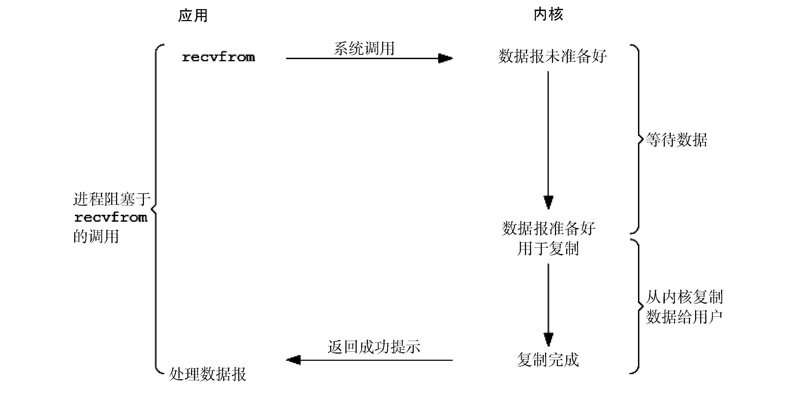
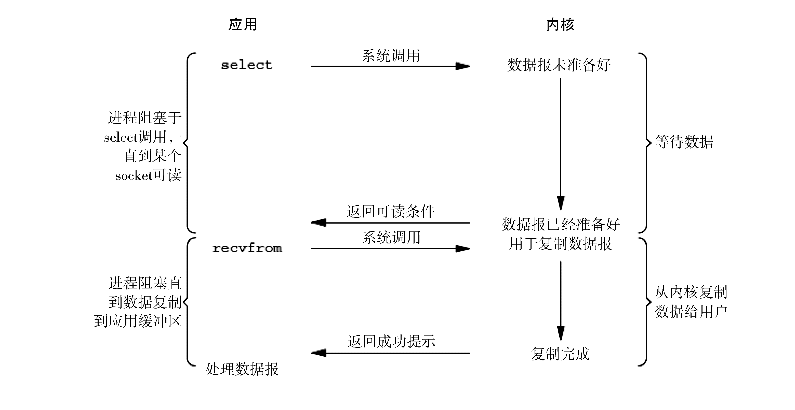

## 4.3 掌握常用网络I/O模型，建立系统级性能优化思维

I/O操作主要是操作系统来完成的。根据UNIX的设计，共有五种类型的I/O模型：

* 阻塞I/O；
* 非阻塞I/O；
* I/O复用（select和poll）；
* 信号驱动I/O（SIGIO）；
* 异步I/O（`Posix.1`的`aio_`系列函数）。

上述模型或多或少的影响了其他操作系统的I/O模型设计。

### 4.3.1 阻塞I/O模型

阻塞I/O模型是指，当请求无法立即完成则保持阻塞。主要分为以下两个阶段：

* 阶段1：等待数据就绪。网络I/O的情况就是等待远端数据陆续抵达；磁盘I/O的情况就是等待磁盘数据从磁盘上读取到内核态内存中。
* 阶段2：数据复制。出于系统安全，用户态的程序没有权限直接读取内核态内存，因此内核负责把内核态内存中的数据复制一份到用户态内存中。

阻塞I/O模型如图4-5所示。

本节中将recvfrom函数视为系统调用。一般recvfrom实现都有一个从应用程序进程中运行到内核中运行的切换，一段事件后再跟一个返回到应用进程的切换。

图4-5中，进程阻塞的整段时间是指从调用recvfrom开始到它返回的这段时间，当进程返回成功指示时，应用进程开始处理数据报。

### 4.3.2 非阻塞I/O模型

非阻塞I/O模型处理流程如下：

* socket设置为NONBLOCK（非阻塞）就是告诉内核，当所请求的I/O操作无法完成时，不要将进程睡眠，而是立刻返回一个错误码（EWOULDBLOCK），这样请求就不会阻塞；
* I/O操作函数将不断地测试数据是否已经准备好，如果没有准备好，继续测试，直到数据准备好为止。整个I/O请求的过程中，虽然用户线程每次发起I/O请求后可以立即返回，但是为了等到数据，仍需要不断地轮询、重复请求，这是对CPU时间的极大浪费。
* 数据准备好了，从内核复制到用户空间。

非阻塞I/O模型如图4-6所示。

一般很少直接使用这种模型，而是在其他I/O模型中使用非阻塞I/O这一特性。这种方式对单个I/O请求的意义不大，但给I/O复用铺平了道路。

### 4.3.3 I/O复用模型

I/O复用会用到select或者poll函数，在这两个系统调用中的某一个上阻塞，而不是阻塞于真正的I/O系统调用。函数也会使进程阻塞，但是和阻塞I/O所不同的是，这两个函数可以同时阻塞多个I/O操作。而且可以同时对多个读操作、多个写操作的I/O函数进行检测，直到有数据可读或可写时，才真正调用I/O操作函数。

I/O复用模型如图4-7所示。

从流程上来看，使用select函数进行I/O请求和同步阻塞模型没有太大的区别，甚至还多了添加监视socket，以及调用select函数的额外操作，效率更差。但是，使用select最大的优势是用户可以在一个线程内同时处理多个socket的I/O请求。用户可以注册多个socket，然后不断地调用select来读取被激活的socket，即可达到在同一个线程内同时处理多个I/O请求的目的。而在同步阻塞模型中，必须通过多线程的方式才能达到这个目的。

I/O复用模型使用了Reactor设计模式实现了这一机制。

调用select/poll该方法由一个用户态线程负责轮询多个socket，直到某个阶段1的数据就绪，再通知实际的用户线程执行阶段2的复制操作。通过一个专职的用户态线程执行非阻塞I/O轮询，模拟实现了阶段1的异步化。

在Java领域，著名的网络编程框架Netty就是采用了Reactor模型。

### 4.3.4 信号驱动I/O（SIGIO）模型

首先，我们允许socket进行信号驱动I/O，并通过调用sigaction来安装一个信号处理函数，进程继续运行并不阻塞。当数据准备好时，进程会收到一个SIGIO信号，可以在信号处理函数中调用recvfrom来读取数据报，并通知主循环数据已准备好被处理，也可以通知主循环，让它来读取数据报。

信号驱动I/O（SIGIO）模型如图4-8所示。

该模型的好处是，当等待数据报到达时，可以不阻塞。主循环可以继续执行，只是等待信号处理程序的通知；或者数据已准备好被处理，或者数据报已准备好被读。

### 4.3.5 异步I/O模型

异步I/O是POSIX规范定义的。通常，这些函数会通知内核来启动操作并在整个操作（包括从内核复制数据到我们的缓存中）完成时通知我们。

该模式与信号驱动I/O（SIGIO）模型的不同点在于，驱动I/O（SIGIO）模型告诉我们I/O操作何时可以启动，而异步I/O模型告诉我们I/O操作何时完成。

调用aio_read函数，告诉内核传递描述字、缓存区指针、缓存区大小、文件偏移，然后立即返回，我们的进程不阻塞于等待I/O操作的完成。当内核将数据复制到缓存区后，才会生成一个信号，来通知应用程序。

异步I/O模型如图4-9所示。

异步I/O模型使用了Proactor设计模式实现了这一机制。异步I/O模型会告知内核，当整个过程（包括阶段1和阶段2）全部完成时，通知应用程序来读数据。

### 4.3.6 几种I/O模型的比较

前四种模型的区别是阶段1不相同，阶段2基本相同，都是将数据从内核复制到调用者的缓存区。而异步I/O的两个阶段都不同于前四个模型。几种I/O模型的比较如图4-10所示。

同步I/O操作引起请求进程阻塞，直到I/O操作完成。异步I/O操作不引起请求进程阻塞。上面前四个模型—阻塞I/O模型、非阻塞I/O模型、I/O复用模型和信号驱动I/O模型都是同步I/O模型，而异步I/O模型才是真正的异步I/O。
