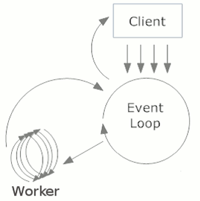
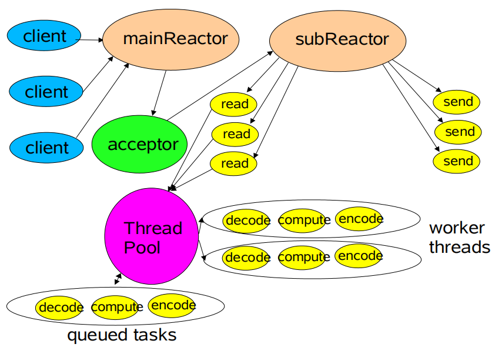
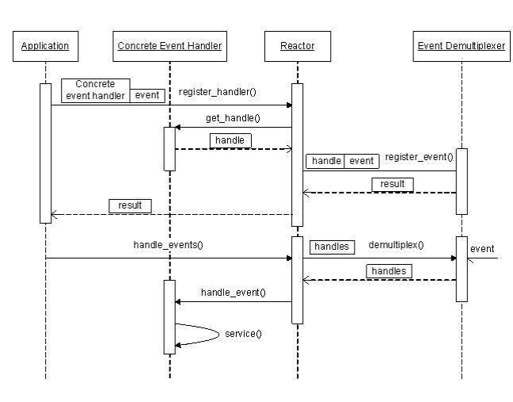
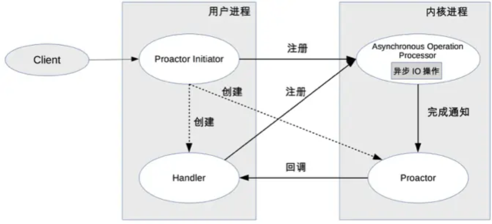

## 4.8 理解分布式下的事件驱动，突破同步编程思维定式

在GUI编程中，事件是非常常见的。比如，用户在界面点击了按钮，就会发送一个“点击”事件，而相应的会有一个处理“点击”事件的事件处理器会来处理该事件。因此，

所谓事件驱动，简单地说就是你点什么按钮（即产生什么事件），电脑执行什么操作（即调用什么函数）。当然事件也不仅限于用户的操作，事件驱动的核心自然是事件。从事件角度说，事件驱动程序的基本结构是由一个事件收集器、一个事件发送器和一个事件处理器组成。事件收集器专门负责收集所有事件，包括来自用户的（如鼠标、键盘事件等）、来自硬件的（如时钟事件等）和来自软件的（如操作系统、应用程序本身等）。事件发送器负责将收集器收集到的事件分发到目标对象中。事件处理器做具体的事件响应工作，它往往要到实现阶段才完全确定。对于框架的使用者来说，他们唯一能够看到的是事件处理器。这也是他们所关心的内容。

 

### 4.8.1 事件驱动编程

事件驱动编程通常只是用一个执行过程，CPU之间不是并发的，在处理多任务的时候，事件驱动编程是使用协作式处理任务，而不是多线程的抢占式。事件驱动简洁易用，只需要注册感兴趣的事件，在回调中设计逻辑就可以了。在调用的过程中，事件循环器（Event Loop）在等待事件的发生，跟着调用处理器。事件处理器不是抢占式的，处理器一般只有很短的生命周期。

 

#### 1. 事件驱动编程的优势

* 在大部分的应用场景中，事件编程优与多线程编程。
* 相对与多线程编程来讲，事件驱动编程比较容易，复杂度低，是开发者乐于接受的。
* 大多数的GUI框架，都是使用事件驱动编程架构的。每一个事件会绑定一个处理器，这些事件通常是点击按钮、选择菜单等等。处理器来实现具体的行为逻辑。
* 事件驱动经常使用在I/O框架中，可以很好的实现I/O复用。很多高性能的I/O框架都是使用事件驱动模型的，例如：Mina、Netty、Node.js[1]。
* 易于调试。时间依赖只和事件有关系，而不是内部调度。问题容易暴露。

#### 2. 事件驱动编程的劣势

* 如果处理器占用时间较长，那会阻塞应用程序的响应。
* 无法通过时间来维护本地状态，因为处理器必须返回。
* 通常在单CPU环境下，比多线程编程要快，因为没有锁的因素，没有线程切换的损耗。CPU不是并发的，这样的话就不适合用在一些科学计算的应用中。

 

### 4.8.2 事件循环（Event Loop）的实现

事件循环（Event Loop）是一个程序结构，用于等待和发送消息和事件。事件驱动编程的代码核心就是事件循环器，在Linux下推荐使用epoll实现，在其它没有epol的系统上可以使用kqueue/ports/poll/select实现。

 

下图是事件循环的工作示例图。事件循环器不断接受来自客户端（Client）的请求，事件循环器把请求转交给注册了某类事件的工作线程（Worker）处理。

 

 

 

根据实现的方式不同，在网络编程中基于事件驱动主要有两种设计模式：Reactor和Proactor。

 

 

### 4.8.3 Reactor模型

首先来回想一下普通函数调用的机制：

*  程序调用某函数->函数执行
*  程序等待->函数返回结果
*  控制权返回给程序->程序继续处理

 

和普通函数调用的不同之处在于：应用程序不是主动的调用某个API完成处理，而是恰恰相反，应用程序需要提供相应的接口并注册到Reactor上，如果相应的事件发生，Reactor将主动调用应用程序注册的接口，这些接口又称为“回调函数”。

 

用“好莱坞原则”来形容Reactor再合适不过了：不要打电话给我们，我们会打电话通知你。

 

举个例子：你去应聘某某公司，面试结束后。

*  “普通函数调用机制”公司HR比较懒，不会记你的联系方式，那怎么办呢，你只能面试完后自己打电话去问结果；有没有被录取啊，还是被拒了；
*  “Reactor”公司HR就记下了你的联系方式，结果出来后会主动打电话通知你：有没有被录取啊，还是被拒了；你不用自己打电话去问结果，事实上也不能，因为你没有HR的联系方式。

 
以下是Reactor示意图。

 

 
 
 
#### 1. Reactor模型的优点

Reactor模型是编写高性能网络服务器的必备技术之一，它具有如下的优点：

* 响应快，不必为单个同步时间所阻塞，虽然Reactor本身依然是同步的；
* 编程相对简单，可以最大程度的避免复杂的多线程及同步问题，并且避免了多线程/进程的切换开销；
* 可扩展性，可以方便的通过增加Reactor实例个数来充分利用CPU资源；
* 可复用性，Reactor框架本身与具体事件处理逻辑无关，具有很高的复用性。

#### 2. Reactor模型框架

使用Reactor模型，必备的几个组件：事件源、Reactor框架、事件多路复用机制和事件处理程序，先来看看Reactor模型的整体框架，接下来再对每个组件做逐一说明。

* 事件源：Linux上是文件描述符，Windows上就是Socket或者Handle了，这里统一称为“句柄集”；程序在指定的句柄上注册关心的事件，比如I/O事件。
* 事件多路复用机制：由操作系统提供的I/O多路复用机制，比如select和epoll。程序首先将其关心的句柄（事件源）及其事件注册到多路复用机制上。当有事件到达时，事件多路复用机制会发出通知“在已经注册的句柄集中，一个或多个句柄的事件已经就绪”。程序收到通知后，就可以在非阻塞的情况下对事件进行处理了。
* Reactor。是事件管理的接口，内部使用事件多路复用机制注册、注销事件；并运行事件循环，当有事件进入“就绪”状态时，调用注册事件的回调函数处理事件。
* 事件处理程序。事件处理程序提供了一组接口，每个接口对应了一种类型的事件，供Reactor在相应的事件发生时调用，执行相应的事件处理。通常它会绑定一个有效的句柄。

 

 

使用Reactor模型后，事件控制流是什么样子呢？可以参见下面的序列图。

 

 

 

我们分别以读操作和写操作为例来看看Reactor中的具体步骤：

* 应用程序注册读就绪事件和相关联的事件处理器；
* 事件分离器等待事件的发生；
* 当发生读就绪事件的时候，事件分离器调用第一步注册的事件处理器；
* 事件处理器首先执行实际的读取操作，然后根据读取到的内容进行进一步的处理。

 

写入操作类似于读取操作，只不过第一步注册的是写就绪事件。

### 4.8.4 Proactor模型

我们来看看Proactor模型中读取操作和写入操作的过程：

* 应用程序初始化一个异步读取操作，然后注册相应的事件处理器，此时事件处理器不关注读取就绪事件，而是关注读取完成事件，这是区别于Reactor的关键。
* 事件分离器等待读取操作完成事件。
* 在事件分离器等待读取操作完成的时候，操作系统调用内核线程完成读取操作（异步I/O都是操作系统负责将数据读写到应用传递进来的缓冲区供应用程序操作），并将读取的内容放入用户传递过来的缓存区中。这也是区别于Reactor的一点。
* 事件分离器捕获到读取完成事件后，激活应用程序注册的事件处理器，事件处理器直接从缓存区读取数据，而不需要进行实际的读取操作。

 

Proactor中写入操作与读取操作类似，只不过感兴趣的事件是写入完成事件。

 

从上面可以看出，Reactor和Proactor模型的主要区别就是真正的读取和写入操作是有谁来完成的，Reactor中需要应用程序自己读取或者写入数据，而Proactor模型中，应用程序不需要进行实际的读写过程，它只需要从缓存区读取或者写入即可，操作系统会读取缓存区或者写入缓存区到真正的I/O设备。

 

 

[1]有关Netty和Node.js方面的内容，可以参阅笔者所著的《Netty原理解析与开发实战》《Node.js企业级应用开发实战》