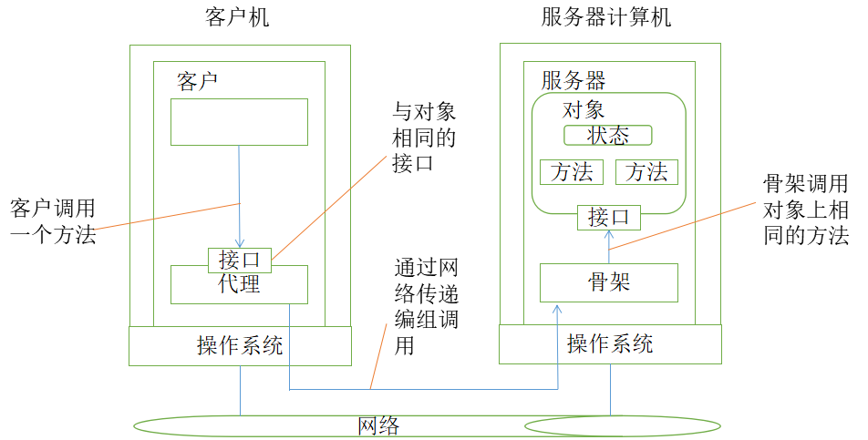

## 6.3 面向对象的分布式架构：从单体到分布式的平滑过渡路径示

在基于对象的分布式系统中，对象的概念在分布式实现中起着极其关键的作用。从原理上来讲，所有的一切都可以被作为对象抽象出来，而客户端将以调用对象的方式来获得服务和资源。

分布式对象之所以成为重要的范型，是因为它相对比较容易地把分布的特性隐藏在对象接口后面。此外，因为对象实际上可以是任何事务，所以它也是构建系统的强大范型。

面向对象技术于20世纪80年代开始用于开发分布式系统。同样，在达到高度分布式透明性的同时，通过远程服务器宿主独立对象的理念构成了开发新一代分布式系统的稳固的基础。在本节中，我们将看到基于对象的分布式系统的常用体系结构。

### 6.3.1 基本概念

面向对象的分布式架构是一种融合了面向对象编程思想和分布式计算技术的软件架构模式，它将系统中的各种元素视为具有特定属性和行为的对象，并使这些对象能够在分布式环境中协同工作，以实现复杂的业务功能。

常见的面向对象的分布式架构技术包括微软DCOM（COM+）、CORBA、Java RMI等。

面向对象的分布式架构包含以下基本概念。

- **面向对象**：源于面向对象编程（OOP），将现实世界中的事物抽象为对象，每个对象都有自己的状态（属性）和行为（方法）。对象之间通过消息传递进行交互，这种方式使得软件结构更清晰，易于理解、维护和扩展。
- **分布式**：指系统的各个组件分布在不同的物理节点上，通过网络进行通信和协作。分布式架构可以将任务分散到多个节点上并行处理，提高系统的处理能力和可靠性，同时能够灵活地扩展系统规模以应对不同的业务需求。
- **融合**：面向对象的分布式架构就是将面向对象的思想应用到分布式系统中，使分布式系统中的各个节点和组件都可以看作是具有独立功能的对象，它们在网络环境下相互协作，共同完成系统的整体任务。

### 6.3.2 基本原理

软件世界中的对象和现实世界中的对象类似，对象存储状态在属性里，而通过方法来暴露其行为。方法对对象的内部状态进行操作，并作为对象与对象之间通信的主要机制。隐藏对象内部状态，通过方法进行所有的交互操作，这是面向对象编程的一个基本原则：数据封装（data encapsulation），可以通过接口（interface）来使用方法。一个对象可能实现多个接口，而给定的一个接口定义可能有多个对象为其提供实现。

把接口与实现这些接口的对象进行分隔，对于分布式系统是至关重要的。严格的隔离允许我们把接口放在一台机器上，而使对象本身驻留在另外一台机器上。这种组织通常称为分布式对象（distributed object），如图6-1所示。

当客户绑定（bind）到一个分布式对象时，就会把这个对象的接口的实现—称为代理（proxy）—加载进客户的地址空间中。代理类似于RPC系统中的客户存根（client stub）。它所做的事是把方法调用编组进消息中，以及对应答消息进行解组，把方法调用的结果返回给客户。实际的对象驻留在服务器计算机上，它在这里提供了与它在客户机上提供的相同的接口。进入的调用请求首先被传递给服务器存根，服务器存根对它们进行解码，在服务器中的对象接口上进行方法的调用。服务器存根还负责对应答进行编码，并把应答消息转发给客户端代理。

服务器端存根通常被称为骨架（skeleton），因为它提供了明确的方式，允许服务器中间件来访问用户定义的对象。实际上，它通常以特定于语言的类的形式包含不完整的代码，需要开发人员来进一步对其进行特殊化处理。

大多数分布式对象的一个特性是它们的状态不是分布式的。状态驻留在单台机器上，在其他机器上，智能地使用被对象实现的接口，这样的对象也被称为远程对象（remote object）。分布式对象的状态本身可能物理地分布在多台机器上，但是这种分布对于对象接口背后的客户来说是透明的。

### 6.3.3 关键特点

面向对象的分布式架构具有以下关键特点。

- **封装性**：每个对象都将其内部状态和操作封装起来，对外提供统一的接口。在分布式环境中，这意味着每个节点上的对象可以独立地进行数据处理和业务逻辑执行，而不需要暴露其内部的实现细节，提高了系统的安全性和可维护性。
- **继承性**：允许新对象继承已有对象的属性和行为，在分布式架构中，可以利用继承来实现代码的复用和功能的扩展。例如，在一个分布式的电商系统中，不同类型的商品对象可以继承商品基类的共同属性和方法，同时又可以根据自身特点定义独特的属性和行为。
- **多态性**：同一操作可以根据对象的不同类型而有不同的行为表现。在分布式系统中，多态性使得不同节点上的对象可以以统一的方式进行交互，而具体的操作实现则根据对象的实际类型来确定，增加了系统的灵活性和可扩展性。
- **分布式协作**：各个对象分布在不同的节点上，但能够通过网络进行有效的通信和协作。它们可以根据业务需求，在不同的节点之间传递消息、共享数据，共同完成复杂的任务，实现了系统的分布式处理能力。
- **可扩展性**：由于系统中的对象可以独立扩展，因此面向对象的分布式架构能够方便地应对业务增长带来的压力。可以根据需要在分布式系统中添加新的节点或对象，以增加系统的处理能力和功能，而不会对整体架构造成太大的影响。

### 6.3.4 架构组成

面向对象的分布式架构一般由以下部分组成。

- **对象层**：是架构的基础，包含了系统中的各种对象，如业务对象、数据对象等。这些对象具有各自的属性和方法，负责实现具体的业务逻辑和数据处理功能。
- **通信层**：负责在不同节点上的对象之间建立通信通道，实现消息的传递和数据的交换。常见的通信协议和技术如TCP/IP、HTTP、RPC（远程过程调用）等都可以在这一层中使用。
- **协调层**：用于协调各个对象之间的协作和交互，确保它们能够按照预定的规则和流程共同完成任务。协调层可以实现分布式事务处理、任务调度、资源管理等功能，保证系统的一致性和高效运行。
- **数据层**：负责数据的存储和管理，在分布式环境中，数据可能分布在多个节点上的不同数据库或存储设备中。数据层需要提供数据的一致性保证、数据复制、数据缓存等功能，以支持对象对数据的高效访问。

### 6.3.5 应用场景

面向对象的分布式架构有以下应用场景。

- **大型互联网应用**：如社交媒体平台、电商平台等，用户数量庞大，业务功能复杂，需要处理海量的数据和高并发的请求。面向对象的分布式架构可以将不同的业务功能封装成对象，分布在多个服务器上进行处理，提高系统的性能和可扩展性。
- **企业级应用集成**：在企业内部，往往存在多个不同的业务系统，如ERP、CRM、OA等。采用面向对象的分布式架构可以将这些系统中的各个功能模块视为对象，通过分布式通信和协作实现系统之间的集成和数据共享，提高企业的信息化管理水平。
- **分布式计算和大数据处理**：在科学计算、气象预报、金融风险分析等领域，需要处理大量的数据和复杂的计算任务。面向对象的分布式架构可以将计算任务分解为多个子任务，分配到不同的节点上并行处理，充分利用分布式系统的计算能力，提高数据处理的效率。

