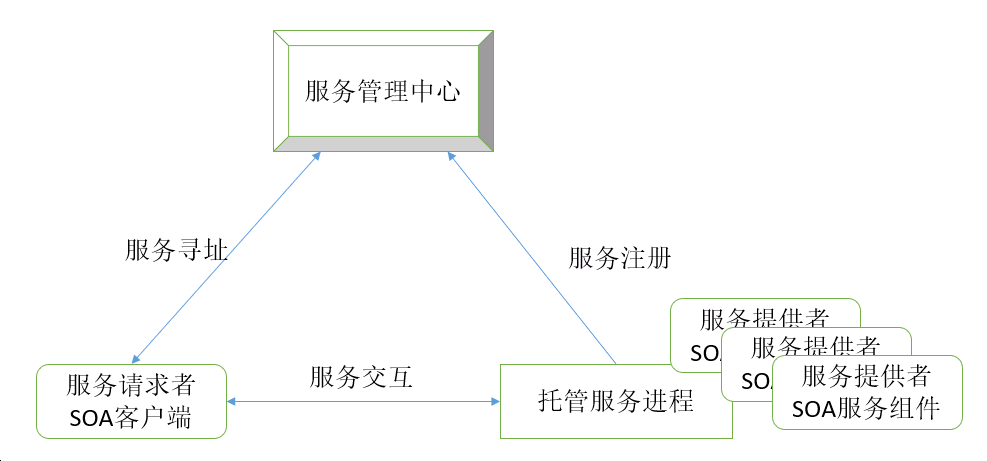

## 6.4 面向服务的分布式架构：让系统可维护性提升300%的秘籍

在当今数字化时代，软件系统的规模和复杂度不断攀升，对架构的灵活性、可扩展性与互操作性提出了更高要求。面向服务的架构（Service Oriented Architecture，SOA）应运而生，它正逐渐成为构建大型复杂软件系统的主流架构模式。

### 6.4.1 核心概念

面向服务的架构将软件系统设计为一组松散耦合、可独立部署和管理的服务集合。每个服务都围绕特定的业务功能构建，具备明确的接口定义，以实现与其他服务的交互。这些服务分布在不同的物理节点上，通过网络进行通信协作，共同完成系统的整体业务目标。

想象一个大型电商平台，用户下单、库存管理、支付处理等功能都可被抽象为一个个独立的服务。下单服务负责接收用户订单信息，库存服务处理库存的查询与更新，支付服务则专注于完成支付流程。它们各自独立运行，却又相互配合，如同交响乐团中的不同乐器，各自演奏独特旋律，共同奏响和谐乐章。

### 6.4.2 关键特性

面向服务的架构具有以下关键特性。

- **服务封装**：每个服务将实现特定业务功能的逻辑封装在内，对外提供统一的接口。这就如同黑盒，使用者无需了解其内部实现细节，只需关注接口契约。例如，地图导航服务对开发者而言，只需调用其提供的接口输入起点和终点，就能获取导航路线，而不必关心地图数据的存储与算法实现。
- **松耦合**：服务之间的依赖关系被降至最低，一个服务的内部变更（如算法优化、数据存储方式改变）不会对其他服务造成直接影响。在电商平台中，支付服务从使用第三方支付接口A切换到接口B，只要新接口能满足原有的契约，下单服务和库存服务无需进行任何修改。
- **可复用**：服务的设计着眼于通用性，一个服务可被多个不同的应用或业务流程复用。例如，用户身份验证服务不仅可用于电商平台的登录环节，还能被同一企业的其他业务系统（如供应链管理系统）复用，极大提高了开发效率与资源利用率。
- **分布式部署**：服务可根据需求部署在不同的服务器或云端节点上，实现负载均衡与资源优化利用。大型电商在促销活动期间，可将订单处理服务部署在更多的服务器上，以应对高并发的订单请求，确保系统的稳定性和响应速度。

### 6.4.3 架构构成

在SOA架构中，必须有如下重要实体角色，如图6-2所示。

- **服务提供者**：创建并提供服务的实体，负责实现具体的业务逻辑，并通过网络对外发布服务接口。例如，物流服务提供商开发的物流跟踪服务，为电商平台等客户提供包裹位置查询等功能。
- **服务请求者**：需要使用服务的应用或其他服务，通过查找服务接口并发送请求来获取服务。在电商平台中，用户下单后，订单服务作为请求者调用物流服务的接口，获取订单的物流信息。
- **服务注册中心**：类似于电话簿，负责记录服务提供者发布的服务信息（如服务名称、接口地址、服务描述等）。服务请求者可通过注册中心查找所需服务的详细信息。例如，新开发的电商营销活动系统可在注册中心查找库存服务的接口地址，以便在活动策划时实时了解商品库存情况。

SOA体系结构中的每个实体都扮演着服务提供者、请求者和管理中心这三种角色中的某一种（或多种）。SOA体系结构中的操作包括：

* 服务注册。为了使服务可访问．需要服务提供者向服务管理中心注册服务以使服务请求者可以发现和调用它。
* 服务寻址。服务请求者定位服务．方法是查询服务注册中心来找到满足其服务需求的服务资源网络地址。
* 服务交互（远程服务调用）。在完成服务寻址之后，服务请求者根据与目标服务提供者建立的网络通道来调用服务。

### 6.4.4 通信与交互

在面向服务的分布式架构中，服务之间的通信通常通过网络协议进行。这些服务可以独立开发、部署和运维，使得系统的开发迭代更加敏捷，能够快速响应市场变化。

- **基于标准协议**：服务之间的通信通常基于标准的网络协议，如HTTP、SOAP（Simple Object Access Protocol，简单对象访问协议）、REST（Representational State Transfer，表述性状态转移）等。HTTP协议因其简单通用、跨平台性强，成为最常用的通信协议之一；SOAP则更注重消息的规范性与安全性，适用于对数据传输要求较高的场景；REST以其简洁的设计风格和高效的性能，在互联网应用中广泛应用。
- **异步与同步交互**：服务间交互既支持同步方式，即请求者发送请求后等待服务提供者响应，如同在餐厅点餐等待上菜；也支持异步方式，请求者发送请求后无需等待，可继续执行其他任务，服务提供者处理完成后通过消息队列等方式通知请求者，类似点外卖后可以继续做自己的事，等外卖送达通知。

### 6.4.5 应用场景

面向服务的分布式架构适合以下应用场景。

- **企业应用集成（EAI）**：企业内部往往存在多个异构的业务系统，如ERP、CRM、HR系统等。面向服务的分布式架构可将这些系统的功能封装为服务，实现系统间的无缝集成与数据共享，打破信息孤岛。例如，财务系统可调用HR系统的员工薪资数据进行成本核算，同时将财务报表数据提供给管理层决策支持系统。
- **云计算与微服务架构**：在云计算环境中，面向服务的分布式架构是实现软件即服务（SaaS）模式的重要基础。微服务架构则是其一种更细粒度的应用，将大型应用拆分为多个小型的、独立的服务，每个服务专注于单一业务功能，通过分布式协作实现复杂业务。例如，Netflix通过微服务架构将视频推荐、播放、用户管理等功能拆分为多个服务，实现了高度灵活和可扩展的视频流媒体平台。
- **物联网（IoT）**：在物联网场景下，大量的设备和传感器产生海量数据，需要不同的服务进行数据收集、分析与处理。面向服务的分布式架构可将设备管理、数据存储、数据分析等功能设计为服务，实现物联网系统的高效运行与管理。例如，智能城市系统中，通过不同服务处理来自交通传感器、环境监测设备等的数据，实现交通优化、环境预警等功能。 

### 6.4.6 Web服务的分类

在技术层面上，Web服务可以通过多种方式实现。目前，业界主流分类方法是将Web服务区分为“大”Web服务和RESTful Web服务。

#### 1. “大”Web服务

“大”Web服务使用遵循简单对象访问协议（SOAP）标准的XML消息，SOAP是一种定义消息架构和消息格式的XML语言。此类系统通常包含服务所提供的操作的机器可读描述，用Web服务描述语言（WSDL）编写，WSDL是一种用于按语法定义接口的XML语言。

基于SOAP的设计必须包含以下元素。

* 必须建立正式合同来描述Web服务提供的接口。WSDL可以用来描述契约的细节，它可能包括消息、操作、绑定和Web服务的位置。还可以在`JAX-WS`服务中处理SOAP消息，而无需发布WSDL。
* 架构必须满足复杂的非功能性需求。许多Web服务规范满足了这些需求，并为它们建立了通用词汇表。例如，事务、安全、寻址、信任、协调等等。
* 架构需要处理异步处理和调用。在这种情况下，标准（如Web服务可靠消息）和API（如`JAX-WS`）提供的基础设施及其客户端异步调用支持可以开箱即用。

#### 2. RESTful Web服务

REST非常适合基本的、即席的集成场景。RESTful Web服务通常比基于SOAP的服务更好地与HTTP集成，因此不需要XML消息或WSDL服务API定义。RESTful Web服务也简称为REST服务。

由于RESTful Web服务使用现有的知名W3C和IETF标准（HTTP、XML、URI、MIME），并且具有轻量级基础结构，允许以最少的工具构建服务，因此开发RESTful Web服务成本较低，因此具有很低的采用门坎。

RESTful设计一般满足一下特征。

* Web服务是完全无状态的。一个好的测试是考虑交互是否能在服务器重新启动后存活下来。
缓存基础设施可用于提高性能。如果Web服务返回的数据不是动态生成的并且可以缓存，那么可以利用Web服务器和其他中介固有提供的缓存基础设施来提高性能。但是，开发人员必须小心，因为对于大多数服务器来说，这种缓存仅限于HTTP GET方法。
* 服务生产者和服务消费者对传递的上下文和内容有相互理解。因为没有正式的方法来描述Web服务接口，所以双方必须就描述正在交换的数据的模式和有意义地处理数据的方法达成一致。在现实世界中，将服务作为RESTful实现公开的大多数商业应用程序还以流行的编程语言向开发人员分发描述接口的所谓增值工具包。
* 带宽尤其重要，需要限制。REST对于一些受限设备（例如物联网设备和手机）特别有用，对于这些设备，必须限制XML有效负载上的头和SOAP元素的额外层的开销。

有关RESTful Web服务的内容，还将在后续“REST风格的架构”章节详细讲解。

#### 3. Web服务技术选型

选择使用 “大”Web服务和RESTful Web服务是要针对具体的场景的。

* “大”Web服务：解决企业计算中常见的高级QoS需求。与RESTful Web服务相比，“大”Web服务更容易支持`WS-*`组协议，这些协议提供了安全性和可靠性等标准，并与其他符合`WS-*`的客户机和服务器进行互操作。在老的遗留项目或者是传统的企业级项目中，“大”Web服务还有用武之地。
* RESTful Web服务：使编写Web应用程序更轻松，这些应用程序应用REST风格的部分或全部约束，从而在应用程序中引入所需的属性，例如松耦合（在不破坏现有客户端的情况下，更轻松地演进服务器）、可伸缩性（从小到大）和架构简单性（使用现成组件，例如代理或HTTP路由器）。许多类型的客户端使用RESTful Web服务比较容易，同时允许服务器端进行演进和扩展。客户可以选择使用服务的部分或全部方面，并将其与其他基于Web的服务混搭起来。随着移动APP、云计算、Cloud Native、微服务等架构的兴起，越来越多的应用倾向于使用RESTful Web服务。