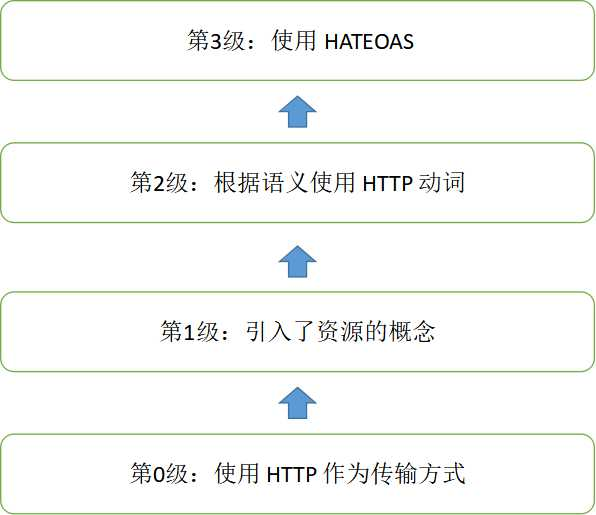

## 6.6 REST风格的架构：理解表述性状态转移

在“面向服务的分布式架构”一节中，我们介绍了Web服务。其中Web服务又可以分为“大”Web服务及RESTful Web服务。

本节将深入讨论RESTful Web服务及其架构风格。

### 6.6.1 什么是REST

一说到REST，大家都耳熟能详，很多人的第一反应就是认为这是前端请求后台的一种通信方式。甚至有些人将REST和RPC混为一谈，认为两者都是基于HTTP的类似的东西。实际上，很少人能详细讲述REST所提出的各个约束、风格特点以及如何开始搭建REST服务。

REST（REpresentation State Transfer，表述性状态转移）描述了一个架构样式的网络系统，比如Web应用程序。它首次出现在2000年Roy Fielding的博士论文*Architectural Styles and the Design of Network-based Software Architectures中*。Roy Fielding还是HTTP规范的主要编写者之一，也是Apache HTTP服务器项目的共同创立者。所以这篇文章一发表，就引起了极大的反响。很多公司或者组织如雨后春笋般宣称自己的应用或者服务实现了REST API。但该论文实际上只是描述了一种架构风格，并未对具体的实现作出规范。所以社会上，各大厂商不免存在浑水摸鱼或者“挂羊头卖狗肉”地误用或者滥用REST。所以在这种背景下，Roy Fielding不得不再次发文做了澄清，坦言了他的失望，并对SocialSite REST API提出了批评。同时他还指出，除非应用状态引擎是超文本驱动的，否则它就不是REST或REST API。据此，他给出了REST API应该具备的条件：

* REST API不应该依赖于任何通信协议，尽管要成功映射到某个协议可能会依赖于元数据的可用性、所选的方法等。
* REST API不应该包含对通信协议的任何改动，除非是补充或确定标准协议中未规定的部分。
* REST API应该将大部分的描述工作放在定义用于表示资源和驱动应用状态的媒体类型上，或定义现有标准媒体类型的扩展关系名和（或）支持超文本的标记。
* REST API绝不应该定义一个固定的资源名或层次结构（客户端和服务器之间的明显耦合）。
* REST API永远也不应该有那些会影响客户端的“类型化”资源。
* REST API不应该要求有先验知识（prior knowledge），除了初始URI和适合目标用户的一组标准化的媒体类型（即，它能被任何潜在使用该API的客户端理解）。

REST并非标准，而是一种开发Web应用的架构风格，可以将其理解为一种设计模式。REST基于HTTP、URI以及XML这些现有的广泛流行的协议和标准，伴随着REST的应用，HTTP协议得到了更加正确的使用。

### 6.6.2 REST设计原则

REST指的是一组架构约束条件和原则。满足这些约束条件和原则的应用程序或设计就是REST。

相较于基于SOAP和WSDL的Web服务，REST模式提供了更为简洁的实现方案。RESTful Web服务是松耦合的，这特别适用于为客户创建在互联网传播的轻量级的Web服务 API。REST应用是围绕“资源表述的转移（the transfer of representations of resources）”为中心来做请求和响应的。数据和功能均被视为资源，并使用统一的资源标识符（URI）来访问资源。网页里面的链接就是典型的URI。该资源由文档表述，并通过使用一组简单的、定义明确的操作来执行。

例如，一个REST资源可能是一个城市当前的天气情况。该资源的表述可能是一个XML文档、图像文件或HTML页面。客户端可以检索特定表述，通过更新其数据来修改资源，或者完全删除该资源。

目前，越来越多的Web服务开始采用REST风格设计和实现，真实世界中比较著名的REST服务包括：Google AJAX搜索API、Amazon Simple Storage Service（Amazon S3）等。

基于REST的Web服务遵循一些基本的设计原则，使得REST应用更加简单、轻量，开发速度也更快。这些原则包括：

* 通过URI来标识资源。系统中的每一个对象或资源都可以通过一个唯一的URI来进行寻址，URI的结构应该简单、可预测且易于理解，比如定义目录结构式的URI。
* 统一接口。以遵循RFC-2616所定义的协议的方式显式地使用HTTP方法，建立创建、检索、更新和删除（CRUD：Create、Retrieve、Update 及 Delete）操作与HTTP方法之间的一对一映射。
  * 若要在服务器上创建资源，应该使用POST方法；
  * 若要检索某个资源，应该使用GET方法；
  * 若要更新或者添加资源，应该使用PUT方法；
  * 若要删除某个资源，应该使用DELETE方法。
* 资源多重表述。URI所访问的每个资源都可以使用不同的形式加以表示（比如XML或者JSON），具体的表现形式取决于访问资源的客户端，客户端与服务提供者使用一种内容协商的机制（请求头与MIME类型）来选择合适的数据格式，最小化彼此之间的数据耦合。在REST的世界中，资源即状态，而互联网就是一个巨大的状态机，每个网页是其一个状态；URI是状态的表述；REST风格的应用则是从一个状态迁移到下一个状态的状态转移过程。早期的互联网只有静态页面的时候，通过超链接在静态网页之间间浏览跳转的模式就是一种典型的状态转移过程。也就是说，早期的互联网就是天然的REST。
* 无状态。对服务器端的请求应该是无状态的，完整、独立的请求不要求服务器在处理请求时检索任何类型的应用程序上下文或状态。无状态约束使服务器的变化对客户端是不可见的，因为在两次连续的请求中，客户端并不依赖于同一台服务器。一个客户端从某台服务器上收到一份包含链接的文档，当它要做一些处理时，这台服务器宕掉了，可能是硬盘坏掉而被拿去修理，也可能是软件需要升级重启——如果这个客户端访问了从这台服务器接收的链接，它不会察觉到后台的服务器已经改变了。通过超链接实现有状态交互，即请求消息是自包含的（每次交互都包含完整的信息），有多种技术实现了不同请求间状态信息的传输，例如URI、cookies和隐藏表单字段等，状态可以嵌入到应答消息里，这样一来状态在接下来的交互中仍然有效。REST风格应用可以实现交互，但它却天然地具有服务器无状态的特征。在状态迁移的过程中，服务器不需要记录任何Session，所有的状态都通过URI的形式记录在了客户端。更准确地说，这里的无状态服务器，是指服务器不保存会话状态（Session）；而资源本身则是天然的状态，通常是需要被保存的；这里的无状态服务器均指无会话状态服务器。

### 6.6.3 成熟度模型

正如前文所述，正确、完整的使用REST是困难的，关键在于Roy Fielding所定义的REST只是一种架构风格，它并不是规范，所以也就缺乏可以直接参考的依据。好在Leonard Richardson补充了这方面的不足。他提出的关于REST的成熟度模型（Richardson Maturity Model），将REST的实现划分为不同的等级。图6-3展示了不同等级的成熟度模型。

* 第0级：使用HTTP作为传输方式。
* 第1级：引入了资源的概念。每个资源有对应的标识符和表达。所以，不是将所有的请求发送到单个服务端点（Service Endpoint），而是和单独的资源进行交互。
* 第2级：根据语义使用HTTP动词。Web服务使用不同的HTTP方法来进行不同的操作，并且使用HTTP状态码来表示不同的结果。例如， GET方法用来获取资源， DELETE方法用来删除资源。
* 第3级：使用HATEOAS。HATEOAS是Hypertext As The Engine Of Application State的缩写，是指在资源的表达中包含了链接信息，客户端可以根据链接来发现可以执行的动作。