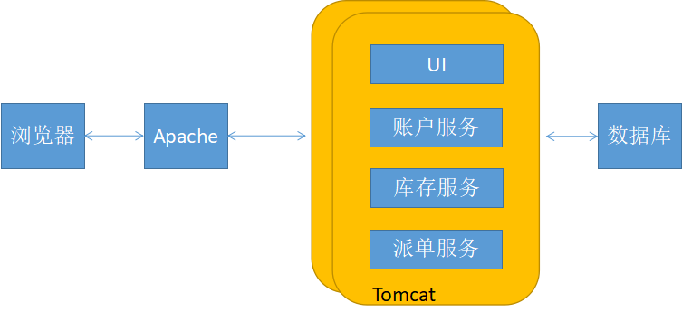
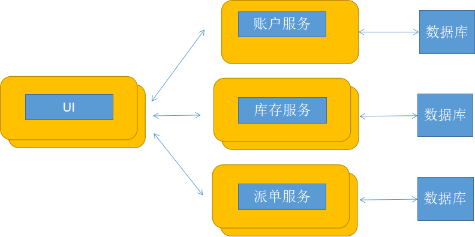

## 6.7 微服务架构：掌握从分布式单体到真正业务自治的破局之路

自2014年业界提出“微服务（Microservices）”的概念以来，微服务架构就不断演进，并且日趋火爆。越来越多的企业拥抱微服务，期望通过微服务的架构来解决大型项目的管理与运维。

那么什么是微服务？微服务架构与传统的SOA架构有什么区别？何时应该采用微服务架构？如何构建微服务？本节就针对上述提到的问题，来简单介绍下微服务架构。

### 6.7.1 什么是微服务架构

微服务架构（Microservices Architecture，MSA）的出现并非偶然，而是与这个时代的软件思想、技术工具的发展有着密切的联系。比如，将业务功能服务化，是SOA的延续；RESTful 等架构的兴起，让我们可以考虑更多轻量化的通信机制；领域驱动设计指导我们如何分析并模型化复杂的业务；敏捷方法论帮助我们拥抱变化，快速反馈；持续集成和持续交付（CI/CD）促使我们构建更快、更可靠、更频繁的软件部署和交付能力；虚拟化和容器技术的发展，使我们简化了部署环境的创建、安装；DevOps文化的流行以及全栈自治团队的出现，使得小团队更加全功能化。这些都是推动微服务架构诞生和发展的重要因素。

实际上，业界对于微服务本身并没有一个严格的定义。James Lewis和Martin Fowler对微服务架构做了如下定义：

*简言之，微服务架构风格就像是把小的服务开发成单一应用的形式，运行在其自己的进程中，并采用轻量级的机制进行通信（一般是HTTP资源API）。这些服务都是围绕业务能力来构建的，通过全自动部署工具来实现独立部署。这些服务可以使用不同的编程语言和不同的数据存储技术，并保持最小化集中管理。*

MSA包含如下特征：

* 组件以服务形式来提供—正如其名，微服务也是面向服务的。
* 围绕业务功能进行组织—微服务更倾向于围绕业务功能对服务结构进行划分、拆解。这样的服务，是针对业务领域有着关完整实现的软件，它包含使用接口、持久存储以及对应的交互。因此团队应该是跨职能的，包含完整的开发技术—用户体验、数据库以及项目管理。
* 产品不是项目—传统的开发模式致力于提供一些被认为是完整的软件。一旦开发完成，软件将移交给维护或者实施部门，然后开发组就可以解散了。而微服务要求开发团队对软件产品的整个生命周期负责。这要求开发者每天都关注软件产品的运行情况，并与用户联系的更紧密，同时承担一些售后支持。越小的服务粒度越容易促进用户与服务提供商之前的关系。Amazon的理念就是“You build it, you run it”，这也正是DevOps的文化理念。
* 强化终端及弱化通道—微服务的应用致力于松耦合和高内聚，它们更喜欢简单的REST风格，而不是复杂的协议（如WS或者BPEL或者集中式框架）。或者采用轻量级消息总线（如RabbitMQ或ZeroMQ等）来发布消息。
* 分散治理—这是跟传统的集中式管理有很大区别的地方。微服务把整体式框架中的组件拆分成不同的服务，在构建它们时将会有更多的选择。
* 分散数据管理—当整体式的应用使用单一逻辑数据库对数据持久化时，企业通常选择在应用的范围内使用一个数据库。微服务让每个服务管理自己的数据库：无论是相同数据库的不同实例，或者是不同的数据库系统。
* 基础设施自动化—云计算，特别是AWS的发展，减少了构建、发布、运维微服务的复杂性。微服务的团队更加依赖于基础设施的自动化，毕竟发布工作相当无趣。近些年开始火爆的容器技术，诸如Docker也是一个不错的选择（有关容器技术以及Docker的内容在后面章节会涉及）。
* 容错性设计—任务服务都可能因为供应商的不可靠而出现故障。微服务应为每个应用的服务及数据中心提供日常的故障检测和恢复。
* 改进设计—由于设计会不断更改，微服务所提供的服务应该能够替换或者报废，而不是要长久地发展。

### 6.7.2 微服务架构与SOA架构的区别

微服务架构（MSA）与面向服务架构（SOA）有相似之处，比如，都是面向服务，通信大多基于HTTP协议。通常传统的SOA意味着大而全的单体架构（Monolithic Architecture）的解决方案。单体架构有时也被称为“单块架构”，这种架构风格会让设计、开发、测试、发布都增加了难度，其中任何细小的代码变更，都将导致整个系统需要重新测试、部署。而微服务架构恰恰把所有服务都打散，设置合理的颗粒度，各个服务间保持低耦合，每个服务都在其完整的生命周期中存活，将互相之间的影响降到最低。SOA需要对整个系统进行规范，而MSA的每个服务都可以有自己的开发语言、开发方式、灵活性大大提高。

#### 1. 单体架构的例子

我们假设在构建一个电子商务应用，应用从客户处接收订单，验证库存和可用额度，并派送订单。应用包含多个组件，包括UI组件（用来实现用户接口），以及一些后台服务（用于检测信用额度、维护库存和派送订单）。

应用作为一体应用部署。例如，一个Java Web应用运行在Tomcat之类Web容器上，仅包含单个WAR文件；一个Rails应用使用Phusion Passenger部署在Apache/Nginx上，或者使用JRuby部署在Tomcat上，它们都仅包含单个目录结构。为了伸缩和提高可用性，我们可以在一个负载均衡器下面运行该应用的多份实例。

单体架构的开发、测试、部署和扩展如图6-4所示。

这个方案有一些好处：

* 易于开发—当前开发工具和IDE的目标就是支持这种一体应用的开发；
* 易于部署—只需要将WAR文件或目录结构放到合适的运行环境下即可；
* 易于伸缩—只需要在负载均衡器下面运行应用的多份副本就可以伸缩。

但是，一旦应用变大、团队增长，这种方法的缺点就愈加明显：

* 代码库庞大—巨大的一体代码库可能会吓到开发者，尤其是团队的新人。应用难于理解和修改。因此，开发速度通常会减缓。另外，由于没有模块硬边界，模块化也随着时间的增加而破坏。还有，因为难于理解如何实现变更，代码质量也随着时间的增加而逐渐下降。这是个恶性循环！
* IDE超载—代码库越大，IDE越慢，开发效率越低。
* Web容器超载—应用越大，容器启动时间越长。因此开发者大量的时间被浪费在等待容器启动上。这也会影响到部署。
* 难于持续部署—对于频繁部署，巨大的单体架构应用也是个问题。为了更新一个组件，你必须重新部署整个应用。这还会中断后台任务（如Java应用的Quartz作业），不管变更是否影响到这些任务，这都有可能引发问题。未被更新的组件也可能因此不能正常启动。因此，鉴于重新部署的相关风险会增加，不鼓励频繁更新。尤其对用户界面的开发者来说，因为他们通常需要快速迭代，频繁重新部署。
* 难于伸缩应用—单体架构只能在一个维度伸缩。一方面，它可以通过运行多个副本来伸缩以满足业务量的增加。某些云服务甚至可以动态地根据负载调整应用实例的数量。但是另一方面，该架构不能通过伸缩来满足数据量的增加。每个应用实例都要访问全部数据，这使得缓存低效，并且提升了内存占用和I/O流量。而且，不同的组件所需的资源不同，有些可能是CPU密集型的，另一些可能是内存密集型的。单体架构下，我们不能独立地伸缩各个组件。
* 难于调整开发规模—单体应用对调整开发规模也是个障碍。一旦应用达到一定规模，将工程组织分成专注于特定功能模块的团队通常更有效。比如，我们可能需要UI团队，会计团队，库存团队等。单体架构应用的问题是它阻碍组织团队相互独立地工作。团队之间必须在开发进度和重新部署上进行协调。对团队来说也很难改变和更新产品。
* 需要对一个技术栈长期投入—单体架构迫使你采用开发初期选择的技术栈（某些情况下，是那项技术的某个版本）。单体架构下，很难递增式地采用更新的技术。比如，你选了JVM。除了Java你还可以选择其他使用JVM的语言，比如Groovy和Scala也可以与Java很好地进行互操作。但是单体架构下，非JVM语言写的组件就不行。而且，如果应用使用了后期过时的平台框架，将应用迁移到更新更好的框架上就很有挑战性。还有可能为了采用新的平台框架，需要重写整个应用，这样就太冒险了。

微服务架构正是解决单体架构缺点的替代模式。

#### 2. 微服务架构的例子

一个微服务架构的应用或是多层架构的或是六角架构的，并且包含多种类型的组件：

* 表示组件（Presentation components）—响应处理HTTP请求，并返回HTML或JSON/XML（对于Web Service API而言）。
* 业务逻辑（Business logic）—应用的业务逻辑。
* 数据库访问逻辑（Database access logic）—数据访问对象用于访问数据库。
* 应用集成逻辑（Application integration logic）—消息层，如基于Spring的集成。

这些逻辑组件分别响应应用中不同的功能模块。

最终微服务架构的解决方案如下：

* 通过采用伸缩立方（Scale Cube），特别是y轴方向上的伸缩来架构应用，将应用按功能分解为一组相互协作的服务的集合。每个服务实现一组有限并相关的功能。比如，一个应用可能包含订单管理服务、客户管理服务等。
* 服务间通过HTTP/REST等同步协议或AMQP等异步协议进行通信。
* 服务独立开发和部署。
* 每个服务为了与其他服务解耦，都有自己的数据库。必要时，数据库间的一致性通过数据库复制机制或应用级事件来维护。

微服务架构的服务部署如图6-5所示。

这个方案有一些好处：

* 每个微服务都相对较小。
  * 易于开发者理解；
  * IDE反应更快，开发更高效；
  * Web容器启动更快，开发更高效，并提升了部署速度。
* 每个服务都可以独立部署，易于频繁部署新版本的服务。
* 易于伸缩开发组织结构。我们可以对多个团队的开发工作进行组织。每个团队负责单个服务。每个团队可以独立于其他团队开发、部署和伸缩服务。
* 提升故障隔离（fault isolation）。比如，如果一个服务存在内存泄露，那么只有该服务受影响，其他服务仍然可以处理请求。相比之下，单体架构的一个出错组件可以拖垮整个系统。
* 每个服务可以单独开发和部署。
* 消除了任何对技术栈（technology stack）的长期投入（long-term commitments）。

这个方案也有一些缺点：

* 开发者要处理分布式系统的额外复杂度；
* 开发者IDE大多是面向构建单体架构应用的，并没有显示提供对开发分布式应用的支持；
* 测试更加困难；
* 开发者需要实现服务间通信机制；
* 不使用分布式事务实现跨服务的用例更加困难；
* 实现跨服务的用例需要团队间的细致协作；
* 生产环境的部署复杂度高，对于包含多种不同服务类型的系统，部署和管理的操作复杂度仍然存在；
* 内存消耗增加。微服务架构使用N×M个服务实例来替代N个单体架构应用实例。如果每个服务运行在自己独立的JVM上，通常有必要对实例进行隔离，对这么多运行的JVM，就有M倍的开销。另外，如果每个服务运行在独立的虚拟机上，那么开销会更高。

### 6.7.3 何时采用微服务架构

微服务使开发变得更简单、更快捷了。以前开发人员耗费时间来搭建环境、熟悉代码结构，在微服务的世界里会简单许多。但是，微服务带来了一系列的非功能性需求，比如说事务、服务治理（注册，发现，负载，路由，认证授权，隔离）、监控（日志，性能监控，告警，调用链路）、部署、测试等。微服务依赖于“基础设施自动化”。

微服务不是“银弹”，何时采用微服务还需考虑企业自身的需求。

在开发应用的初期，我们通常不会遇到采用微服务这种方法来试图解决问题的情况。而且，使用这个精细、分布式的架构将会拖慢开发进度。对于初创公司，这是个严重问题，因为它们的最大挑战通常是如何快速发展业务模型及相关应用。

另一个挑战是如何将系统分隔为微服务。这是个技术活，但有些策略可能有帮助。一种方法是通过动词或用例来分隔。比如，之后您将看到分隔后的电子商务应用有个负责派送已完成订单的派单服务。另一个通过动词分隔的例子是实现登录用例的登录服务。

另一种分隔方法是通过名称或资源来分隔系统。这种服务负责对应给定类型的实体/资源的所有操作。比如，之后会发现为何电子商务系统有个库存服务来跟踪产品是否在库存中。

如果你熟悉DDD（领域驱动设计），那么采用DDD来设计微服务，不但可以减少微服务环境中通用语言的复杂，而且可以帮助团队搞清楚领域的边界，理清上下文边界。建议将每个微服务都设计成一个DDD限界上下文（Bounded Context）。这为系统内的微服务提供了一个逻辑边界。

理论上，每个服务应该只承担很小的职责。Bob Martin讲过使用单一职责原则（SRP）来设计类。SRP定义类的职责作为变化的原因，而且类应该只有一个变化的原因。使用SRP来设计服务也是合理的。

另一个有助于服务设计的类比是UNIX实用工具的设计方法。UNIX提供了大量的实用工具如grep、cat和find。每个工具只做一件事，通常做得非常好，并且可以跟其他工具使用shell脚本组合来执行复杂任务。

更多有关微服务架构设计的内容，可以参阅笔者所著的《Spring Cloud 微服务架构开发实战》。