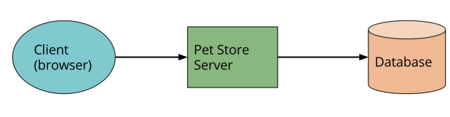
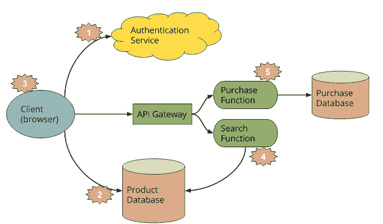
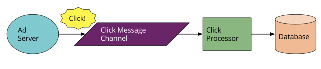
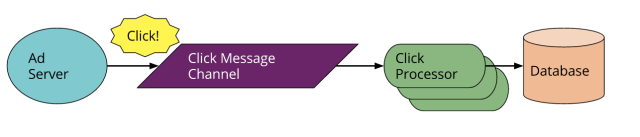

## 6.8 Serverless架构：让运维成本降低90%的革命性实践

在目前主流云计算IaaS（Infrastructure-as-a-Service，基础设施即服务）和PaaS（Platform-as-a-Service，平台即服务）中，开发者进行业务开发时，仍然需要关心很多和服务器相关的服务端开发工作，比如缓存、消息服务、Web应用服务器、数据库，以及对服务器进行性能优化，考虑存储和计算资源，考虑负载和扩展，考虑服务器容灾稳定性等非业务逻辑的开发。这些服务器的运维和开发，知识和经验极大地限制了开发者进行业务开发的效率。设想一下，如果开发者直接租用服务或者开发服务而无须关注如何在服务器中运行部署服务，是否可以极大地提升开发效率和产品质量？这种去服务器而直接使用服务的架构，我们称之为Serverless架构（无服务器架构）。

### 6.8.1 什么是Serverless架构

如今，随着移动和物联网应用蓬勃发展，伴随着面向服务架构（SOA）以及微服务架构（MSA）的盛行，造就了Serverless架构平台的迅猛发展。在Serverless架构中，开发者无须考虑服务器的问题，计算资源作为服务而不是服务器的概念出现，这样开发者只需要关注面向客户的客户端业务程序开发，后台服务由第三方服务公司完全或者部分提供，开发者调用相关的服务即可。Serverless是一种构建和管理基于微服务架构的完整流程，允许我们在服务部署级别而不是服务器部署级别来管理应用部署，甚至可以管理某个具体功能或端口的部署，这就能让开发者快速迭代，更快速地交付软件。

这种新兴的云计算服务交付模式为开发人员和管理员带来了许多益处。它提供了合适的灵活性和控制性级别，因而在IaaS和PaaS之间找到了一条中间道路。由于服务器端几乎没有什么要管理的，Serverless架构正在彻底改变软件开发和部署领域，比如，推动了NoOps模式的发展。

Serverless架构是新兴的架构体系，业界也没有一个明确的关于Serverless架构的定义。Mike Roberts认为的Serverless架构主要有下面两种形式：

* 首先，Serverless架构用于描述依赖第三方服务（“云端”）实现对逻辑和状态进行管理的应用。这些应用包括典型的富客户端应用，比如单页Web应用或移动应用，它们使用基于云的数据库（比如Parse或Firebase），还有授权服务（比如Auth0、AWS Cognito等），这类服务以前曾经被描述为BaaS（（Mobile）Backend as a Service，（移动）后端即服务）。
* 其次，Serverless架构也可以指这样的一类应用，一部分服务逻辑由应用实现，但是跟传统架构不同在于，它们运行在无状态的容器中，可以由事件触发，短暂、完全地被第三方管理。一种观点认为这是FaaS（Functions as service，函数服务），而AWS Lambda就是一种流行的FaaS实现，当然还有其他。

云计算的发展从IaaS、PaaS、SaaS，到最新的BaaS，在这个趋势中Serverless（去服务器化）的趋势越来越明显。IaaS将真实的物理机变成了虚拟机，PaaS进一步将虚拟机变成了包含基础设施的中间件服务。BaaS和SaaS将中间件服务扩展到更基础的后端能力。这些是云计算解决效率和成本的重要体现。Serverless这种无服务器架构，用服务代替服务器，无须了解落实服务，进一步提高了云计算的成本和效率，从而为BaaS这种新时代云计算提供了架构基础。

BaaS要被开发者广泛接受，需要在云端解决以下的限制：

* BaaS服务的治理；
* BaaS服务需要提供逻辑定制扩展；
* BaaS服务能独立部署，快速启动；
* BaaS服务可以弹性扩展，满足大并发需要；
* BaaS服务可以被监控、计费；
* BaaS服务要解决DevOps相关的问题。

要实现Serverless架构，需要利用以下技术和方案：

* 实现BaaS中的云代码特性，开发者可以直接开发在云端的业务代码，实现FaaS；
* 实现API网关，用API代表服务的入口，并对所有服务进行治理；
* 微服务架构技术，用微服务的概念来实施服务的开发；
* 利用Docker等容器技术部署运行微服务

### 6.8.2 Serverless典型的应用场景

Serverless典型的应用场景主要有UI驱动的应用和消息驱动的应用两大类。

#### 1. UI驱动的应用

先讨论一个带有服务功能逻辑的传统面向客户端的三层应用—一个典型的电子商务应用Pet Store（在线宠物商店）。一般架构如图6-6所示，假设服务端用Java开发完成，客户端用HTML/Javascript。

这种架构中，服务端不得不实现诸多系统逻辑，例如认证、页面导航、搜索、交易等都需要在服务端完成，而客户端则显得相对比较简单。如果采用Serverless架构来对该应用进行改造，则架构如图6-7所示。

Serverless架构相比于传统面向客户端的三层应用架构，有以下几方面的差异：

* （1）删除了认证逻辑，用第三方BaaS服务来替代。
* （2）使用另外一个BaaS，允许客户端直接访问架构与第三方（例如AWS Dynamo）上的数据子库。通过这种方式提供给客户更安全的访问数据库模式。
* （3）前两点中包含着很重要的第三点，也就是以前运行在Pet Store服务端的逻辑现在都转移到客户端中，例如跟踪用户访问，理解应用的UX架构（例如页面导航），读取数据库并转化为可视视图等。客户端则慢慢转化为单页面应用。
* （4）某些我们想保留在服务端的UX相关功能，例如，计算敏感或者需要访问大量数据，比如搜索这类应用。对于搜索这类需求，我们不需要运行一个专用服务，而是通过FaaS模块，通过API Gateway对HTTP访问提供响应。这样可以使得客户端和服务端都从同一个数据库中读取相关数据。由于原始服务使用Java开发，AWS Lambda（FaaS提供者）支持Java功能，因此可以直接从Pet Store服务端将代码移植到Pet Store搜索功能，而不用重写代码。
* （5）最后，可以将“Purchase”功能用另外一个FaaS功能取代，因为安全原因放在服务端还不如在客户端重新实现，当然前端还是API Gateway。

#### 2. 消息驱动的应用

消息驱动的应用是一个纯后台数据处理服务，如图6-8所示。例如正在编写一个面向用户的应用，需要对UI请求快速响应，但是同时还想获取所有发生的行为。我们设想一个Ad Server（在线广告系统），当用户点击一个广告时，希望快速导向目标，但是同时需要搜集点击量以便向广告商收取费用。

在传统的架构中，Ad Server同步地响应客户，但是同时还会向异步处理“点击量”的应用发送一个消息更新到便于以后向广告商收费的数据库。
而采用Serverless架构的情况下，将会改为如图6-9所示的方式。

这个架构跟第一个例子有些许不同，这里我们用FaaS功能取代了一个一直运行的应用。此FaaS运行于第三方提供商提供的消息驱动上下文之间。需要注意的是，供应商提供了消息代理和FaaS，两者将更加紧密地合作在一起。

FaaS环境通过复制出若干实例来并行处理这些点击，这无疑带来了全新开发体验和执行效率。

### 6.8.3 Serverless架构原则

Peter Sbarski和Sam Kroonenburg合著的*Serverless Architectures on AWS*一书中总结了Serverless架构的以下五种原则，运用这些原则可以帮助我们在构建Serverless架构应用时做出正确的决定：

* 根据需要，使用计算服务来执行代码（没有服务器）。
* 编写单一用途的无状态函数。
* 设计基于推送的、事件驱动的管道。
* 创建更粗实、更强大的前端。
* 拥抱第三方服务。