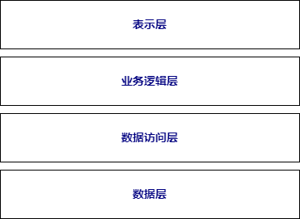

## 7.2 分层模式：直击模块耦合严重痛点，建立清晰的职责划分体系

在软件技术架构的众多设计模式中，分层模式宛如一座结构精巧的大厦，每一层都承担着特定的功能，各层之间协同工作，共同支撑起整个软件系统的稳定运行。分层模式是一种被广泛应用且行之有效的架构设计方法，它通过将软件系统按照功能划分为不同的层次，使得系统的结构更加清晰、易于理解和维护。在当今复杂多变的软件环境中，分层模式为开发者提供了一种高效、灵活的解决方案，无论是小型应用程序还是大型企业级系统，都能从中受益。

### 7.2.1 分层模式的基本概念

分层模式是一种将软件系统按照功能划分为多个层次的架构设计模式。每个层次都有明确的职责和功能，并且只能与相邻的层次进行交互。这种层次化的结构使得系统的各个部分相对独立，降低了模块之间的耦合度，提高了系统的可维护性、可扩展性和可复用性。

一般来说，常见的分层模式如图4-2所示，包含以下几个基本层次：

- 表示层（Presentation Layer）也称为用户界面层，是系统与用户进行交互的接口。它负责接收用户的输入，并将系统的处理结果以可视化的方式展示给用户。表示层可以是图形用户界面（GUI）、Web 页面、命令行界面等。例如，在一个电子商务网站中，用户登录页面、商品展示页面等都属于表示层。
- 业务逻辑层（Business Logic Layer）该层是系统的核心，负责处理业务规则和业务流程。它接收来自表示层的请求，根据业务逻辑进行相应的处理，并调用数据访问层获取或更新数据。业务逻辑层封装了系统的核心业务逻辑，使得业务逻辑与表示层和数据访问层分离，便于维护和修改。例如，在电子商务系统中，订单处理、商品库存管理等业务逻辑都在这一层实现。
- 数据访问层（Data Access Layer）主要负责与数据库或其他数据存储系统进行交互，完成数据的增、删、改、查等操作。数据访问层将业务逻辑层的请求转换为对数据存储系统的具体操作，屏蔽了不同数据存储系统的差异，为业务逻辑层提供了统一的数据访问接口。例如，在一个使用 MySQL 数据库的系统中，数据访问层负责执行 SQL 语句，从数据库中获取或保存数据。
- 数据层（Data Layer）即数据的实际存储位置，可以是关系型数据库（如 MySQL、Oracle）、非关系型数据库（如 MongoDB、Redis）、文件系统等。数据层为数据访问层提供数据存储和管理的支持。

### 7.2.2 分层模式的优势

#### 1. 可维护性

由于各层的职责明确，当系统出现问题或需要进行修改时，开发人员可以快速定位到问题所在的层次，只需要对该层次进行修改，而不会影响到其他层次。例如，如果表示层的某个页面需要调整样式，开发人员只需要修改表示层的相关代码，而不会对业务逻辑层和数据访问层产生影响。

#### 2. 可扩展性

分层模式使得系统具有良好的扩展性。当需要增加新的功能时，可以在相应的层次中添加新的模块或组件，而不会对整个系统的结构造成太大的影响。例如，在电子商务系统中，如果需要增加新的促销活动功能，可以在业务逻辑层中添加相应的业务处理模块。

#### 3. 可复用性

各层的模块或组件具有较高的独立性，可以在不同的系统或项目中进行复用。例如，数据访问层的一些通用数据操作方法可以在多个项目中复用，减少了开发工作量。

#### 4. 团队协作

分层模式便于团队协作开发。不同层次的开发工作可以由不同的团队或开发人员负责，每个团队只需要关注自己所负责的层次，提高了开发效率。例如，前端开发团队负责表示层的开发，后端开发团队负责业务逻辑层和数据访问层的开发。

### 7.2.3 分层模式的应用场景

分层模式的应用场景如下。

* 企业级应用系统：企业级应用系统通常具有复杂的业务逻辑和大量的数据处理需求，分层模式可以很好地满足这些需求。例如，企业资源规划（ERP）系统、客户关系管理（CRM）系统等，通过分层模式可以将业务逻辑、数据处理和用户界面分离，使得系统的结构更加清晰，便于维护和扩展。
* Web 应用程序：在 Web 应用程序开发中，分层模式也是一种常用的架构设计方法。表示层负责处理用户的请求和展示页面，业务逻辑层处理业务规则，数据访问层与数据库进行交互。例如，各种电商网站、社交平台等都广泛采用了分层模式。
* 移动应用开发：移动应用开发同样可以受益于分层模式。表示层负责设计和实现移动应用的界面，业务逻辑层处理应用的核心业务，数据访问层负责与服务器或本地存储进行数据交互。例如，各种购物类、社交类移动应用都采用了分层架构。

### 7.2.4 分层模式的实现要点

#### 1. 层间接口设计

层与层之间通过接口进行交互，接口的设计要清晰、简洁，明确规定各层之间的通信方式和数据格式。例如，业务逻辑层与数据访问层之间的接口可以定义为一组数据访问方法，业务逻辑层通过调用这些方法来获取或更新数据。

#### 2. 依赖管理

各层之间的依赖关系要遵循严格的规则，一般来说，上层依赖于下层，下层不依赖于上层。例如，表示层依赖于业务逻辑层，业务逻辑层依赖于数据访问层，这样可以保证系统的稳定性和可维护性。

#### 3. 异常处理

在分层模式中，异常处理要合理设计。各层应该捕获并处理本层产生的异常，对于无法处理的异常，可以向上层抛出。例如，数据访问层在与数据库交互时可能会出现数据库连接异常，数据访问层应该捕获并处理这些异常，或者将异常信息传递给业务逻辑层进行处理。

### 7.2.5 分层模式的局限性与挑战

#### 1. 性能开销

分层模式会引入一定的性能开销，因为层与层之间的交互需要进行数据传递和方法调用。例如，业务逻辑层调用数据访问层的方法时，需要进行参数传递和返回值处理，这会增加系统的响应时间。

#### 2. 层次划分难度

在实际应用中，如何合理地划分层次是一个挑战。如果层次划分不合理，可能会导致层与层之间的职责不清晰，增加系统的复杂度。例如，如果将一些业务逻辑错误地划分到表示层，会导致表示层的代码过于复杂，影响系统的可维护性。

#### 3. 跨层调用问题

在某些情况下，可能会出现跨层调用的需求，这会破坏分层模式的结构，增加系统的耦合度。例如，表示层直接调用数据访问层的方法，会导致表示层与数据访问层之间的耦合度增加，违反了分层模式的设计原则。
