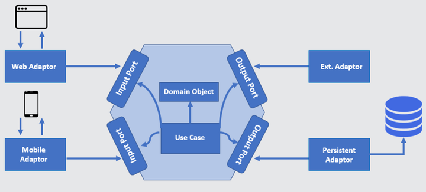

## 7.3 端口适配器模式：攻克技术栈锁定难题，构建可扩展的业务核心系统

在当今复杂多变的 IT 环境中，软件系统需要与各种各样的外部系统和设备进行交互，如数据库、消息队列、第三方 API 等。同时，系统内部的业务逻辑也需要保持相对的独立性和稳定性，以应对不断变化的需求。端口适配器模式（Ports and Adaptors Pattern），也被称为六边形架构（Hexagonal Architecture），应运而生，为解决这些问题提供了一种有效的架构设计方案。它就像一个灵活的连接器，能够让软件系统在保持内部核心稳定的同时，与外部世界进行顺畅的交互。

### 7.3.1 端口适配器模式的基本概念

端口适配器模式是一种软件架构设计模式，它将软件系统划分为三个主要部分：核心业务逻辑（也称为领域模型）、端口（Ports）和适配器（Adaptors）。核心业务逻辑是系统的核心，包含了系统的业务规则和业务流程；端口是核心业务逻辑与外部世界交互的接口，它定义了核心业务逻辑需要从外部获取的服务或需要向外部提供的服务；适配器则是实现这些端口的具体实现，它负责将外部系统或设备的不同接口和协议转换为核心业务逻辑能够理解的形式，或者将核心业务逻辑的输出转换为外部系统或设备能够接受的形式。

如下图4-3所示，端口适配器模式的基本结构如下：

- 核心业务逻辑（领域模型）是系统的核心，它独立于任何外部系统和技术。领域模型包含了系统的实体、值对象、聚合根等领域概念，以及处理这些领域概念的业务规则和业务流程。核心业务逻辑不依赖于任何外部系统，只关注业务本身的逻辑处理。例如，在一个电子商务系统中，订单处理、商品库存管理等业务逻辑都属于核心业务逻辑。
- 端口（Ports）是核心业务逻辑与外部世界交互的接口。它定义了核心业务逻辑需要从外部获取的服务（如数据查询服务、消息发送服务等）或需要向外部提供的服务（如业务事件通知服务等）。端口是抽象的，不涉及具体的实现细节，它只规定了接口的方法和参数。例如，一个数据查询端口可能定义了一个查询商品信息的方法，而不关心具体是从数据库还是其他数据源获取商品信息。
- 适配器（Adaptors）是实现端口的具体实现。它负责将外部系统或设备的不同接口和协议转换为核心业务逻辑能够理解的形式，或者将核心业务逻辑的输出转换为外部系统或设备能够接受的形式。适配器可以分为驱动适配器（Driving Adaptors）和被驱动适配器（Driven Adaptors）。驱动适配器负责接收外部的请求，并将其转换为核心业务逻辑能够处理的形式，如 Web 控制器、消息监听器等；被驱动适配器负责将核心业务逻辑的请求转换为外部系统或设备能够接受的形式，如数据库访问适配器、消息发送适配器等。

### 7.3.2 端口适配器模式的优势

#### 1. 提高可维护性

由于核心业务逻辑与外部系统分离，当外部系统发生变化时，只需要修改相应的适配器，而不会影响到核心业务逻辑。例如，如果数据库从 MySQL 更换为 PostgreSQL，只需要修改数据库访问适配器，而核心业务逻辑不需要做任何修改。

#### 2. 增强可测试性

核心业务逻辑独立于外部系统，使得单元测试变得更加容易。可以使用模拟对象（Mock Objects）来模拟端口的实现，从而对核心业务逻辑进行单独的测试，而不需要依赖于外部系统的运行环境。

#### 3. 支持技术多样性

端口适配器模式允许系统使用不同的技术和框架来实现适配器。例如，可以使用 Spring Boot 实现 Web 控制器适配器，使用 MyBatis 实现数据库访问适配器，这样可以根据具体的项目需求选择最合适的技术。

#### 4. 促进团队协作

端口适配器模式将系统划分为不同的部分，不同的团队或开发人员可以分别负责核心业务逻辑、端口和适配器的开发。这样可以提高开发效率，同时也便于团队之间的沟通和协作。

### 7.3.3 端口适配器模式的应用场景

#### 1. 企业级应用系统

企业级应用系统通常需要与多个外部系统进行交互，如 ERP 系统、CRM 系统、财务系统等。端口适配器模式可以将核心业务逻辑与这些外部系统分离，使得系统更加灵活和可维护。例如，一个企业级的订单管理系统可能需要与库存管理系统、物流系统等进行交互，通过端口适配器模式可以方便地实现与这些系统的集成。

#### 2. 微服务架构
在微服务架构中，每个微服务都有自己的核心业务逻辑，并且需要与其他微服务或外部系统进行通信。端口适配器模式可以帮助微服务更好地处理与外部系统的交互，提高微服务的独立性和可扩展性。例如，一个用户服务微服务可能需要与认证服务、消息服务等进行交互，通过端口适配器模式可以将这些交互逻辑封装在适配器中，使得用户服务微服务的核心业务逻辑更加清晰。

#### 3. 物联网应用

物联网应用通常需要与各种硬件设备和传感器进行交互，同时还需要与后端的云服务进行通信。端口适配器模式可以将核心业务逻辑与硬件设备和云服务分离，使得系统更加灵活和可扩展。例如，一个智能家居系统可能需要与各种智能设备（如智能灯泡、智能门锁等）进行交互，通过端口适配器模式可以方便地实现与这些设备的通信。

### 7.3.4 端口适配器模式的实现要点

#### 1. 明确核心业务逻辑

在设计系统时，首先要明确核心业务逻辑，将其与外部系统和技术分离。核心业务逻辑应该只关注业务本身的规则和流程，不涉及任何与外部系统交互的细节。

#### 2. 定义端口

根据核心业务逻辑的需求，定义相应的端口。端口应该是抽象的，只规定接口的方法和参数，不涉及具体的实现细节。端口的设计要遵循单一职责原则，每个端口只负责一个特定的功能。

#### 3. 实现适配器

根据端口的定义，实现相应的适配器。适配器要负责将外部系统或设备的不同接口和协议转换为核心业务逻辑能够理解的形式，或者将核心业务逻辑的输出转换为外部系统或设备能够接受的形式。适配器的实现要遵循开闭原则，对扩展开放，对修改关闭。

#### 4. 依赖倒置原则

在实现端口适配器模式时，要遵循依赖倒置原则，即高层模块不应该依赖于低层模块，两者都应该依赖于抽象。核心业务逻辑依赖于端口（抽象接口），而适配器实现这些端口，这样可以降低模块之间的耦合度。

### 7.3.5 端口适配器模式的局限性与挑战

#### 1. 增加系统复杂度

端口适配器模式将系统划分为多个部分，增加了系统的复杂度。开发人员需要理解核心业务逻辑、端口和适配器之间的关系，并且需要编写更多的代码来实现端口和适配器。

#### 2. 性能开销

由于端口适配器模式需要进行多次的接口转换和数据传递，可能会引入一定的性能开销。在对性能要求较高的系统中，需要对性能进行优化。

#### 3. 学习成本

对于开发人员来说，学习和掌握端口适配器模式需要一定的时间和精力。特别是对于一些传统的开发人员来说，需要转变思维方式，适应这种新的架构设计模式。
