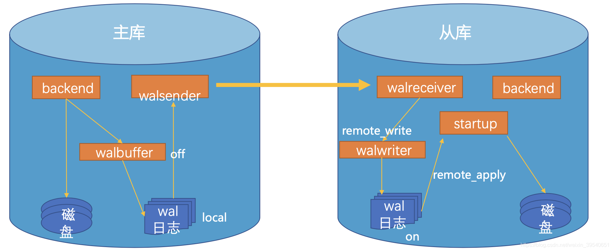

## 7.5 主从模式：解决单点故障痛点，构建容灾备份与自动恢复体系

在信息技术飞速发展的当下，软件和硬件系统面临着越来越高的性能、可靠性和可扩展性要求。主从模式（Master Slave Pattern）作为一种经典且广泛应用的架构设计模式，在解决这些问题上发挥着重要作用。从数据库系统到分布式计算环境，从网络设备到物联网架构，主从模式以其独特的结构和运行机制，为系统的稳定运行和高效扩展提供了有力支持。

### 7.5.1 主从模式的基本概念

主从模式是一种将系统中的组件划分为主节点（Master）和从节点（Slave）的架构模式。主节点负责协调和控制整个系统的运行，处理关键决策和核心任务；从节点则听从主节点的指挥，执行主节点分配的任务，并向主节点汇报执行结果。主从节点之间通过特定的通信协议进行数据交互和指令传递，共同完成系统的整体功能。

主从模式包含以下基本结构与角色。

#### 1. 主节点（Master）

主节点是整个系统的核心控制中心，具有以下主要职责：

- **任务分配**：根据系统的需求和从节点的状态，将任务合理地分配给各个从节点。例如，在一个分布式文件系统中，主节点会根据文件的存储需求和从节点的磁盘空间情况，决定将文件存储在哪个从节点上。
- **协调管理**：协调从节点之间的工作，确保各个从节点之间的任务执行不会产生冲突。同时，主节点还负责监控从节点的运行状态，及时发现并处理从节点出现的异常情况。
- **数据同步**：在某些场景下，主节点需要负责数据的同步工作，确保从节点上的数据与主节点保持一致。例如，在数据库主从复制中，主节点将数据的更新操作同步到从节点上。

#### 2. 从节点（Slave）

从节点是系统中的执行单元，主要负责以下工作：

- **任务执行**：接收主节点分配的任务，并按照主节点的要求进行执行。例如，在一个分布式计算系统中，从节点会执行主节点分配的计算任务。
- **数据处理**：对主节点传递过来的数据进行处理，并将处理结果反馈给主节点。
- **状态汇报**：定期向主节点汇报自身的运行状态，包括资源使用情况、任务执行进度等信息。

下图7-5展示的是PostgreSQL数据库主从模式下的流复制原理图。

### 7.5.2 主从模式的优势

#### 1. 提高性能

通过将任务分配给多个从节点并行执行，主从模式可以显著提高系统的处理能力。例如，在一个数据库主从架构中，读操作可以分散到多个从节点上进行，从而减轻主节点的负载，提高系统的读取性能。

#### 2. 增强可靠性

主从模式具有一定的容错能力。当某个从节点出现故障时，主节点可以将该从节点的任务重新分配给其他正常的从节点，保证系统的正常运行。同时，在某些情况下，还可以通过主从切换机制，当主节点出现故障时，将某个从节点提升为主节点，继续提供服务。

#### 3. 便于扩展

随着系统业务的增长，可以通过增加从节点的数量来扩展系统的处理能力。主从模式的结构使得新的从节点可以很容易地加入到系统中，而不需要对系统的整体架构进行大规模的修改。

### 7.5.3 主从模式的应用场景

#### 1. 数据库系统

在数据库领域，主从模式被广泛应用于实现数据的读写分离和数据备份。主数据库负责处理写操作，从数据库则复制主数据库的数据，并处理读操作。这样可以提高数据库的读写性能，同时保证数据的安全性和可靠性。例如，在大型电商系统中，用户的下单、支付等写操作会在主数据库中进行，而商品信息查询、订单查询等读操作则可以在从数据库中进行。

#### 2. 分布式计算

在分布式计算环境中，主从模式可以将一个大型的计算任务分解为多个小任务，分配给多个从节点并行执行。主节点负责任务的调度和结果的汇总，从节点负责具体的计算任务。例如，在大数据处理框架 Hadoop 中，NameNode 作为主节点，负责管理文件系统的元数据和任务调度，DataNode 作为从节点，负责存储和处理数据。

#### 3. 网络设备

在网络设备中，主从模式常用于实现设备的集群和负载均衡。主设备负责管理和协调整个集群的运行，从设备则根据主设备的指令进行工作。例如，在一些企业级的路由器集群中，主路由器负责处理路由决策和流量调度，从路由器则负责转发数据包。

### 7.5.4 主从模式的实现要点

#### 1. 通信协议

主从节点之间需要通过稳定、高效的通信协议进行数据交互和指令传递。通信协议要保证数据的准确性和及时性，同时要考虑网络延迟、丢包等问题。常见的通信协议有 TCP/IP、HTTP 等，具体选择要根据系统的需求和特点来决定。

#### 2. 数据同步机制

在主从模式中，数据同步是一个关键问题。要确保从节点上的数据与主节点保持一致，需要采用合适的数据同步机制。常见的数据同步方式有实时同步、定时同步等。例如，在数据库主从复制中，常用的同步方式有基于二进制日志的复制和基于 GTID（全局事务标识符）的复制。

#### 3. 故障处理与恢复

要建立完善的故障处理和恢复机制，当主节点或从节点出现故障时，能够及时发现并采取相应的措施。例如，当从节点出现故障时，主节点要能够及时将该从节点的任务重新分配给其他从节点；当主节点出现故障时，要能够快速进行主从切换，保证系统的正常运行。

### 7.5.5 主从模式的局限性与挑战

#### 1. 主节点单点故障

主从模式中，主节点是系统的核心，如果主节点出现故障，可能会导致整个系统瘫痪。虽然可以通过主从切换机制来解决这个问题，但主从切换过程中可能会出现数据不一致、服务中断等问题。

#### 2. 主节点负载过重

主节点需要承担任务分配、协调管理等重要职责，随着系统规模的扩大和任务量的增加，主节点的负载可能会过重，成为系统的性能瓶颈。

#### 3. 数据一致性问题

在数据同步过程中，由于网络延迟、从节点处理能力等因素的影响，可能会导致从节点上的数据与主节点不一致。需要采取相应的措施来保证数据的一致性，如增加数据校验、重试机制等。
