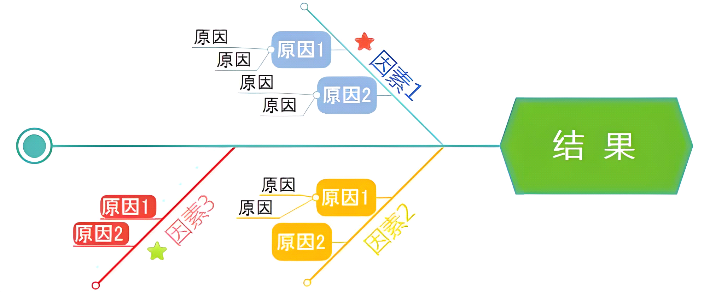

## 8.1 理解问题的常用方法

在 IT 技术架构的设计与实现过程中，理解问题是解决问题的关键第一步。一个复杂的 IT 系统往往涉及众多的组件、交互和业务规则，若不能准确理解问题的本质，后续的架构设计和开发工作很可能会偏离方向，导致资源浪费和项目失败。因此，掌握理解问题的常用方法对于 IT 技术人员至关重要。本节将详细介绍几种在 IT 技术架构领域中常用的理解问题的方法。

### 8.1.1 观察法

#### 1. 直接观察系统运行

在 IT 技术架构相关问题中，直接观察系统的运行状态是一种直观且有效的方法。通过监控系统的各项指标，如 CPU 使用率、内存占用、网络带宽等，可以了解系统在不同负载下的表现。例如，在一个电商系统中，在促销活动期间观察系统的响应时间和吞吐量，若发现某些页面加载缓慢，可能意味着该页面所依赖的数据库查询或后端服务存在性能瓶颈。

#### 2. 观察用户操作

观察用户与系统的交互方式能帮助我们发现系统在实际使用中存在的问题。可以通过用户调研、录制用户操作视频等方式进行观察。例如，在一个办公自动化系统中，观察用户在创建和审批流程中的操作步骤，可能会发现某些操作过于繁琐，导致用户体验不佳，这就提示我们在架构设计上可能需要优化流程或提供更便捷的操作界面。

### 8.1.2 访谈法

#### 1. 与业务人员交流

业务人员是系统需求的提出者和使用者，与他们进行深入的访谈可以了解业务的核心流程、目标和痛点。例如，在开发一个医疗信息管理系统时，与医生、护士和管理人员交流，了解他们在日常工作中如何使用患者信息、病历记录等，以及他们对系统的期望和遇到的问题。这样可以确保架构设计能够满足业务需求，支持业务的顺利开展。

#### 2. 与技术团队沟通

与技术团队成员（如开发人员、运维人员等）访谈，可以了解系统的技术实现细节、现有架构的优缺点以及技术层面存在的问题。例如，开发人员可能会反馈某些模块的代码复杂度较高，维护困难；运维人员可能会提到系统在某些情况下容易出现故障，需要进行架构优化以提高系统的稳定性。

### 8.1.3 文档分析法

#### 1. 研究需求文档

需求文档是系统开发的基础，仔细研究需求文档可以明确系统的功能和性能要求。在文档中寻找关键的业务规则、数据流程和约束条件等信息。例如，在一个金融交易系统的需求文档中，明确规定了交易的处理时间、数据的准确性要求等，这些信息对于架构设计中的性能优化和数据一致性保障至关重要。

#### 2. 分析技术文档

技术文档（如系统架构文档、接口文档等）可以帮助我们了解系统的现有架构和技术实现方式。通过分析这些文档，可以发现架构中的潜在问题和改进空间。例如，在查看一个分布式系统的架构文档时，发现某些服务之间的通信依赖过于复杂，可能会导致系统的可维护性和扩展性较差，需要在后续的架构设计中进行优化。

### 8.1.4 思维导图法

#### 1. 梳理问题结构

使用思维导图工具可以将问题进行分解和结构化。以一个大型项目的架构设计问题为例，可以将问题的核心主题作为思维导图的中心节点，然后将相关的子问题（如功能需求、性能要求、技术选型等）作为分支节点展开。通过这种方式，可以清晰地看到问题的全貌和各个部分之间的关系。

#### 2. 激发创新思维

思维导图还可以帮助我们激发创新思维，在梳理问题的过程中，不断产生新的想法和解决方案。例如，在考虑一个社交网络系统的架构时，通过思维导图可以将不同的功能模块和技术实现方式进行关联，从而发现新的架构设计思路，如采用微服务架构来提高系统的可扩展性和灵活性。

### 8.1.5 鱼骨图法

下图8-1展示的是一张鱼骨图法使用案例。

#### 1. 分析问题原因

鱼骨图（也称为因果图）是一种用于分析问题原因的有效工具。在 IT 技术架构中，当遇到系统性能问题、故障问题等时，可以使用鱼骨图来找出可能的原因。以系统响应时间过长为例，将“系统响应时间过长”作为鱼骨图的鱼头，然后从人员、设备、方法、环境等方面进行分析，找出可能导致问题的原因，如人员操作不当、服务器硬件配置不足、算法复杂度高等。

#### 2. 确定关键因素

通过鱼骨图的分析，可以确定导致问题的关键因素。在上述例子中，如果发现服务器硬件配置不足是导致系统响应时间过长的主要原因，那么在后续的架构优化中，就可以重点考虑升级服务器硬件或采用分布式架构来分担负载。

### 8.1.6 标杆分析法

#### 1. 寻找行业标杆

在 IT 技术架构领域，寻找行业内的标杆系统或成功案例进行分析是一种学习和借鉴的有效方法。例如，在设计一个电商系统的架构时，可以研究亚马逊、阿里巴巴等行业巨头的架构设计理念和实践经验。了解他们如何处理高并发、大数据量、分布式存储等问题，从中获取灵感和启示。

#### 2. 对比自身系统

将自身系统与行业标杆进行对比，找出差距和不足之处。分析标杆系统在架构设计、技术选型、运营管理等方面的优势，结合自身系统的特点和需求，制定改进方案。例如，如果发现标杆系统采用了先进的缓存技术来提高系统性能，而自身系统在这方面存在不足，就可以考虑引入缓存技术来优化架构。

### 8.1.7 模拟与实验法

#### 1. 构建原型系统
对于一些复杂的 IT 技术架构问题，可以通过构建原型系统来进行模拟和实验。例如，在设计一个新的数据库架构时，可以构建一个小型的原型数据库，模拟实际的业务场景和数据访问模式，测试不同的数据库配置和查询优化策略的效果。通过原型系统的实验，可以快速验证架构设计的可行性和有效性。

#### 2. 进行压力测试

压力测试是模拟系统在高负载情况下的运行状态，以评估系统的性能和稳定性。在设计一个网站架构时，可以使用压力测试工具模拟大量用户同时访问网站的场景，观察系统的响应时间、吞吐量、资源利用率等指标。根据压力测试的结果，可以发现系统在高并发情况下存在的性能瓶颈，如数据库查询缓慢、服务器处理能力不足等，从而对架构进行针对性的优化。

### 8.1.8 总结

理解问题是 IT 技术架构设计和解决问题的基础，不同的理解问题的方法适用于不同的场景和问题类型。观察法可以让我们直观地了解系统的运行状态和用户需求；访谈法有助于我们获取业务和技术方面的信息；文档分析法可以帮助我们深入了解系统的需求和现有架构；思维导图法和鱼骨图法可以帮助我们梳理问题结构和分析问题原因；标杆分析法可以让我们借鉴行业的成功经验；模拟与实验法可以验证架构设计的可行性和性能。在实际应用中，我们可以根据具体情况综合运用这些方法，以准确理解问题的本质，为后续的架构设计和问题解决提供有力支持。 