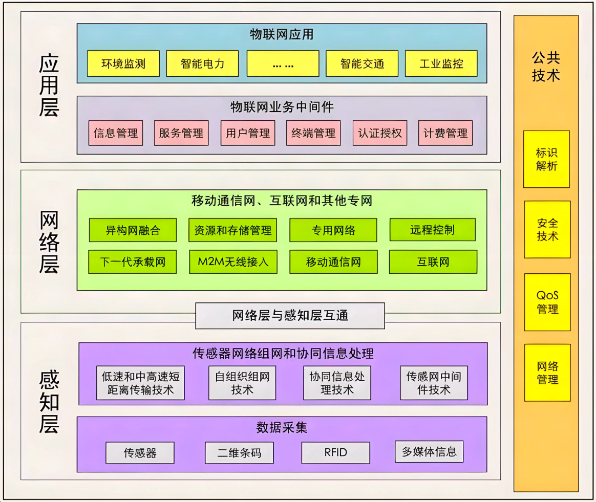

## 8.3 展示设计的常用方法

在IT技术架构领域，精心设计的架构方案需要通过有效的展示方法传达给不同的利益相关者，如技术团队、管理层、客户等。一个清晰、直观且富有说服力的展示，不仅能帮助受众更好地理解架构的价值、功能和优势，还能为项目的推进和决策提供有力支持。本节将详细介绍IT技术架构展示设计的常用方法。

### 8.3.1 可视化图表法

#### 1. 架构图绘制

架构图是展示IT技术架构最直观的方式之一。常见的架构图包括系统架构图、模块架构图、网络拓扑图等。

- **系统架构图**：从整体上展示系统的组成部分及其相互关系。例如，在一个电商系统的架构图中，会包含用户界面层、业务逻辑层、数据访问层以及数据库等核心组件，并用箭头表示它们之间的数据流向和交互方式。可以使用专业的绘图工具，如 Visio、Lucidchart 等，确保图形的规范性和专业性。
- **模块架构图**：聚焦于系统内部各个模块的详细设计。以一个企业资源规划（ERP）系统为例，模块架构图会展示财务模块、采购模块、销售模块等之间的接口和依赖关系，帮助技术人员理解模块的分工和协作。
- **网络拓扑图**：主要用于展示网络设备的连接方式和网络结构。在一个大型数据中心的网络拓扑图中，会包含服务器、交换机、路由器等设备，以及它们之间的物理和逻辑连接，便于网络工程师进行网络规划和故障排查。

下图8-2展示的是一张物联网技术系统架构图示例。

#### 2. 流程图设计

流程图能够清晰地展示业务流程或系统操作流程。例如，在一个在线支付系统的展示中，使用流程图可以详细描述用户从选择商品、下单、支付到订单完成的整个过程，包括各个环节的条件判断和跳转逻辑。通过不同形状的图形（如矩形表示操作步骤、菱形表示判断条件）和箭头的指向，让受众一目了然地理解流程的走向和关键节点。可以使用专业的流程图绘制工具，如ProcessOn、Draw.io等。

#### 3. 数据流向图

数据流向图用于展示数据在系统中的流动路径和处理过程。在一个大数据分析系统中，数据流向图会展示数据从数据源（如传感器、日志文件）采集，经过数据清洗、转换、存储，最终到数据分析和可视化的整个过程。通过不同颜色或线条的粗细来表示数据的重要性或流量大小，帮助受众理解数据的流转和处理机制。

### 8.3.2 故事板法

#### 1. 构建故事场景

将IT技术架构的应用场景以故事的形式呈现出来。例如，对于一个智能医疗系统的架构展示，可以构建一个患者就医的故事场景：患者通过手机端预约挂号，到医院后使用自助设备进行签到，医生通过电子病历系统查看患者的病史和检查报告，进行诊断并开具处方，药房根据处方进行配药，整个过程中各个系统模块协同工作。通过生动的故事场景，让受众更容易理解架构在实际业务中的应用和价值。

#### 2. 分镜展示

将故事场景分解为多个分镜，每个分镜对应一个关键环节或操作步骤。例如，在上述智能医疗系统的故事板中，可以分为患者预约分镜、医院签到分镜、医生诊断分镜、药房配药分镜等。每个分镜可以配以相应的架构图或流程图，详细展示该环节中系统的工作原理和组件交互，使展示更加有条理和层次感。

### 8.3.3 对比分析法

#### 1. 新旧架构对比

如果是对现有架构进行升级或改造，可以将新架构与旧架构进行对比展示。对比的方面可以包括性能指标（如响应时间、吞吐量）、可扩展性、维护成本等。例如，在一个企业级应用系统的架构升级项目中，通过图表对比旧架构在处理高并发请求时的响应时间较长，而新架构采用了分布式架构和缓存技术，响应时间大幅缩短，让受众直观地看到新架构的优势。

#### 2. 竞品架构对比

将自己的IT技术架构与市场上的竞争对手架构进行对比。分析双方在功能特点、技术实现、成本效益等方面的差异。例如，在一个云计算平台的架构展示中，对比自家平台与其他竞争对手在弹性伸缩能力、数据安全性、服务价格等方面的优劣，突出自身架构的独特卖点和竞争优势。

### 8.3.4 案例分析法

#### 1. 实际项目案例

分享基于该IT技术架构实施的实际项目案例。详细介绍项目的背景、目标、面临的挑战以及如何运用架构解决问题并取得的成果。例如，在展示一个物联网架构时，可以介绍一个智能工厂项目案例：该工厂面临设备管理复杂、生产效率低下的问题，通过采用物联网架构实现了设备的实时监控和自动化控制，生产效率提高了 30%，设备故障率降低了 20%。通过具体的数据和实际效果，增强受众对架构的信任和认可。

#### 2. 行业标杆案例

引用行业内的标杆案例，说明类似架构在其他企业的成功应用。分析这些标杆案例的架构设计思路、实施过程和经验教训，为受众提供参考和借鉴。例如，在展示一个金融科技架构时，可以介绍国际知名银行采用的先进架构模式，以及它们如何通过架构创新提升业务竞争力和客户体验。

### 8.3.5 交互式展示法

#### 1. 演示系统搭建

搭建一个可交互的演示系统，让受众亲自操作和体验IT技术架构的功能。例如，在展示一个智能家居架构时，搭建一个模拟的智能家居环境，受众可以通过手机应用或智能语音设备控制灯光、窗帘、空调等设备的开关和调节，直观地感受架构的便捷性和智能化。

#### 2. 实时数据展示
在展示过程中，实时展示系统的运行数据和状态信息。例如，在展示一个大数据分析平台的架构时，通过仪表盘实时展示数据的采集量、处理速度、分析结果等指标，让受众了解系统的实际运行情况和性能表现。

### 8.3.6 文档说明法

#### 1. 架构文档撰写

撰写详细的架构文档，包括架构概述、设计原则、组件说明、接口定义、部署方案等内容。架构文档是对架构设计的全面描述，为技术人员提供了详细的参考资料。文档中可以配以相应的图表和示例代码，增强文档的可读性和实用性。

#### 2. 用户手册编写

编写用户手册，针对不同的用户角色（如管理员、普通用户）详细说明如何使用基于该架构开发的系统。用户手册应包含操作步骤、常见问题解答等内容，帮助用户快速上手和解决使用过程中遇到的问题。

### 8.3.7 总结

在IT技术架构的展示设计中，可视化图表法直观呈现架构结构和关系，故事板法通过生动场景增强理解，对比分析法突出优势，案例分析法提供实践参考，交互式展示法带来亲身体验，文档说明法提供详细资料。综合运用这些常用方法，根据不同的受众和展示目的进行灵活组合和调整，能够更有效地展示IT技术架构的魅力和价值，推动项目的顺利实施和技术的广泛应用。 